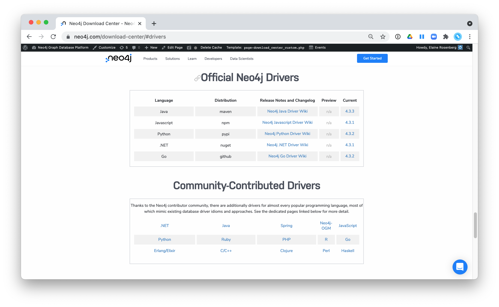

= Neo4j Drivers
:type: quiz
:order: 7

== Neo4j-supported drivers

Because Neo4j is open source, you can delve into the details of how the Neo4j Database is accessed, but most developers simply use Neo4j without needing a deeper understanding of the underlying code.
Neo4j provides a full stack that implements all levels of access to the database and clustering layer where you can use our published APIs.
The language used for querying the Neo4j database is Cypher, an open source language.

In addition, Neo4j supports Java, JavaScript, Python, .NET, and Go drivers out-of-the box that use Neo4j's bolt protocol for binary access to the database layer.
Bolt is an efficient binary protocol that compresses data sent over the wire as well as encrypting the data.
For example, you can write a Java application that uses the Bolt driver to access the Neo4j database, and the application may use other packages that allow data integration between Neo4j and other data stores or uses as common framework such as spring.
You download drivers from the https://neo4j.com/download-center/#drivers[Neo4j driver download page].

== Community-supported drivers

It is also possible for you to develop your own server-side extensions in Java that access the data in the database directly without using Cypher.
The Neo4j community has developed drivers for a number of languages including Ruby, PHP, and R.

You can also extend the functionality of Neo4j by creating user defined functions and procedures that are callable from Cypher.

These drivers are also found on the https://neo4j.com/download-center/#drivers[Neo4j driver download page].

== Check your understanding

leveloffset=+1include::questions/1-drivers.adoc[leveloffset=+1]

[.summary]
== Summary

In this lesson, you learned about drivers that application developers can use to access the graph.
