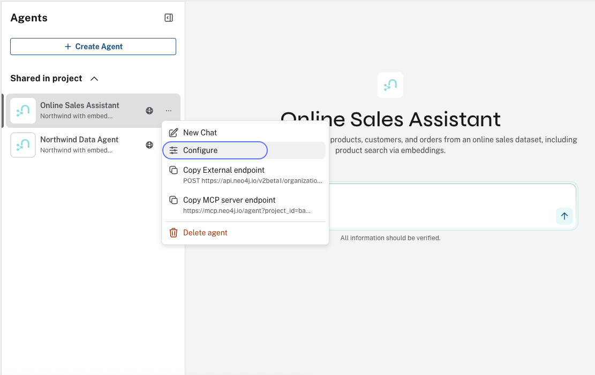

= Publishing an Agent
:order: 2
:type: challenge
:disable-cache: true

In this challenge, you will publish your agent so it can be called from external applications like Claude Desktop or Cursor.

== Goal

Make your Northwind Analyst agent accessible via an MCP server endpoint, then connect to it from a host application.

== Internal and External Access

Agents have two access modes:

**Internal** (default): Only members of your Aura project can use the agent. No additional charges.

image::images/enable-internal-agent.png[Access settings showing Internal selected, available to members of this Aura project]

**External**: The agent is exposed via REST API or MCP server. External agents incur charges per link:https://neo4j.com/pricing/[Neo4j pricing^].

image::images/make-external-enable-mcp-server.png[Access settings showing External selected with Enable MCP server toggle]

For this challenge, you need External access with MCP server enabled.

== Steps

. Open your agent in the Aura Console
. Click the agent menu and select **Configure**
+

. Under Access, select **External**
. Enable the **MCP server** toggle
. Click **Save**
. From the agent menu, click **Copy MCP server endpoint**
. Add the endpoint to your host application (see below)
. Send a test message to confirm the agent responds

== Connecting to Claude Desktop

. Open Claude Desktop settings or configuration file
. Add your agent's MCP endpoint
. Configure authentication if required
. Restart Claude Desktop
. Send a test question to your agent

See link:https://neo4j.com/docs/aura/aura-agent/[Aura Agent documentation^] for detailed Claude Desktop setup instructions.

== Connecting to Cursor

. Open Cursor settings → MCP configuration
. Add a new MCP server with your agent's endpoint
. Save and reload Cursor
. Use the agent through Cursor's interface

See link:https://neo4j.com/docs/aura/aura-agent/[Aura Agent documentation^] for detailed Cursor setup instructions.

[.summary]
== Summary

In this challenge, you published your agent as an external MCP server and connected to it from a host application.

== Next Steps

Continue with the GraphRAG track:

* link:/courses/genai-graphrag-python/[Neo4j GraphRAG for Python^] - Build knowledge graphs using the neo4j-graphrag package
* link:/courses/genai-integration-langchain/[Using Neo4j with LangChain^] - Integrate Neo4j with LangChain for RAG and agents
* link:https://neo4j.com/blog/developer/new-cypher-ai-procedures/[New Cypher AI Procedures^] - GraphRAG in pure Cypher with `ai.text.embed`, `ai.text.embedBatch`, and `ai.text.completion`

read::Mark as completed[]

