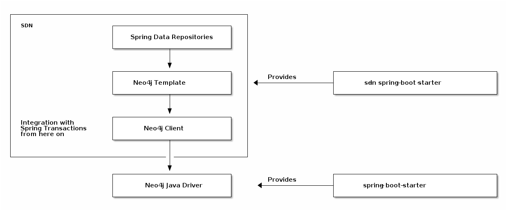

= Spring Data Neo4j Building Blocks
:order: 2
:type: lesson

The primary goal of the https://projects.spring.io/spring-data[Spring Data] project is to make it easier to build Spring-powered applications to integrate with data access technologies.

The Spring Data Neo4j (SDN) library aims to provide a familiar and consistent Spring-based programming model for integrating with the https://neo4j.com/[Neo4j] graph database. There are several ways to go about creating a Spring Data Neo4j project, but this course uses Spring Boot for the automatic configuration and (especially) the dependency management.

== Database configuration

When you get to the next lesson, you might notice that you don't create a driver object and manage sessions and transactions to connect the application to Neo4j. That's where this lesson comes in - to show you why it's often unnecessary and how to customize those components in later projects, if desired.

== Building blocks of Spring Data Neo4j

SDN assembles a few building blocks that allow users to choose their level of customization/abstraction. All of the pieces are shown in the image below.

Starting on the left side of the diagram, four components stack vertically. At the bottom is the plain Java driver. The driver component allows you to customize and manage the driver lifecycle, handling the nuts and bolts of the connection, query execution, and transactions. However, these transactions are not tied to Spring transactions (those are separate). To the right of the driver component shows the `spring-boot-starter` library, the dependency that allows auto-configuration of the Java driver dependency.

Above the driver is a container representing the Spring Data Neo4j library, which encompasses three components. The bottom SDN components is the Neo4j Client. The client gives you access to Spring transactions, but does not map to any domain model, so results will be generic types. Above the client is the Neo4j Template. The template sees your domain, but allows you to query ad-hoc objects. Finally, at the top is the Spring Data Repositories. The repositories are the highest level of abstraction, allowing you to work with your domain model and use Spring Data's repository abstractions.

You can use each of the components in SDN separately, but this course will utilize them together with the `spring-boot-starter-data-neo4j` library. Sliding right from the container in the digram shows that dependency, which is included in this course's project.

[TIP]
.Check the Dependency
====
You can check this by opening the `pom.xml` file in your project and looking for the `spring-boot-starter-data-neo4j` dependency.
====

== Driver Lifecycle and Transaction Management

Core Spring Framework provides a consistent approach to transactions and transaction management. While it is possible to customize this for certain scenarios, many use cases can operate under Spring's default configuration.

Since Spring Data Neo4j taps into the Spring transactions, your project already includes automatic management of the driver sessions and transactions. It is abstracted away, so that you can focus on your domain model and queries.

[.quiz]
== Check your understanding

include::questions/1-building-blocks.adoc[leveloffset=+2]

[.summary]
== Lesson Summary

In this lesson, you learned how Spring Data Neo4j combines a few building blocks to provide management of the driver sessions and transactions.

In the next lesson, you will learn how to apply this by connecting your application to Neo4j and testing it.

=== Further reading

* https://docs.spring.io/spring-data/neo4j/docs/current/reference/html/#building-blocks[SDN Building Blocks]