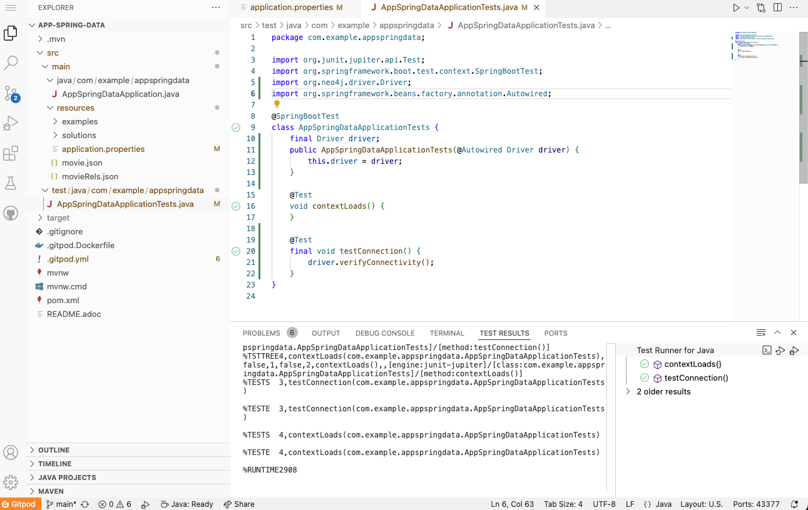

= Configure Neo4j Connection
:order: 3
:type: lesson
:sandbox: true
:lab: {repository-blob}/src/{lab-file}
:lab-file: test/java/com/example/appspringdata
:lab-filename: AppSpringDataApplicationTests.java
:disable-cache: true

You do not need to manage a driver object, but you still need to put the database connection details somewhere for the application. In Spring applications, this is typically handled in the `application.properties` file. In this lesson, you will learn how to configure the connection details for your Neo4j database and test the connection.

== Configure the Connection

The library contains some namespaced properties to use for connecting to a database.

[source,properties,subs="attributes"]
----
spring.neo4j.uri=neo4j+s://{sandbox_ip}:{sandbox_boltPort}
spring.neo4j.authentication.username={sandbox_username}
spring.neo4j.authentication.password={sandbox_password}
spring.data.neo4j.database=neo4j
----

Each of the above properties are as follows:

1. `spring.neo4j.uri` - the connection URI string for our database. For example, `neo4j://localhost:7687` or `neo4j+s://<dbhash>.databases.neo4j.io`.
2. `spring.neo4j.authentication.username` and `spring.neo4j.authentication.password` - properties to authenticate with the database.
3. `spring.data.neo4j.database` - name of the database we want to connect to. This is optional and defaults to `neo4j`.

[TIP]
.Authentication Types
====
Neo4j supports four authentication methods, basic authentication (e.g. username and password or LDAP), a base64 encoded Bearer token, a Kerberos token, or a custom authentication token.
For more information on these options, visit link:https://neo4j.com/docs/operations-manual/current/authentication-authorization/[Authentication and Authorization^].
====

=== Set environment variables

In your project, open the `src/main/resources/application.properties` file and update the required values.

[source]
.Open the properties file
----
include::code/application.properties[]
----

Update the file with your Neo4j sandbox connection details:

NEO4J_URI:: [copy]#neo4j://{sandbox-ip}:{sandbox-boltPort}#
NEO4J_USERNAME:: [copy]#{sandbox-username}#
NEO4J_PASSWORD:: [copy]#{sandbox-password}#

=== Verifying Connectivity

Run the tests to confirm everything is ok. Running as-is will only result in an error if general syntax is incorrect. However, it will not test whether you can actually connect to the instance or not.

To take it one step further and fully test the connection, open the `src/main/test/AppSpringDataApplicationTests` file and add the code shown below.

1. Import `org.neo4j.driver.Driver` and `org.springframework.beans.factory.annotation.Autowired` classes.
+ 
[source,java]
----
include::code/AppSpringDataApplicationTests.java[tag=import]
----
2. Inject the driver into the class.
+ 
[source,java]
----
include::code/AppSpringDataApplicationTests.java[tag=driver-injection]
----
3. Add a new test method that calls the driver's `verifyConnectivity()` method.
+
[source,java]
----
include::code/AppSpringDataApplicationTests.java[tag=test-connection]
----

Completed code is available below to cross-check.

[%collapsible]
.Click to reveal completed `AppSpringDataApplicationTests` code
====
[source,java]
----
include::code/AppSpringDataApplicationTestsCompleted.java[indent=0]
----
====

Run the test class in the IDE to verify that the test passes by clicking on the `Test Results` tab at the bottom of the IDE. If the test doesn't pass, then the database credentials or connection details are incorrect.

read::Success[]

[.summary]
== Lesson Summary

In this lesson, you added connection details to your application and tested the connection to the Neo4j database. This lesson completes Module 1 of the course.

In the next module, you will learn about mapping the graph data model to the application domain model.

=== Further Reading

* link:https://docs.spring.io/spring-data/neo4j/docs/current/reference/html/#configure-spring-boot-project[Docs: Spring Data Neo4j Database Configuration Properties^]