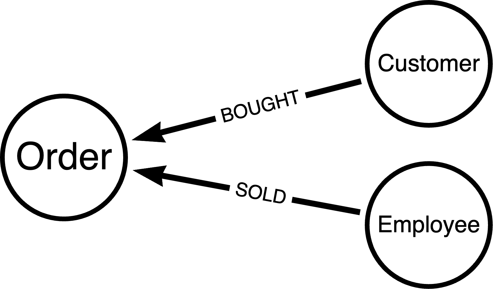
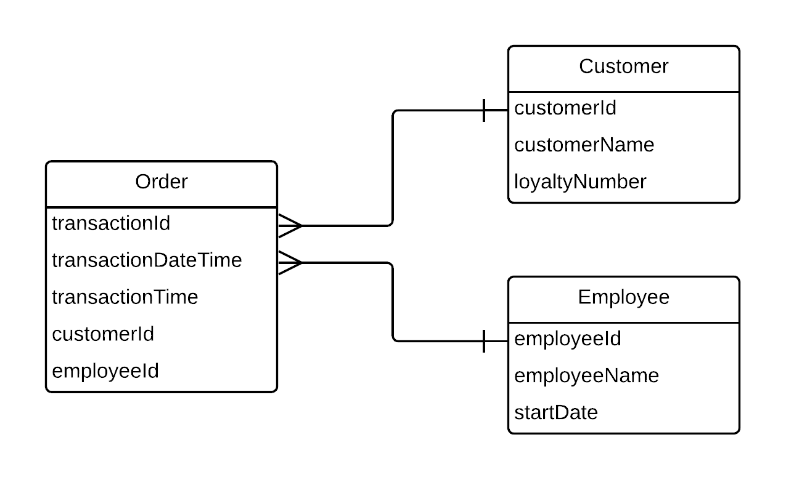
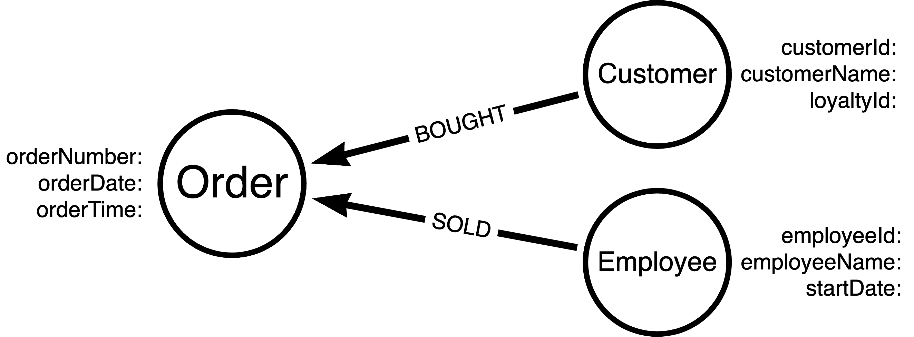

= Application Domain and the Graph Model
:order: 2
:type: lesson

In the last lesson, we talked about how a set of data is organized into a domain model for human understanding, and then mapped to an application domain model. In some cases, the application domain model also needs to be mapped to a database model. 

While this can be a one-to-one mapping where all three models are the same, it often isn't. This is because each model must fit the constraints of the system it is designed for. The human domain model must be easily translatable to stakeholders, business analysts, and developers. The application domain model must fit the constraints of the chosen programming language. The database model must fit the constraints of data types, relationship syntax, and efficient storage and query retrieval.

== Graph Data Model for the Win

Graphs help us to bridge the gap between data models. The graph data model is an excellent fit for the human model because it is flexible and naturally represents data as it exists in the real world, making it more easily understandable across technical and non-technical realms.

A graph data model is also a good fit for the application domain model because the entities and relationships found in the graph model also translate well into the object-oriented world of Java and Spring. Finally, the Neo4j graph database was designed around the graph data model, so there is no mapping required between the original human graph model and the database model.

The best way to grasp this concept is to see it in action. Let's see an example!

== Coffee Shop Orders Example

Let's say we are building an application for a coffee shop. The application will allow customers to place orders, and allow baristas to fulfill those orders. Managers could also use the data to make decisions for their shop.

With this information, let's build a human domain model. Most of us probably gravitate towards a whiteboard or piece of paper (digital or physical) to start drawing out our ideas for mapping the data, so feel free to do that.

=== Domain Model

Try to create your version of the model, and then feel free to reveal the one below to compare them. Your data model may differ, and that's ok.

Remember that we want _customers_ to create _orders_ and _employees_ to fulfill them.

[%collapsible]
.Click to reveal a sample domain model
====
Sample Coffee Shop Order Domain Model

====

Is your data model different? If so, how (i.e. drawing style, different entities, properties/no properties)? What decisions or perspectives might have influenced the differences?

No matter what your model looks like, it's important to note that there is no right or wrong way to draw it. For the next step, we could create either the database model or the application model. Since the database model is traditionally more restrictive, let's map to a database model first.

=== Database Model

Feel free to choose whichever database modeling structure you are most comfortable with - relational, document, etc. We will create a generic model before we look at a graph version. You can use the human model you just created or our version above for your database model. Again, when you're ready, reveal the one below to compare.

[%collapsible]
.Click to reveal sample database model
====
Sample Coffee Shop Order Database Model

====

There is a lot more room for differences in this model. For example, did you create a generic `Person` entity where `Customer` and `Employee` are sub-entities? Can employees also create orders (i.e. purchase coffee for themselves)? Should there be a `total` property the `Order` entity? These are all valid questions that can lead to different database models.

Now let's see a sample graph model.

[%collapsible]
.Click to reveal sample graph model
====
Sample Coffee Shop Order Graph Model

====

Notice that the graph model is very similar to the human model. This is intentional because graphs are designed for the human domain model. Looking back at the relational model, there are a few extra fields built in for lookups. This might not be too terrible to explain to non-technical users, but more complex and diverse models compound the mismatch.

Graph models reduce the mismatch, thereby improving understanding with small and large models. The graph model also translates well to the application domain model, which we will see in the next section.

=== Application Model

A sample Java application domain model might look like the one below. This is based off of the graph database model above.

[%collapsible]
.Click to reveal sample application model
====
Sample Coffee Shop Order Application Model

[source,java]
----
include::code/ApplicationModel.java[tag=model]
----
====

In the application model, we end up with three main entities - `Order`, `Customer`, and `Employee`. This looks very similar to the domain and graph models. The `@Node` annotation tells Spring that this entity should map to a node entity in the database. Similarly, an `@Relationship` annotation should map to a relationship entity in the database.

Application models tend to mirror database models closely because they need to retrieve data from the database. Typically, the more entities and relationships that are added to a model, the more the database model will deviate from the human model, impacting the application model, as well. Graph data models help to reduce this deviation, making it easier to maintain and understand the application.

[.summary]
== Lesson Summary

In this lesson, we walked through constructing a human domain model, a database model, and an application model for a sample coffee shop data set.

Next, we will take a look at the data types that are available in Neo4j and how those are mapped to Java data types.
