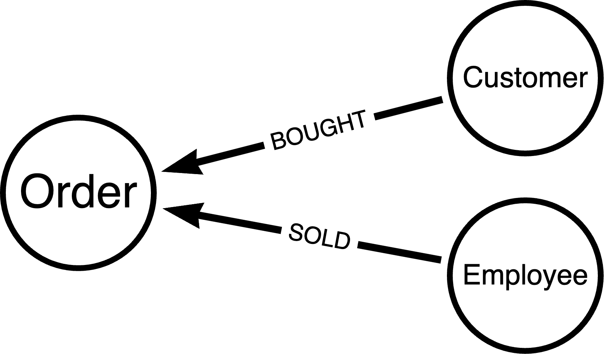
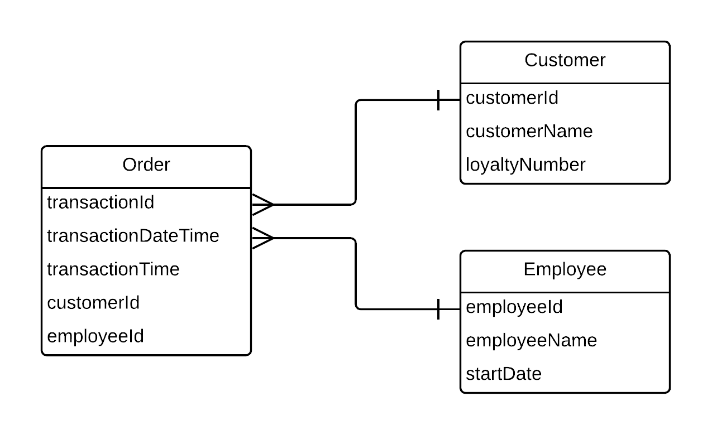
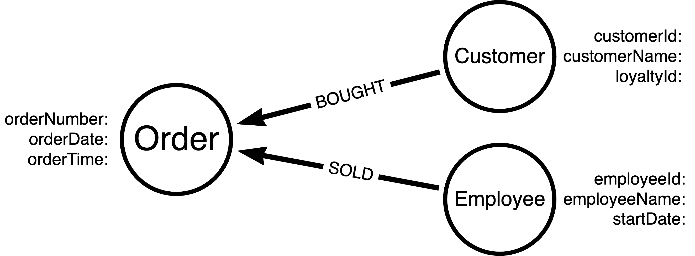

= Challenge: Coffee Shop Modeling Example
:order: 3
:type: challenge

If you are building an application for a coffee shop, it might allow customers to place orders and allow baristas to fulfill those orders.

With this information, what would a human domain model look like? Many developers probably gravitate towards a whiteboard or piece of paper (digital or physical) to start drawing out ideas for mapping the data, so feel free to do that.

== Domain Model

Try to create your version of the model, and then feel free to reveal the one below to compare them. Your data model may differ, and that's ok.

Remember that, in our data, _customers_  create _orders_ and _employees_ fulfill them.

[%collapsible]
.Click to reveal a sample domain model
====
Sample Coffee Shop Order Domain Model

====

Is your data model different? If so, how (i.e. drawing style, different entities, properties/no properties)? What decisions or perspectives might have influenced the differences?

No matter what your model looks like, it's important to note that there is no right or wrong way to draw it. For the next step, you could create either the database model or the application model. Since the database model is traditionally more restrictive, mapping to a database model seems a good next step.

== Database Model

Feel free to choose whichever database modeling structure you are most comfortable with - relational, document, etc. You can create a generic model before looking at a graph version, using the human model you just created or the sample version above for your database model. Again, when you're ready, reveal the one below to compare.

[%collapsible]
.Click to reveal sample database model
====
Sample Coffee Shop Order Database Model

====

There is a lot more room for differences in this model. For example, did you create a generic `Person` entity where `Customer` and `Employee` are sub-entities? Can employees also create orders (i.e. purchase coffee for themselves)? Should there be a `total` property the `Order` entity? These are all valid questions that can lead to different database models.

Now here is a sample graph model.

[%collapsible]
.Click to reveal sample graph model
====
Sample Coffee Shop Order Graph Model

====

Notice that the graph model is very similar to the human model. This is intentional because graphs are designed for the human domain model. Looking back at the relational model, there are a few extra fields built in for lookups. This might not be too terrible to explain to non-technical users, but more complex and diverse models increase the mismatch.

Graph models reduce the mismatch, improving understanding with small and large models. The graph model also translates well to the application domain model, which you will see in the next section.

== Application Model

A sample Java application domain model might look like the one below. This is based off of the graph database model above.

[%collapsible]
.Click to reveal sample application model
====
Sample Coffee Shop Order Application Model

[source,java]
----
include::code/ApplicationModel.java[tag=model]
----
====

In the application model, there are three main entities - `Order`, `Customer`, and `Employee`. This looks very similar to the domain and graph models. The `@Node` annotation tells Spring that this entity should map to a node entity in the database. Similarly, an `@Relationship` annotation should map to a relationship entity in the database.

[TIP]
.Node Ids
====
Best practice is to use a natural key (where possible) or a generated UUID key as an entity's id, rather than referencing the Neo4j internal id (which `@Id` alone does). If you are using your own keys, the optimistic locking feature in SDN is needed. For more information, see the documentation on https://docs.spring.io/spring-data/neo4j/docs/current-SNAPSHOT/reference/html/#mapping.annotations.id[`@Id`^] and https://docs.spring.io/spring-data/neo4j/docs/current-SNAPSHOT/reference/html/#mapping.annotations.version[optimistic locking^].
====

Application models tend to mirror database models closely because they need to retrieve data from the database. Typically, the more entities and relationships that are added to a model, the more the database model will deviate from the human model, impacting the application model, as well. Graph data models help to reduce this deviation, making it easier to maintain and understand the application.

read::Continue[]

[.summary]
== Lesson Summary

In this lesson, you walked through an example of creating a domain model, (graph) database model, and application model for a sample coffee shop application.

Next, you will learn the data types that are available in Neo4j and how those are mapped to Java data types.