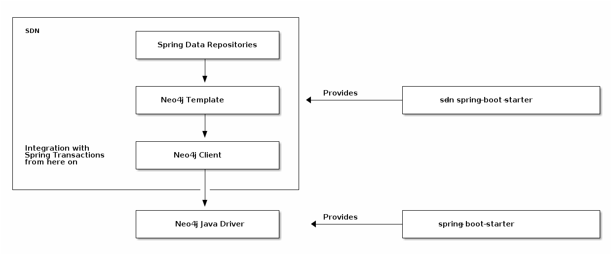

= Mapping Neo4j Object Types
:order: 5
:type: lesson

Nodes and Relationships are separate entities in the Neo4j database, and they are also mapped to separate classes in an application. Depending on your domain model, you will map the database entities to your application entities directly.

== Nodes & Relationships

Remember the Spring Data Neo4j building blocks lesson? The Neo4j Template and Spring Data Repositories layers apply the domain. This means that the generic driver type classes will not be used (and their methods inaccessible) when using the Spring Repositories layer. Instead, objects coming from the database will be mapped to the domain object and their methods.

[%collapsible]
.Memory recap: Spring Data Neo4j building blocks
====

====

This can be applied to the coffee shop example from the previous lesson.

=== Nodes

To retrieve coffee shop orders, you must set the return type on any methods to the domain object (in this case, `Order`). The https://docs.spring.io/spring-data/neo4j/docs/current/reference/html/#mapping.annotations.node[`@Node` annotation^] on the `Order` class tells Spring to map this domain object to node entities in the database.

.Working with Nodes
[source,java,role=ncopy,subs="attributes+",indent=0]
----
include::code/EntityMapping.java[tag=order-mapping]
----

Spring will try to map the object returned from the repository query to the `Order` class, and if it is unable to, the application will error. This is important to keep in mind when writing your queries - you must return the same object from the query that you want to map in the application domain.

The entity exposes the get and set methods defined in the domain class for member variables. For example, `order.getCustomer()` would return the `Customer` object associated with the order.

=== Relationships

`Relationship` objects are similar to those for `Node` in that they also are mapped to any domain objects specified. If there are no specific properties on the relationship, you can skip a separate domain object and map connections between nodes directly. However, if you have relationship properties, then a separate class is needed to map those values. Using the https://docs.spring.io/spring-data/neo4j/docs/current/reference/html/#mapping.annotations.relationship[`@Relationship` annotation^] notifies Spring that this variable maps to a relationship entity in the database.

.Working with Relationships
[source,java,role=ncopy,subs="attributes+",indent=0]
----
include::code/EntityMapping.java[tag=receipt-mapping]
----

For instance, if you want to map an `orderTotal` property on the relationship between an `Order` and a `Customer`, you would define a `Receipt` class with the `@RelationshipProperties` annotation, then map the relationship from the `Order` to the `Receipt` entity and `Receipt` to `Customer`.

Just like with nodes, relationship properties can be accessed with getter and setter methods - for example, `receipt.getOrderTotal()`. However, since you cannot access a relationship by itself, you traverse from the node to the relationship entity to access it.

== Check Your Understanding

include::questions/1-rel-mapping.adoc[leveloffset=+1]

[.summary]
== Lesson Summary

In this lesson, you learned how database node and relationship entities are mapped and handled in a Spring Data Neo4j application.

Next, you will begin building the application for this course, starting with the data model.
