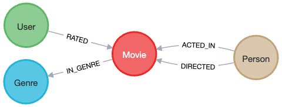

= The `movie` domain
:order: 5
:type: lesson 

Up until now, we have set the stage for creating your own application - discussing the Spring Data Neo4j library, creating the application project, and understanding how domains are modeled and used in an SDN application.

In this lesson, you will get an overview of the data domain that we will be using for the remainder of the course. You will also create your own graph data model from it and create the Java classes for your application domain model.

Let's get started!

== The `movie` application

In this course, you are creating an application that will allow you to search for movies and actors or directors. You will also be able to add new movies and people to the database.

We will use domain classes, repositories, and controllers to structure the application. The domain classes will be used to model the data in the database. The repositories will be used to read and write data to the database. The controllers will be used to expose the data to the user.

== Domain overview

The domain we will be using for this course is a movie database. The database contains information about movies and people. People can be actors or directors, and we also want to track the roles that actors play in movies.

Though there are a few other entities available in the database (such as genres and users), we will focus on movies, people, and roles for this course. The additional entities can be explored on your own.

We already have a graph data model for this domain because the sandbox instance you created earlier in the course has the data pre-loaded.

[%collapsible]
.Click to reveal the movie graph model
====
Movie Database Data Model

====

The `Actor` and `Director` nodes shown are extra labels on the `Person` nodes. `Person` nodes are a broader category that includes both actors and directors.

[.summary]
== Lesson Summary

In this lesson, you learned about the application you will build for this course. You also looked at the graph data model for the movie data set.

Next, you will tackle creating the application domain model for our movie graph, and we will walk through the results.
