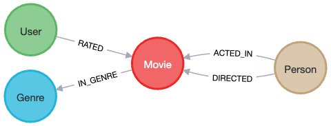

= Creating Role classes
:order: 6
:type: lesson
:sandbox: true

We have created the application entities for movies and people, but we haven't created the most unique part of the graph - *relationships*. In this lesson, we will see how to map relationships between movies and people and create application entities for relationship properties.

== Add relationships to the Movie class

If you are familiar with mapping relationships in Spring applications for other types of data stores (such as relational databases), the syntax with Neo4j will not be completely foreign to you.

In the `Movie` domain class, you will create a new field that represents the relationship between a movie and a person. You will need to annotate the field with `@Relationship` and specify the relationship type that should be mapped from the graph. Depending on the data model, you can also specify which direction the relationship is stored.

[%collapsible]
.Click to review the movie graph model
====
Movie Database Data Model

====

Person entities can `act in` or `direct` movies, so you will first map the `ACTED_IN` relationship from the `Movie` class to the `Person` class.

1. Add a new field to the `Movie` class called `actors` that returns a list of `Person` entities.
2. Directly above the new field, annotate it with `@Relationship` and specify the relationship type as `ACTED_IN` and the direction as `Relationship.Direction.INCOMING`.
3. Add a getter and setter for the new field (do not add to the constructor).

The `@Relationship` annotation has two attributes that are needed - relationship type (`value`) and direction. In this case, you are mapping the `ACTED_IN` relationship from the graph to the `actors` field in the `Movie` class that returns a list of `Person` entities. The `ACTED_IN` relationship goes from `Person` to `Movie`, so you specify the direction as `INCOMING` in the `Movie` class.

You don't need to add the field to the constructor because you can create a movie node in the graph that doesn't have any actors. You *do* need to add the field to the `getters` and `setters`, though, to set and retrieve `actors` with their related movies.

[%collapsible]
.Click to reveal the completed `Movie` class code
====
[source,java]
----
include::code/Movie.java[tag=movie-actors]
----
====

Time to test the changes!

== Test the application (again!)

Start the application and open a browser window to `http://localhost:8080/movies/119155`. You should see the same list of movie properties as before, plus an `actors` one containing a list with fields matching the `Person` class.

//TODO: screenshot of output here!

It's working! However, if you run the Cypher statement in the sandbox tab on the right, we are missing the `role` property on the relationships. You will map those by creating a separate entity class for the relationship to include relationship properties.

== Check Your Understanding

include::questions/1-rel-direction.adoc[leveloffset=+1]

[.summary]
== Summary

In this lesson, you mapped the relationship between `Movie` and `Person` entities in the application domain by creating a property in the the `Movie` class.

Next, you will map relationship properties `Movie` and `Person` entities.