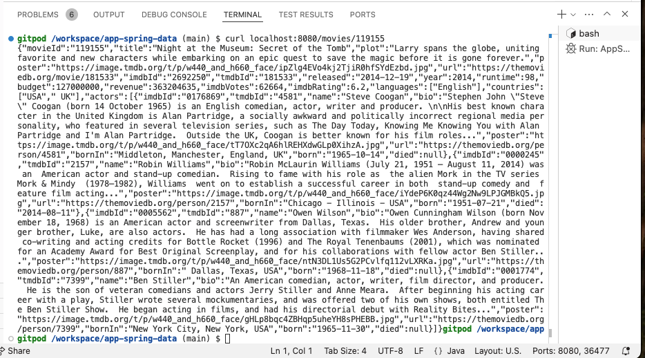

= Mapping Relationships
:order: 6
:type: lesson
:sandbox: true

You have created the application entities for movies and people, but you haven't mapped the most unique part of the graph - *relationships*. In this lesson, you will map relationships between movies and people and create an application entity for relationship properties.

== Add relationships to the Movie class

If you are familiar with mapping relationships in Spring applications for other types of data stores (such as relational databases), the syntax with Neo4j will not be completely foreign to you.

You will need a new field in the `Movie` domain class that represents the relationship between a movie and a person. Person entities can `act in` or `direct` movies, so you will map the `ACTED_IN` relationship from the `Movie` class to the `Person` class.

1. Open the `Movie.java` domain class in your project's `src/main/java/com/example/appspringdata` folder.
2. Import `org.springframework.data.neo4j.core.schema.Relationship` and `java.util.List` classes.
+ 
[source,java]
----
include::code/Movie.java[tag=import]
----
3. Add a new field to the `Movie` class called `actors` that returns a list of `Person` entities.
+ 
[source,java]
----
include::code/Movie.java[tag=actor_field]
----
4. Directly above the new field, annotate it with `@Relationship` and specify the relationship type as `ACTED_IN` and the direction as `Relationship.Direction.INCOMING`.
+ 
[source,java]
----
include::code/Movie.java[tag=relationship]
include::code/Movie.java[tag=actor_field]
----
5. Add a getter and setter for the new field (do not add to the constructor).
+ 
[source,java]
----
include::code/Movie.java[tag=getter]
----

The `@Relationship` annotation has two attributes that are needed - relationship type (`value`) and direction. In this case, you are mapping the `ACTED_IN` relationship from the graph to the `actors` field in the `Movie` class that returns a list of `Person` entities. The `ACTED_IN` relationship goes from `Person` to `Movie`, so you specify the direction as `INCOMING` in the `Movie` class.

You don't need to add the field to the constructor because you can create a movie node in the graph that doesn't have any actors. You *do* need to add the field to the `getters` and `setters`, though, to set and retrieve `actors` with their related movies.

[%collapsible]
.Click to reveal the completed `Movie` class code
====
[source,java]
----
include::code/Movie.java[tag=**]
----
====

== Test the application (again!)

Start the application and execute the `curl 'localhost:8080/movies/119155'` command in another terminal tab. You should see the same list of movie properties as before, plus an `actors` one containing a list with fields matching the `Person` class.

If you run the Cypher statement in the sandbox tab on the right, it is missing the `role` property on the relationships. You will map those in the next lesson by creating a separate entity class for the relationship to include relationship properties.

[.quiz]
== Check your understanding

include::questions/1-rel-direction.adoc[leveloffset=+2]

[.summary]
== Summary

In this lesson, you mapped the relationship between `Movie` and `Person` entities in the application domain by creating a property in the the `Movie` class.

Next, you will map relationship properties `Movie` and `Person` entities with a `Role` class.