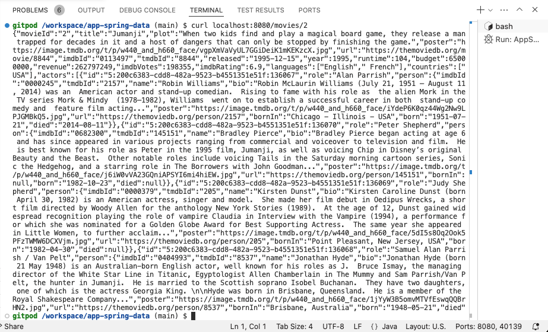

= Relationship Properties
:order: 7
:type: lesson

Last lesson, you mapped the `ACTED_IN` relationship from the graph to the `actors` field in the `Movie` class. Now you will map the relationship's property `role` by creating a separate `Role` class to contain the field.

== Add relationship properties class

1. Create a new class called `Role.java` in the `src/main/java/com/example/appspringdata` package.
2. Import `RelationshipId`, `RelationshipProperties`, and `TargetNode` classes.
+ 
[source,java]
----
include::code/Role.java[tag=import]
----
3. Just above the class definition, add the `@RelationshipProperties` annotation.
+ 
[source,java]
----
include::code/Role.java[tag=annotation]
----
4. Add the properties to the class, including an `id` field (annotated with `@RelationshipId`), the `role` field, and a `person` field (annotated with `@TargetNode`) to specify the end node of the relationship.
+
[source,java]
----
include::code/Role.java[tag=role-properties]
----
5. Add a class constructor, getter methods for all fields, and a setter method for the `role` field.
+
[source,java]
----
include::code/Role.java[tag=boilerplate]
---- 

[TIP]
.Role setter methods
====
You do not need setter methods for the `id` and `person` fields because the id is handled by the database, and the Person entity is handled by a separate class.
====

Completed code is available below to check your work.

[%collapsible]
.Click to reveal the completed `Role` class code
====
[source,java]
----
include::code/RoleComplete.java[]
----
====

== Update Movie class

Next, you need to update the `Movie.java` class to reference the new relationship class `Role`, rather than `Person`.

Update the `actors` variable to return a `List<Role>`, then update the related getter and setter for the same change.

Completed code is available below to check your work.

[%collapsible]
.Click to reveal the updated `Movie` class code
====
[source,java]
----
include::code/Movie.java[]
----
====

== Test the application (again!)

Start the application and run `curl localhost:8080/movies/2` from the terminal tab. You should see the same list of movie properties as before, plus one for `role` containing the name(s) of the character(s) the person played in that movie.

Nice work! You mapped the `ACTED_IN` relationship from the graph to the `actors` field in the `Movie` class, and you mapped a relationship property for `role` by creating a separate `Role` class to contain the field.

read::Success[]

[.summary]
== Summary

In this lesson, you mapped the relationship property for the roles actors played in movies by creating a separate `Role` class.

Next, you can optionally learn about some application modeling mistakes to avoid when working with Neo4j. Or you can continue onto the next module to learn how to write data to the database from the application.