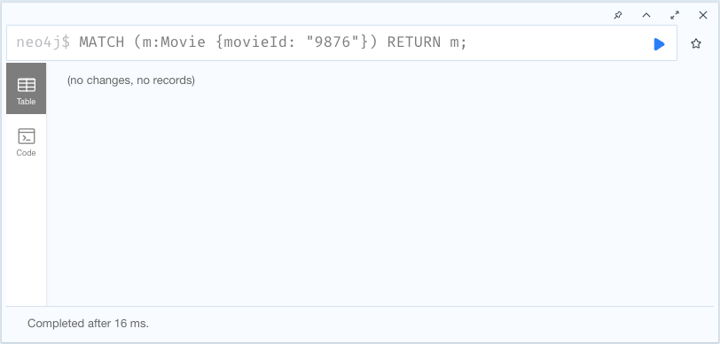

= Deleting Movie nodes
:order: 3
:type: lesson

In previous lessons, you created a new `Movie` node and its relationships in the database from your Java application. Now you will learn how to delete a `Movie` node and its relationships from the database.

== DeleteById() method

Just as with previous derived methods for `findAll()` or `save()`, there is a derived method to delete data called `deleteById()`. You will use this method to delete a `Movie` node in Neo4j.

. Open the `MovieController.java` file in the `src/main/java/com/example/appspringdata` directory.
. Import the `springframework` `DeleteMapping` and `RequestParam` classes:
+
[source,java]
----
include::code/MovieController.java[tag=import]
----
. Add the `delete` method to the `MovieController`:
+
[source,java]
----
include::code/MovieController.java[tag=delete-method]
----

Full code for the `MovieController` class is available in the dropdown below.

[%collapsible]
.Click to reveal the completed `MovieController` class code
====
[source,java]
----
include::code/MovieController.java[tag=**]
----
====

This method is annotated with `@DeleteMapping` and will handle requests to the `/movies/delete` endpoint. It passes in a `movieId` specified as a request parameter at the end of the URL. The `deleteById()` method is called on the repository with the `movieId` passed in as an argument. The method then prints a message to the console to confirm the deletion.

[TIP]
.Deleting relationships
====
By default, the delete operation will do a `DETACH DELETE`, which means it will first delete any relationships connected to the node before deleting the node itself.
====

== Testing the deleteById() method

For this example, you will delete the movie created in the last lesson.

Run your application. Once the application is running, go to the terminal tab and execute `curl -X DELETE localhost:8080/movies/delete?movieId=9876` to delete the `MyMovie` node created in the last lesson.

.Delete Results output (example)
----
Deleted movie with movieId: 9876
----

Note: The output statement above will be printed in the terminal where the application is running, rather than where you make the call because the method returns void. Execute the populated query in the right-hand tab to verify that the node has been deleted. You should see no results returned.

read::Success[]

[.summary]
== Summary

In this lesson, you learned how to delete a `Movie` node in Neo4j using the derived `deleteById()` method.

In the next module, you will define methods with custom Cypher statements for reading, writing, and updating data.