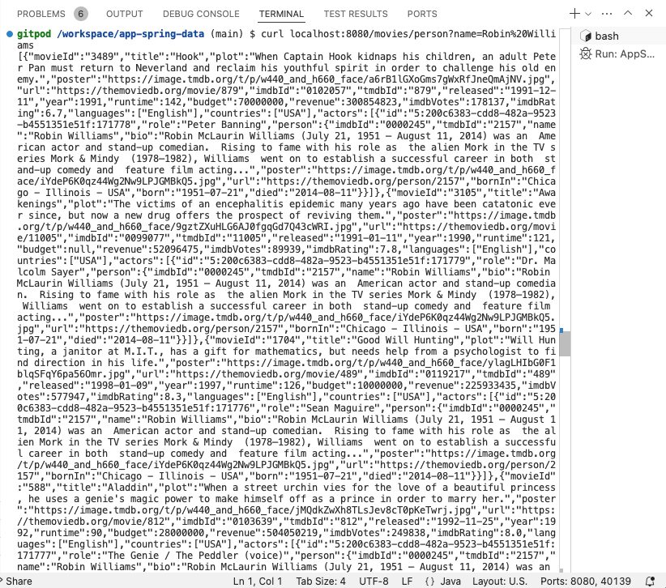

= Custom Cypher for Read with Parameters
:order: 2
:type: lesson
:sandbox: true

In this lesson, you will learn how to write custom methods and queries that take parameters to retrieve data from the database.

== Defining a custom repository method with parameters

You can also define custom methods that take parameters. For instance, what if you wanted to find all of the movies that a specific person acted in.

In the `src/main/java/com/example/appspringdata` folder, open the `MovieRepository.java` and define another custom method shown below.

[source,java]
----
    @Query("MATCH (m:Movie)<-[r:ACTED_IN]-(p:Person {name: $name})" +
            "RETURN m, collect(r), collect(p);")
    Iterable<Movie> findMoviesByPerson(String name);
----

Next, add a new method in the `MovieController` class that calls this method, passing in a `RequestParam` for a name.

[source,java]
----
    //new method to call the custom `findMoviesByPerson()` method
    @GetMapping("/person")
    Iterable<Movie> findMoviesByPerson(@RequestParam String name) {
        return movieRepo.findMoviesByPerson(name);
    }
----

Full code for the `MovieRepository` and `MovieController` classes is available in the dropdown below.

[%collapsible]
.Click to reveal the completed `MovieRepository` and `MovieController` class code
====
[source,java]
----
include::code/MovieRepository.java[]
include::code/MovieController.java[]
----
====

In the repository interface, you have a new method called `findMoviesByPerson()` that takes a `String` parameter called `name`. You annotate the method with `@Query` and provide a Cypher statement that will return all of the movies that a person acted in, using the `$name` parameter to match the `Person` with the name provided in the parameter.

In the controller, there is a new method called `findMoviesByPerson()` that calls the custom repository method and passes in the name from a URL parameter. You also need a `@GetMapping` annotation to map the method to `/movies/person`.

== Testing the findMoviesByPerson() custom method

Just as before, you can test the new method by running the application and calling the `/movies/person` endpoint with a name parameter to search. You should see a response with all of the movies that the person node is connected to, each with their `ACTED_IN` relationships and `Person` nodes.

[source,shell]
----
curl localhost:8080/movies/person?name=Robin%20Williams
----

Feel free to run the provided query in the right-hand tab to see the results there as well. You can also try passing in different actors' names to the request and see the results.

read::Success[]

[.summary]
== Summary

In this lesson, you learned how to write your own custom methods and queries to retrieve data from the database.

Next, you will complete a challenge that builds upon that skill to create custom queries and methods for writing data to the database.