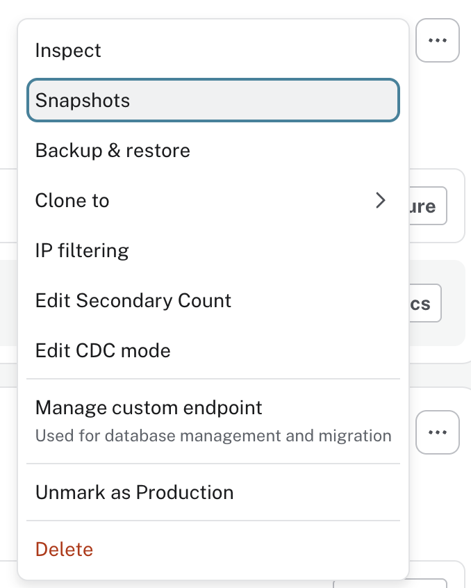

= Managing Snapshots
:type: lesson
:order: 1

[.slide.discrete]
== Introduction

A **snapshot** is a point-in-time copy of your database that you can restore in case of accidental changes, data loss, or to test changes safely without impacting your main database.

In this lesson, you'll learn about the types of snapshot available, how to access them, and retention policies for different Aura tiers.

[.slide]
== Snapshot Types

Aura provides two types of snapshots to help you protect your data and maintain operational flexibility, full and sequential backups.

A **full snapshot** captures your entire database at a specific point in time - it's complete and self-contained.

A **differential snapshot**, on the other hand, only records the changes since the last full snapshot, making it more efficient but dependent on the full snapshot that came before it.

You can use both types of snapshots to restore your database to a specific point in time, but only full snapshots can be exported.

[.slide]
== Scheduled Snapshots

Scheduled snapshots run automatically. The frequency of scheduled snapshots depends on your tier.

* **AuraDB Professional** and **AuraDS Professional** create snapshots once per day.
* **AuraDB Business Critical** creates snapshots every hour.
* **AuraDB Virtual Dedicated Cloud** creates both daily full snapshots and hourly differential snapshots.
* **AuraDS Enterprise** creates daily snapshots.
// * **AuraDB Virtual Dedicated Cloud (4.x)** creates snapshots every 6 hours.

[TIP]
.On Demand Snapshots
====

You can create a snapshot anytime using the **Take snapshot** button in the Aura console. This is useful before major changes or migrations.
====

[.slide.col-2]
== Accessing Snapshots

[.col]
====
To view and manage snapshots:

. Navigate to your Aura instance card in the console
. Click the More menu icon (**…**) on the instance card
. Select **Snapshots**
====

[.col]
====

====

[.slide.col-2.discrete]
== Snapshot list

[.col]
====
The Snapshots tab displays a list of available snapshots with their creation time, type, and available actions.
====

[.col]
====
image::images/snapshots-pane.png[Snapshots pane]
====

[.slide]
== Snapshot Actions

Each _full_ snapshot has two actions via the more menu (**…**):

* **Export**
* **Create instance from snapshot**

The arrow icon image:images/restore-from-snapshot.png[Restore from snapshot icon] to the right of each snapshot item allows you to restore the snapshot to overwrite the current instance.

[.slide]
=== Export

The **Export** action downloads a snapshot as a backup file for offline storage or use with other Neo4j installations.

**AuraDB instances** export as `.backup` files (latest version) or `.dump` files (version 4.x). **AuraDS instances** export as `.tar` files.

[TIP]
.Show exportable only
====
Use the **Show exportable only** filter to identify downloadable snapshots. Only full snapshots can be exported.
====

[.slide]
=== Create Instance from Snapshot

The **Create instance from snapshot** action creates a new instance with data from the snapshot. Your original instance remains unchanged.

This is useful to test changes, debug production issues, or provide realistic test data without affecting production.

[.slide]
=== Restore from snapshot

The **Restore from snapshot** action reverts your instance to the snapshot state.
You will be prompted to confirm the operation by entering `RESTORE` to confirm.

Any updates made to your instance between the time of the snapshot and the current time will be lost.

[WARNING]
.Overwriting existing data
====
Restoring **overwrites all current data** in your instance. This operation is destructive and irreversible.

To verify snapshot data without overwriting, you can create a new instance from the snapshot instead.
====

[.slide]
== Snapshot Retention

The retention policy for snapshots depends on the tier of your instance.

[cols="1,1,1,1", options="header"]
|===
|Tier
|Restorable Days
|Exportable Days
|Total Retention

|AuraDB Free
|N/A (on-demand only)
|N/A (on-demand only)
|N/A

|AuraDB Professional
|7
|7
|7

|AuraDB Business Critical
|30
|30 (full only)
|30

|AuraDB Virtual Dedicated Cloud (latest)
|60 (full)
|60 (full)
|90

|AuraDB Virtual Dedicated Cloud (4.x)
|60 (long), 7 (short)
|14 (long), 7 (short)
|90

|AuraDS Professional
|7
|7
|30

|AuraDS Enterprise
|14
|7
|90
|===

// [NOTE]
// .On-Demand Snapshot Retention
// ====
// On-demand snapshots are restorable and exportable for the same period as the total retention for your tier.
// ====

// == Best Practices

// Take an on-demand snapshot before major database changes for a specific recovery point.

// Test restore procedures regularly to confirm they work before you need them in production.

// Download critical snapshots as backup files for recovery options independent of Aura.

// Use **Show exportable only** filter to identify downloadable snapshots. Differential backups aren't exportable.

// Understand your tier's retention policies - restorable versus exportable periods differ. Professional tier: 7 days for both. Higher tiers vary for full versus differential backups.

// For testing or troubleshooting, create new instances from snapshots rather than restoring to production.

[.quiz]
== Check Your Understanding

include::questions/1-snapshot-schedule.adoc[leveloffset=+1]

[.summary]
== Summary

You now know how to manage snapshots for your Aura instances.

You've learned about automatic snapshot schedules, retention policies, and how to access the Snapshots page in the Aura console.

Next up, you'll learn about the restore operations available in Aura.

