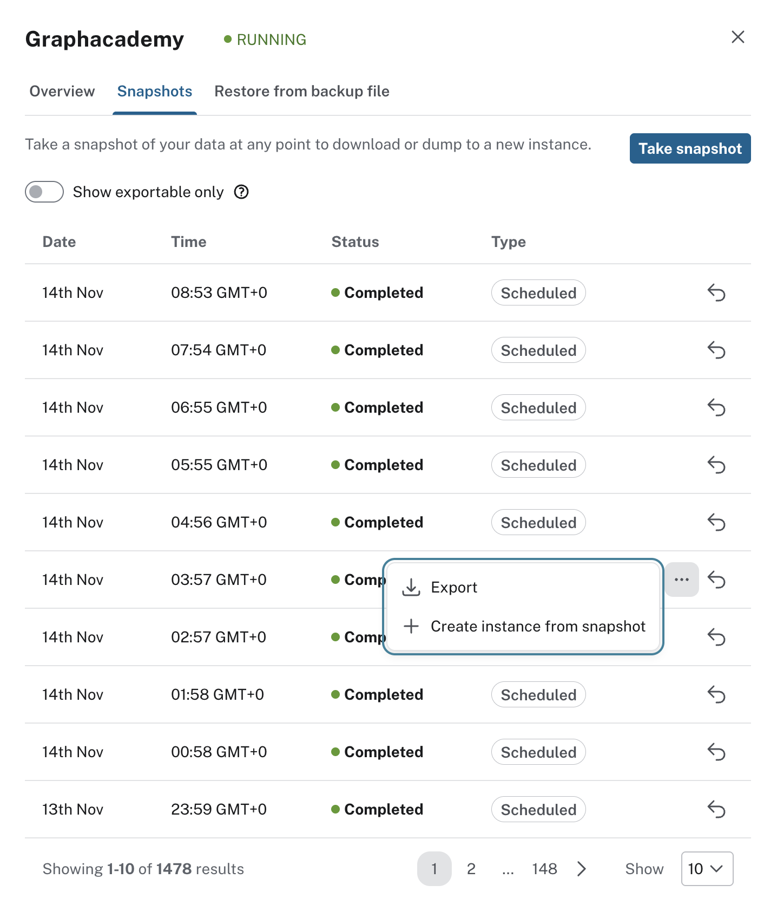
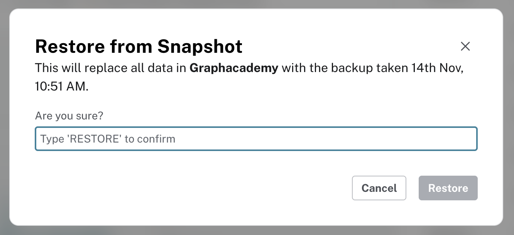
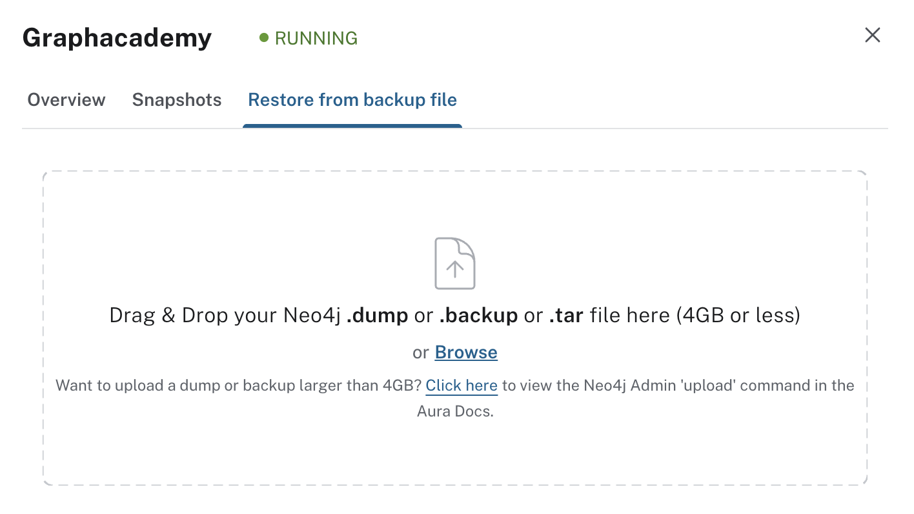

= Restore Operations
:type: lesson
:order: 5

[.slide.discrete]
== Introduction

In this lesson, you'll learn how to perform restore operations using snapshots and backup files, and you'll understand what restoring data really means for your instance.

[.slide]
== When to Restore from Backup

There are several common scenarios that require restoration of your data.

* **Accidental data deletion**: User error deleted critical data
* **Corrupted data**: Data integrity issues require reverting to a known good state
* **Failed migration**: A data migration or schema change caused problems
* **Security incident**: Malicious activity compromised data integrity
* **Testing rollback procedures**: Validating your disaster recovery plan

[.slide]
== Restore Options

You have two primary ways to restore data in Aura:

. Restore from snapshot
. Restore from backup file

[.slide.col-2]
== Restoring from a Snapshot

[.col]
====
To restore your instance from a snapshot,  click on the More menu icon (**…**) on the instance card and select the **Snapshots** tab.
====

[.col]
====

====

[.slide.col-2.discrete]
=== Restore from a Snapshot

[.col]
====
Next to each snapshot you will see an arrow icon .

Click on the arrow icon to restore the snapshot to overwrite the current instance.
You will be asked to confirm the restore operation.
====

[.col]
====

====

[.slide.col-2.discrete]
== Restore from a snapshot

[WARNING]
.Data will be overwritten
====
Restoring from a snapshot **overwrites all data** in your instance, replacing it with the data contained in the snapshot.

If you don't want to overwrite your current data, create a new instance from the snapshot instead.
A new instance will be created with the data from the snapshot with its own URI and credentials.
====

[.slide.col-2.reverse]
=== Option 2: Restore from Backup File

[.col]
====

====

[.col]
====
You can use the **Restore from backup file** tab to upload a previously exported backup file:

Drag and drop your backup file or browse for it:

* **AuraDB instances**: `.backup` file (latest version) or `.dump` file (version 4.x)
* **AuraDS instances**: `.tar` file
====

[.slide]
== Uploading a local backup

You can also use the `neo4j-admin` command-line tool to upload a local backup file to your Aura instance.

The command works for databases of any size, as long as they fit within your Aura instance capacity.

To upload a local backup, you need to create a backup or database dump.
The following command creates a _dump_ of the `neo4j` database in the `backups` directory named `neo4j.dump`.

.Create a dump
[source,bash]
----
bin/neo4j-admin database dump --to-path=./backups neo4j
----

You will see a similar output to the following:

  2025-11-14 11:09:54.468+0000 INFO  [c.n.c.d.EnterpriseDumpCommand] Starting dump of database 'neo4j'
  Done: 68 files, 384.2MiB processed in 0.522 seconds.
  2025-11-14 11:09:55.754+0000 INFO  [c.n.c.d.EnterpriseDumpCommand] Dump completed successfully

[.slide.discrete]
=== Uploading your backup file

The dump file can be uploaded to your Aura instance using the `neo4j-admin database upload` command.

[source,bash]
----
$ bin/neo4j-admin database upload \
  --from-path=./backups/ \
  --to-uri=neo4j+s://<instanceid>.databases.neo4j.io \
  --to-user=neo4j \
  --to-password=<your-password> \
  neo4j
----

The command connects to the Aura instance at `<instanceid>.databases.neo4j.io` using the credentials provided, and uploads the database to the `neo4j` database.

[%collapsible.transcript-only]
.Upload output
====
The command will output the status of the upload process.
You can request more detailed information by adding the `--verbose` flag.

  Detected source dump file at: ./backups/neo4j.dump
  Successfully authenticated with Aura.
  Generating crc32 of archive, this may take some time...
  Upload
  ....................  10%
  ....................  20%
  ....................  30%
  ....................  40%
  ....................  50%
  ....................  60%
  ....................  70%
  ....................  80%
  ....................  90%
  .................... 100%
  Upload completed successfully

  We have received your export and it is currently being loaded into your Aura instance.
  You can wait here, or abort this command and head over to the console to be notified of when your database is running.
  Import progress (estimated)
  ....................  10%
  ....................  20%
  ....................  30%
  ....................  40%
  ....................  50%
  ....................  60%
  ....................  70%
  ....................  80%
  ....................  90%
  .................... 100%
  Your data was successfully pushed to Aura and is now running.
  Dump successfully uploaded to Aura
  Your archive at ./backups/neo4j.dump can now be deleted.

====

The database will appear in a **Loading** state until the upload is complete.
This may take a while to complete depending on the size of the database.

You can link:https://neo4j.com/docs/operations-manual/current/backup-restore/[read more about backup and restore operations in the Neo4j Operations Manual^].

[.quiz]
== Check your understanding

include::questions/1-restore-decision.adoc[leveloffset=+1]

include::questions/2-local-restore-command.adoc[leveloffset=+1]

[.summary]
== Summary

Understanding your restore options is critical for effective disaster recovery planning.

Key concepts:

* **Restoring from snapshot**: Fast, convenient, directly available in the Aura console - ideal for reverting to a recent state
* **Restoring from backup file**: Useful for migrating data or restoring from offline backups - supports `.backup`, `.dump`, and `.tar` formats
* **neo4j-admin upload**: Command-line tool for uploading local database dumps to Aura instances
* **Data overwrite**: All restore operations overwrite existing data - create a new instance if you need to preserve current data

Always test your restore procedures regularly and understand the data loss implications before executing a restore.

In the next module, you will learn how to access the logs available in Aura.
