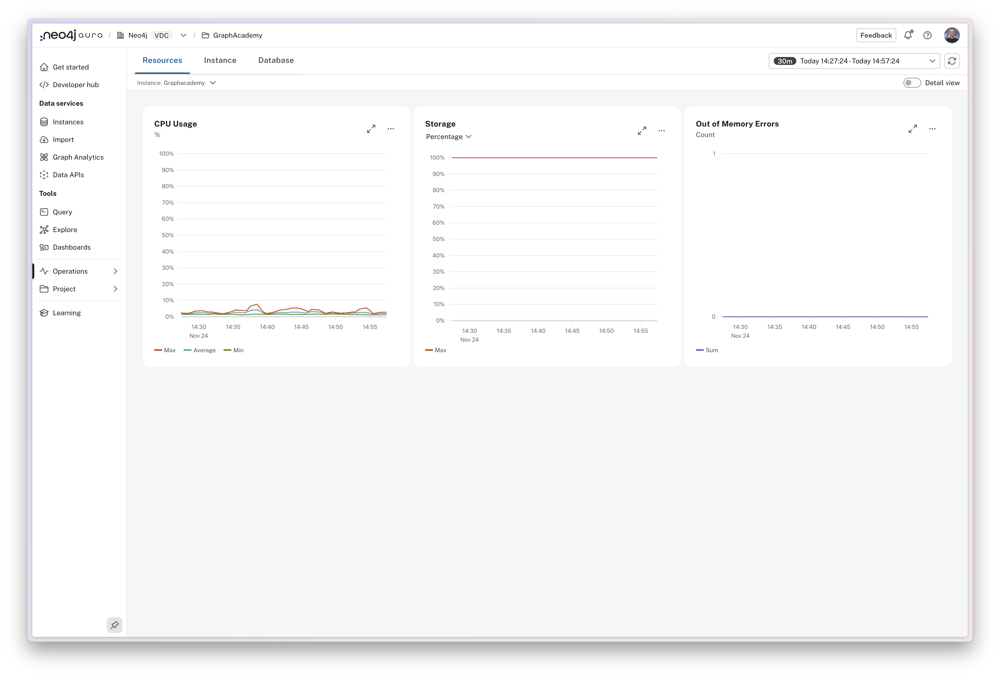
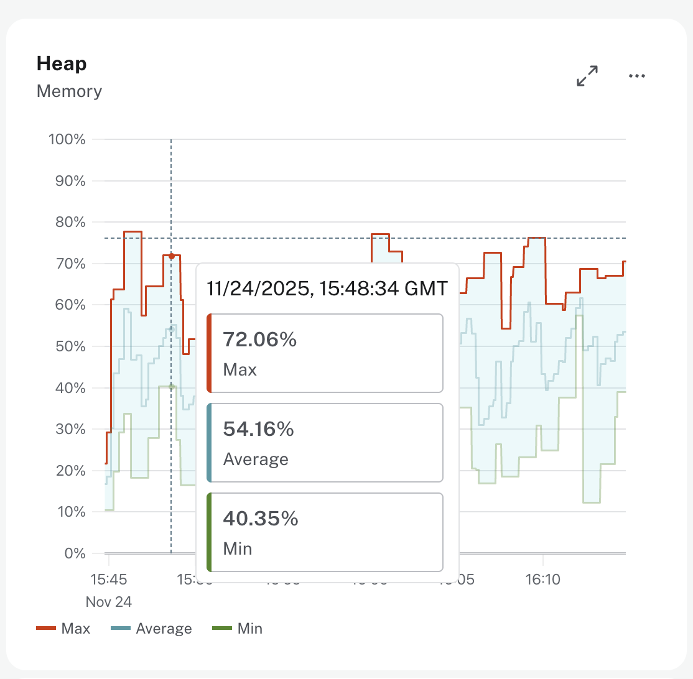

= Viewing your metrics
:type: lesson
:order: 1

[.discrete]
== Introduction

The Metrics dashboard is your primary tool for monitoring the health and performance of your Aura instances.

In this lesson, you'll learn how to navigate the Metrics dashboard and understand the three main monitoring categories: Resources, Instance, and Database.

== Accessing instance metrics

image::images/instance-card.png[Metrics section at the bottom of an instance card]

You can access the top-level metrics for an instance, CPU Usage, Storage, and Query Rate for the last 24 hours, by expanding the **Metrics** section at the bottom of each instance card.

image::images/instance-card-with-metrics.png[Instance card with metrics expanded]

From there, you can access the full set of metrics for the instance by clicking the **View all metrics** button. 
This page can also be accessed directly from the left menu by expanding the **Operations** menu and selecting **Metrics**.

== Metrics Dashboard

Metrics for your Neo4j Aura instances are split into three categories that can be accessed from the tabs at the top of the dashboard.

=== Resources 

The **Resources** tab provides access to the resource utilization metrics for your instance. 

* **CPU Usage**: The minimum, maximum, and average percentage of your CPU capacity being used within the timeframe.  
* **Storage**: The percentage of disk space that is being used to store your data. 
* **Out of Memory Errors**: The number of times your instance has run out of memory.  This is a critical metric and should be monitored closely.

=== Instance

image::images/metrics-instance.png[The instance tab]

The **Instance** tab provides access to the instance-level metrics that monitor the health and performance of your deployment.

* **Heap**: The minimum, maximum, and average percentage of your heap memory being used within the timeframe.  The heap is used for query execution, transaction state, management of the graph.
* **Page Cache**: The percentage of time the data required has been found in memory or being read from disk.  Efficient use of the page cache speeds up query execution because the information does not need to be read from disk.
* **Page Cache Evictions**: The number of times data in memory is replaced per minute.  A spike in evictions may indicate that the page cache is not large enough to hold enough frequently accessed data in memory at any time.
* **Bolt Connections**: The number of connections that are executing Cypher transactions against your instance.  
* **Garbage Collection**: The percentage of time spent clearing up memory.  High values indicate that the current workloads are too memory intensive for the current instance size.

=== Database

image::images/metrics-database.png[The database tab]

The **Database** tab provides access to metrics around the data stored in your instance.

* **Store Size**: The percentage of space that has been allocated and used by your instance.  This is a measure of the total size of the data stored in your instance.
* **Query Rate**: The number of queries executed per minute.
* **Query Latency**: Measures how long it takes for queries to execute. The 50th percentile indicates the typical query speed, while the 75th and 99th percentiles highlight how slower queries are performing, helping you spot occasional or severe performance issues.
* **Entities**: The number of entities (nodes and relationships) in your instance.  This gives you a measure of the size of the graph and how it is growing over time.
* **Active Transactions**: The number of transactions that are currently active against your instance per minute.
* **Transactions**: An accumulative count of the number of transactions that have been executed against your instance since it was started.
* **Replan events**: The count and rate of the number of times that Cypher has to recreate the execution plan for a query.  This can indicate inefficient Cypher statements and changes to the underlying database schema.

== Individual cards 

As you hover over a card, a tooltip will appear with the current value of the metric.  
A dotted line will appear on the other cards in the view to allow you quickly view the values of the other cards at that time.

=== Context menu

Each card  has a context menu that is accessed by clicking the three dot icon in the top right corner of the card.  

image::images/card-context-menu.png[Context menu on a card] 

// The menu allows you to: 

* **More info**: Access a text description of the metric and its purpose. 
* **Reset zoom**: Reset the zoom level of the chart to the default.
* **Metrics Integration**: Access additional information on how to use this metric with external monitoring tools.  

[TIP]
.View reports in full screen
====
The arrows icon in the top right corner of the card allows you to expand the card to fill the screen.
====

[.next]
== Understanding your metrics

As we move through the module, you will learn how to interpret each of these metrics and how to use them to identify and troubleshoot issues with your Aura instances.

[.quiz]
== Check Your Understanding

include::questions/1-dashboard-navigation.adoc[leveloffset=+1]

[.summary]
== Summary

You now know how to navigate the Metrics dashboard for your Aura instances.

You've learned about the three main monitoring categories - Resources, Instance, and Database - and how to use dashboard controls to customize your view.

In the next lesson, you'll learn how to monitor CPU usage and identify performance bottlenecks.

