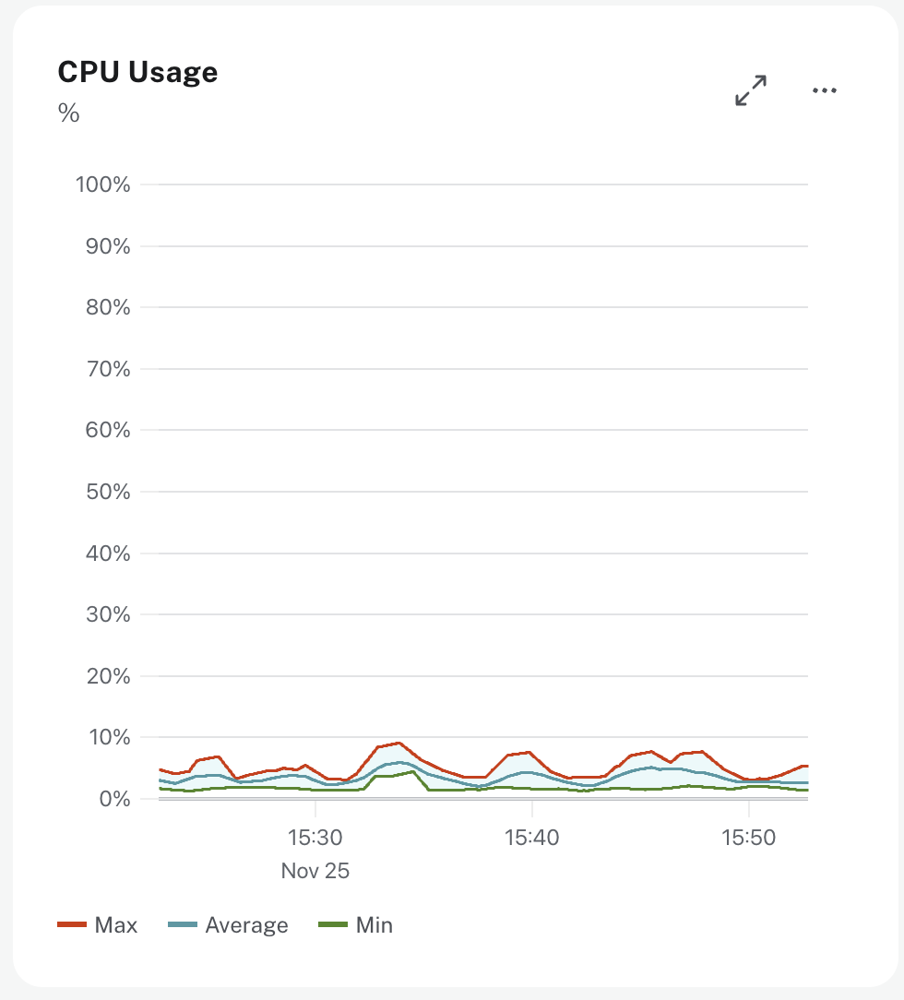

= Monitoring CPU Usage
:type: lesson
:order: 3

// UI Description: CPU usage (cores). CPU is used for planning and serving queries. 
// If this metric is constantly spiking or at its limits, consider increasing the size of your instance.

[.discrete]
== Introduction

CPU is a critical resource for database performance. Your database uses it for planning and executing queries.

In this lesson, you'll learn how to monitor CPU usage, identify bottlenecks, and determine when you need to scale your instance.

== Understanding CPU Metrics

Before you can effectively monitor CPU usage, you need to understand what consumes CPU in Neo4j. CPU is consumed by several key processes.

=== Query Planning and Execution

The query planner analyzes your Cypher statements and creates an execution plan - a series of operations to retrieve your data. This planning process consumes CPU, especially for complex queries.

Once planned, Neo4j executes your query using various operators, each with different CPU costs. **Index seeks** are the most efficient operations, directly accessing specific nodes through indexes. **Label scans** consume moderate CPU by scanning all nodes with a particular label. **Full node scans** are the most expensive operation, fetching every node in your database. **Relationship traversals** expand relationships by type and direction between nodes, with CPU cost proportional to the number of relationships expanded. **Filtering operations** apply `WHERE` clauses to data held in memory, while **sorting and aggregations** can be CPU-intensive for large datasets.

=== Connection and Thread Management  

Every client connection to your database uses CPU through Neo4j's Bolt protocol. **Worker threads** execute your queries and process client requests, **I/O threads** manage network communication with clients, and **transaction threads** handle the transaction lifecycle. Each active connection or transaction holds a thread, and that thread consumes CPU while processing. When you have hundreds of concurrent connections, this can put significant pressure on the CPU which subsequently can cause performance issues.

=== Background Operations

Neo4j periodically performs maintenance tasks that consume CPU. **Checkpointing** writes modified data from memory to disk, while **index updates** keep indexes synchronized as data changes. **Statistics collection** gathers counts of nodes, relationships and properties for the query planner to create efficient execution plans. **Garbage collection** occurs when the Java Virtual Machine (JVM) reclaims memory, often indicating high workloads that lead to memory pressure. Finally, **transaction log management** processes and rotates transaction logs.

== Reading the CPU Usage Chart

Now that you understand what consumes CPU, let's look at how to interpret the CPU metrics in Aura's monitoring dashboard.

The CPU usage chart displays the minimum, maximum, and average percentage of your CPU capacity being used within the timeframe.

In this example, the CPU usage is consistently below 10%, indicating a steady baseline from background operations and regular queries.

You'll typically see a steady baseline like this from background operations and regular queries, but may notice periodic peaks from batch jobs or scheduled tasks, gradual increases as your workload grows over time, and sudden spikes from large queries or unexpected load.

== Identifying CPU Issues

Understanding normal patterns helps you spot problems. CPU issues manifest in three distinct patterns, each requiring different diagnostic approaches.

Use this quick decision guide to identify which pattern you're experiencing:

[mermaid]
----
graph TD
    Start[Observe CPU Usage] --> Decision{What pattern do you see?}
    
    Decision -->|Consistently 70-90% Queries slowing down| P1[Pattern 1: High CPU]
    Decision -->|Regular spikes All queries affected| P2[Pattern 2: Frequent Spikes]
    Decision -->|Sustained 100% Queries failing| P3[Pattern 3: Critical]
    
    P1 --> P1D[Likely: Inefficient queries, too many connections, or missing indexes]
    P2 --> P2D[Likely: Memory pressure, batch operations, or scheduled jobs]
    P3 --> P3D[Emergency: Runaway queries or capacity exceeded]
    
    style P3 fill:#ff6b6b
    style P3D fill:#ff6b6b
----

=== Pattern 1: Consistently High CPU (70-90%)

When your CPU stays consistently high (70-90%), queries start queuing and waiting for available CPU time. Your application users will notice slower response times and increased latency.

The good news? This pattern usually indicates optimization opportunities rather than a genuine need for more resources. Follow this diagnostic path to identify and fix the root cause:

[mermaid]
----
graph TD
    A[High CPU 70-90% Queries slowing down] --> B{What's the cause?}
    
    B --> C[Inefficient Queries?]
    B --> D[Too Many Connections?]
    B --> E[Missing Indexes?]
    
    C --> C1["Run PROFILE MATCH (p:Person)-[:KNOWS]-(f) WHERE f.name = 'Alice' RETURN p"]
    C1 --> C2{Check execution plan}
    C2 --> C3["NodeByLabelScan = millions of hits AllNodesScan = scanning everything Expand with high DB hits"]
    C3 --> C4["Optimize: Filter early, use selective patterns"]
    
    D --> D1[Check active connections vs available cores]
    D1 --> D2{More than 15 per core?}
    D2 -->|Yes| D3["Reduce connections 200 connections on 8 cores = problem Review pool configuration"]
    D2 -->|No| D4[Connections OK]
    
    E --> E1["Look in PROFILE results: Filter after retrieval? No NodeIndexSeek?"]
    E1 --> E2["CREATE INDEX person_name FOR (p:Person) ON (p.name)"]
    E2 --> E3["Restructure query: MATCH (f:Person {name: $name})-[:KNOWS]-(p) Use parameters for plan caching"]
    
    C4 --> F{Did CPU drop?}
    D3 --> F
    D4 --> F
    E3 --> F
    
    F -->|Yes| G["Success! Monitor and maintain"]
    F -->|No| H["All optimizations done? Time to scale instance"]
----

=== Pattern 2: Frequent CPU Spikes

Seeing regular spikes that affect all queries equally? Unlike slow individual queries, these spikes impact your entire database at once. This is often a sign of memory pressure rather than query problems.

Think of spikes as your database taking a "pause" to clean up - when those pauses happen too often or take too long, you'll feel it everywhere. Here's how to diagnose what's causing them:

[mermaid]
----
graph TD
    A["CPU Spiking Regularly All queries degraded at once"] --> B{Check GC Metrics First}
    
    B -->|"GC time >5% ⚠️ Critical"| C["Memory Pressure Problem JVM spending too much time cleaning up memory"]
    B -->|"GC time 1-5% ⚠ Warning"| D["Borderline - investigate before it gets worse"]
    B -->|"GC time <1% ✓ Normal"| E["GC is fine Look for other causes"]
    
    C --> C1["Check heap utilization in metrics dashboard"]
    C1 --> C2{Heap consistently above 90%?}
    C2 -->|Yes| C3["Solution: Increase instance size You need more memory, not query optimization"]
    C2 -->|No| D
    
    D --> D1["Review query logs Look at timestamps"]
    D1 --> D2["Do spikes correlate with: - Specific queries? - Scheduled jobs? - Peak traffic times?"]
    D2 --> D3["Optimize those queries or reschedule operations"]
    
    E --> E1["Check for batch operations ETL jobs, reports, backups"]
    E1 --> E2["Solution: Reschedule to off-peak hours"]
    
    E --> E3["Identify long-running queries holding memory"]
    E3 --> E4["Solution: Optimize or break into smaller chunks"]
    
    E --> E5["Check for lock contention Concurrent writes blocking reads"]
    E5 --> E6["Solution: Separate workloads or adjust timing"]
----

=== Pattern 3: Sustained 100% CPU

This is a critical situation - your database has hit its limit. Queries are timing out, users can't complete transactions, and things are breaking. You need to act fast to restore service, then figure out why this happened.

This flowchart walks you through the emergency response and recovery process:

[mermaid]
----
graph TD
    A["🚨 CPU at 100% Queries failing, timeouts"] --> B["IMMEDIATE ACTION Check Query Monitor"]
    
    B --> C{Spot any long-running queries?}
    
    C -->|"Yes Found the culprit"| D["Terminate runaway queries Use query monitoring to kill specific query IDs"]
    
    C -->|"No Everything looks normal"| E["Check recent deployments New code in last hour? Traffic spike?"]
    
    D --> F{Did CPU drop below 90%?}
    E --> F
    
    F -->|"Yes - Crisis averted"| G["Quick Fixes Buy time while investigating"]
    F -->|"No - Still maxed out"| H["🚨 EMERGENCY SCALE Increase instance size NOW Investigate after service restored"]
    
    G --> G1["Add query timeouts SET query.timeout=30s Prevent future runaway queries"]
    G --> G2["Restrict expensive patterns Temporarily disable heavy analytics or reporting"]
    
    G1 --> I["Root Cause Analysis Why did this happen?"]
    G2 --> I
    H --> I
    
    I --> J{Was this a one-time event or growing trend?}
    
    J -->|"One-time spike e.g. bad query"| K["Apply Pattern 1 fixes: - PROFILE the bad query - Add missing indexes - Optimize query structure"]
    
    J -->|"Sustained growth Traffic increasing"| L["Scale instance permanently Your workload has outgrown current capacity"]
    
    K --> M["Preventive Measures Stop this happening again"]
    L --> M
    
    M --> M1["Set up connection pooling Limit connections per app"]
    M --> M2["Implement rate limiting Protect against traffic surges"]
    M --> M3["Enable query monitoring alerts Catch problems early"]
----

== Optimizing CPU Usage

Now that you can identify CPU issues, let's explore the optimization strategies referenced in the diagnostic flowcharts. Before scaling your instance, these techniques can often resolve performance problems.

=== Query Optimization

Start by identifying your most expensive queries. Use `PROFILE` to see actual CPU costs measured in database hits:

[source,cypher]
----
PROFILE MATCH (p:Person {name: 'Alice'})-[:KNOWS]->(f)
RETURN f.name
----

The **execution plan** shows you exactly where CPU is being spent. Query operations have vastly different costs - an **indexed lookup** might perform 10 **database hits**, while a **full scan** can perform millions. Look for **full scans** (`AllNodesScan` or `NodeByLabelScan` operations examining every node or every node of a label), **high DB hits** (the cumulative number of database operations per operator), **missing indexes** (`Filter` operations happening after data retrieval instead of `NodeIndexSeek` operations that go directly to matching nodes), and **expensive traversals** (`Expand` operations following many relationships without selective starting points).

**Add strategic indexes** for your most common query patterns:

[source,cypher]
----
CREATE INDEX person_name FOR (p:Person) ON (p.name)
----

This single index can reduce a query from millions of operations to just a few.

**Use query parameters** to enable **plan caching** - Neo4j won't need to replan the same query structure repeatedly:

[source,cypher]
----
// Avoid - replanned every time
MATCH (p:Person {name: 'Alice'}) RETURN p;
----

Instead, use parameters to enable plan caching:

[source,cypher]
----
// Good - plan is cached
MATCH (p:Person {name: $name}) RETURN p;
----

**Specify node labels** in your patterns - this helps Neo4j narrow down the search space:

[source,cypher]
.Avoid - must check all nodes
----
MATCH (p)-[:KNOWS]->(f)
----

Instead, specify the node label used to find the starting point(s) of the query:

[source,cypher]
.Good - Neo4j knows to check only Person nodes
----
MATCH (p:Person)-[:KNOWS]->(f:Person)
----

== Monitoring CPU Patterns by Workload Type

Once you can diagnose and fix CPU issues, implement these ongoing monitoring strategies tailored to your workload type. Different workloads create distinct CPU patterns that help you identify what's consuming CPU and whether you need optimization or scaling.

=== Read-Heavy Workloads

Read-heavy workloads show regular spikes during complex queries or aggregations, with baseline CPU generally lower than write workloads. Simple indexed lookups consume minimal CPU, but analytics queries scanning large portions of the graph can spike usage to 100%. Page cache misses add overhead as CPU waits for disk I/O.

**Optimize** by caching frequently accessed data at the application layer and ensuring your hot data fits in memory. Add indexes for common query patterns to reduce expensive scans.

**Scale horizontally** by adding secondary servers for temporary read spikes like end-of-quarter reports or traffic surges - this distributes read queries across multiple instances. For sustained high read CPU, scale instance size vertically for more cores, which is more cost-effective than running permanent replicas.

=== Write-Heavy Workloads

Write-heavy workloads show sustained high CPU during peak write periods with more consistent patterns than reads. Writes consume CPU through transaction log writes, index updates for all indexed properties (a major contributor), data structure updates on disk, statistics collection for the query planner, and consistency checks.

**Optimize** by batching operations - process 1,000 updates in one transaction instead of 1,000 individual transactions. Review your indexed properties since each index adds write overhead. Schedule bulk operations during off-peak hours to reduce impact on normal workloads.

**Always scale vertically** by increasing instance size for more CPU cores. Write operations must go through the primary instance to maintain consistency, so horizontal scaling with secondaries does NOT reduce write-related CPU load on the primary.

=== Mixed Workloads (OLTP + OLAP)

Mixed workloads show high CPU with many active connections but low query throughput - queries are waiting rather than executing. Background writes hold locks that block concurrent reads while long-running analytics queries occupy thread pool threads for extended periods. This causes short transactional queries to queue despite available CPU capacity.

**Optimize** by separating workloads - use different connection pools for transactional versus analytics queries. Schedule heavy batch operations during dedicated time windows and implement query timeouts to prevent thread starvation.

**Analyze your metrics first** to determine if writes (requiring vertical scaling) or reads (allowing horizontal scaling) drive your CPU consumption, then apply the appropriate scaling strategy based on the dominant workload type.

[TIP]
.Proactive vs Reactive Scaling
====
Monitor CPU trends over weeks and months. Scale when you'll reach 80% sustained utilization within your planning horizon, not when you hit 100% and users are experiencing problems.

Proactive scaling prevents performance degradation. Reactive scaling means users suffer through slow queries while you scramble to add capacity.
====

[.quiz]
== Check Your Understanding

include::questions/1-cpu-action.adoc[leveloffset=+1]

[.summary]
== Summary

You now understand how CPU is actually used in Neo4j and how to monitor CPU usage for your Aura instances. You've learned what specific operations consume CPU - from efficient **index seeks** to expensive **full scans** - and how **query execution operators** differ in CPU cost (sometimes by millions of operations). You understand the role of **thread pools** in managing **concurrent connections**, how to use `PROFILE` to identify **expensive operations**, specific optimization techniques to reduce CPU consumption, and how to recognize and diagnose CPU issues through concrete examples.

With this knowledge, you can identify whether high CPU usage is due to **inefficient queries**, too many **connections**, or genuine **capacity limits** - and take appropriate action.

In the next lesson, you'll learn how to monitor storage consumption and query rates.

