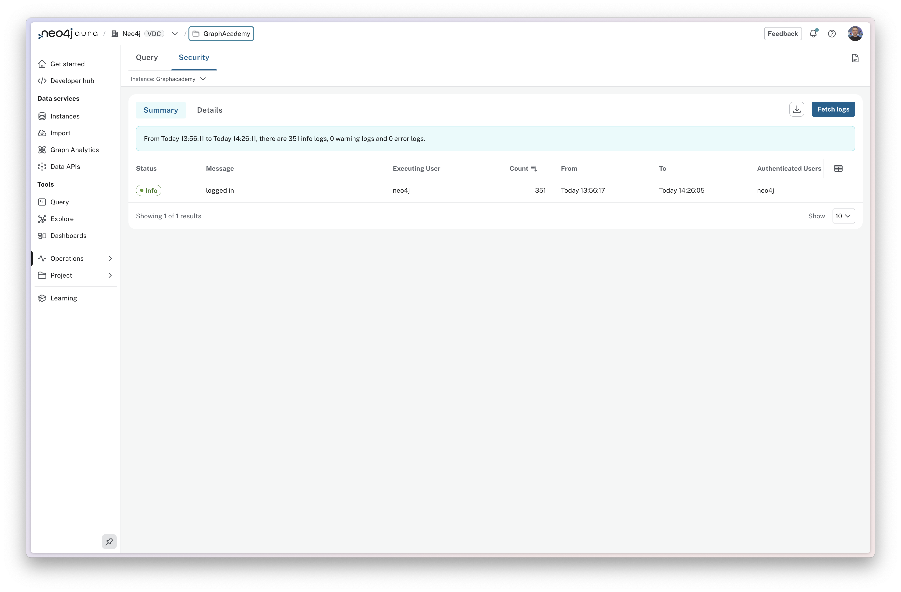

= Accessing logs
:type: lesson
:order: 1

[.slide.discrete]
== Introduction

When managing a Neo4j Aura instance, logs are essential for understanding database activity, diagnosing issues, and maintaining security.

In this lesson, you'll learn about the types of logs available in Aura, how to access them, and what information they provide.

[.slide.col-2]
== Understanding log types

[.col]
====
Aura provides two types of logs to monitor different aspects of your database: **query logs** and **security logs**.

You can access logs by expanding the **Operations** menu and selecting **Logs**.
====

[.col]
====
image::images/logs-menu.png[Operations menu with Logs option highlighted]
====

[.slide.discrete.overflow-hidden.col-2]
=== Switching log types

[.col]
====
You can access the category of logs using the tabs at the top of the screen.
====

[.col]
====

====

[.slide.discrete]
=== Log Tabs

The **Summary** view provides an aggregated view of the logs, grouping the logs and showing occurrences of each, while the **Details** view provides a detailed view of each log entry.

You can switch between the two types of logs by clicking the appropriate tab at the top of the screen.

[.slide]
== Exploring query logs

Query logs provide detailed visibility into every query executed against your database within the selected time period.

The **Summary view** shows an aggregated list grouped by the Cypher query.  This provides you with an overview of the most common queries and provides an insight into their performance.

* **Status**: The status of the query.
* **Count**: The number of times a query has been executed.
* **From**: The first time the query was executed.
* **To**: The last time the query was executed.
* **Total time spent**: The total time spent executing the queries.
* **Average time**: The average time spent executing the queries.

This view helps you to identify slow or inefficient queries, track query patterns and frequency, and optimize database operations.

The **Details view** provides the data on each individual query execution.

[.slide]
== Understanding security logs

Security logs track authentication and authorization events against your instance.

* **Status**: The status of the event.
* **Message**: The message of the event.
* **Executing user**: The user who performed the action.  This could be different from the authenticated user if the action was link:https://neo4j.com/docs/operations-manual/current/authentication-authorization/dbms-administration/#access-control-dbms-administration-impersonation[performed through impersonation^].
* **Count**: The number of times an event has occurred.
* **From**: The first time the event occurred.
* **To**: The last time the event occurred.
* **Authenticated users**: The user(s) whose credentials were used to log in.

This view can help diagnose issues with authentication and authorization, and identify the number and source of connections to your database.

You can download the logs for further analysis or compliance purposes.

[.quiz]
== Check your understanding

include::questions/1-log-types.adoc[leveloffset=+1]

[.summary]
== Summary

In this lesson, you learned about the two types of logs available in Aura: **query logs** and **security logs**.

Query logs provide detailed visibility into database operations through two views:

* **Summary view**: Aggregated query patterns showing execution count, total time spent, and average time
* **Details view**: Individual query executions for investigating specific issues

Security logs track authentication and authorization events, helping you monitor access and identify connection patterns.

In the next lesson, you'll learn how to use query logs to identify and troubleshoot slow or problematic queries.

