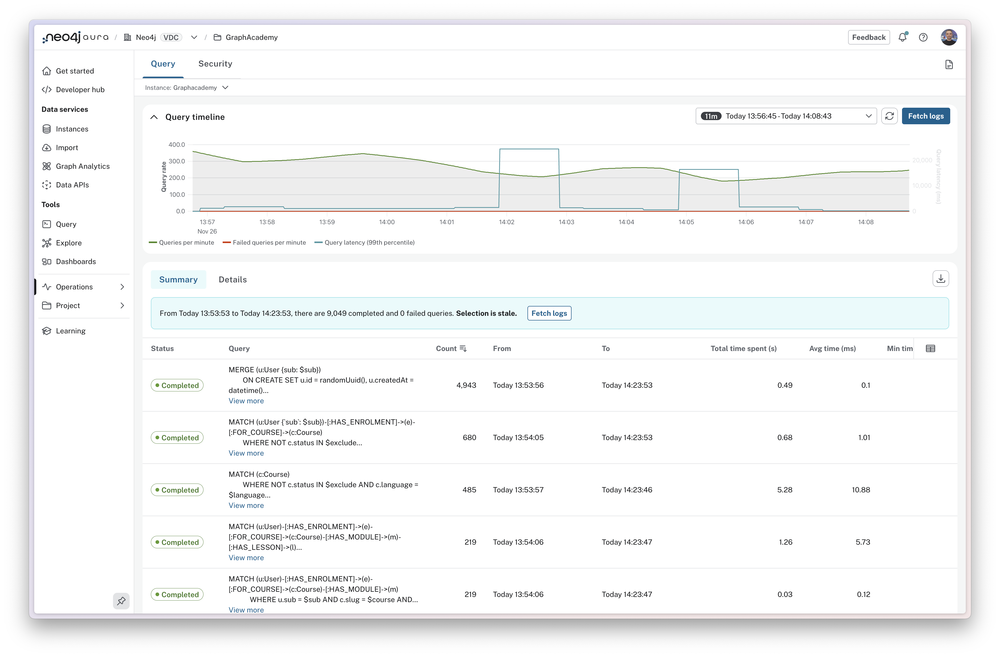
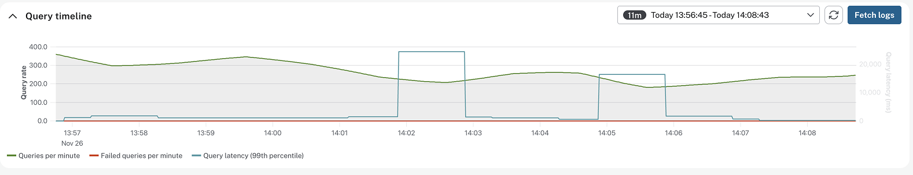

= Working with Query Logs
:type: lesson
:order: 2

[.slide.discrete]
== Introduction

When you're managing a production database, understanding what queries are running and how they're performing is absolutely critical.

In this lesson, you'll learn how to use the query logs to identify and troubleshoot slow or problematic queries.

[.slide.col-2.reverse]
== Understanding what query logs capture

[.col]
====

====

[.col]
====
When a query is executed against your Neo4j Aura instance, it is saved to the query log along with the following information:

* When the query ran (timestamp)
* Execution duration (in milliseconds)
* Success or failure status
* The user who executed it
* The application or driver that sent it
* Any error messages if it failed

This information helps you diagnose performance issues, troubleshoot errors, and optimize your database before problems impact users.
====

[.slide]
== Reading the query timeline

The query timeline at the top of the page shows aggregated information for the period selected in the time period filter.
The chart includes counts of _total queries per minute_ and _failed queries per minute_.

The chart also shows _Query latency_ for the _99th percentile_ of queries, highlighting the time taken to execute the slowest running queries.

If you spot a spike in any of these metrics, you can drag to highlight the period of time to zoom in for further investigation.

[.slide]
== Comparing summary and details views

The query log interface has two views.

* **Summary view** - groups identical queries together and shows aggregate statistics
* **Details view** - shows individual executions for specific investigation

[.slide]
=== Summary View

**Summary view** groups identical queries together and shows aggregate statistics: execution count, total time spent, and average execution time.  This view is useful for identifying commonly run queries, queries with poor performance, and queries with variations in performance.

The **Total time spent** column shows the total amount of time spent executing the queries. This is a useful metric for identifying queries that are consuming the most database time.  Even small improvements to queries that are run frequently can have a significant impact on performance.

The **Average time** column shows the average amount of time spent executing the queries. This is a useful metric for identifying queries that are consistently slow.

A large difference between the **Min time** and **Max time** columns is a good indicator of variability in query performance. This can be caused by a variety of factors, for example the query running through a node with a high number of relationships.

[.slide]
=== Details View

The **Details view** shows individual query executions. This view includes additional information on a query-by-query basis, including the time it took to execute the query, the user who executed it, the driver that executed it, and the application that executed it.

This information can be useful when investigating specific issues, like what happened at a particular time, or why some runs of a query are slower than others.

[.slide]
== Filtering query logs

[.transcript-only]
====
You can filter query logs by the following criteria:
====

[cols="2,4,1,3", options="header"]
|===
|Filter
|Description
|Type
|Example

|Time Period
|Filter by when queries ran
|Date Range
|Last 24 hours, Last hour, Custom range

|Status
|Filter by completion status
|Enum
|Completed, Failed

|GQL Status Code
|Filter by Graph Query Language status code
|Enum
|00000 (Success), 42000 (Syntax error), 22000 (Constraint error)

|User
|Filter by database username
|Enum
|neo4j, app_user

|Driver
|Filter by Neo4j client driver
|Enum
|neo4j-python/5.9.0, neo4j-javascript/5.14.0

|Application Name
|Filter by custom application name set in driver configuration
|Enum
|inventory-service, browser, my-app

|Minimum Duration
|Show only queries taking longer than specified milliseconds (primary tool for finding slow queries)
|Number
|1000 (1 second), 5000 (5 seconds)

|Query Text
|Search within Cypher query text (case-insensitive, partial matches)
|Text
|Product, CREATE, DELETE

|Error Text
|Search within error messages
|Text
|terminated, constraint, memory, locked

|===

[TIP,role=transcript-only]
.Setting a custom application name
====
You can configure your application to use a custom application name.

[source,python]
.Setting the user agent in Python
----
driver = GraphDatabase.driver(
    uri,
    auth=(user, password),
    user_agent="inventory-service"
)
----

link:/courses/drivers-python/[Learn more in Using Neo4j with Python^]
====

[.slide]
== Finding slow queries

Here's a practical workflow for identifying slow queries:

1. **Set your filters**: Time period (e.g., last 24 hours), Status: "Completed", Minimum duration: 1000ms
2. **Switch to Summary view**: Sort by "Total time spent" (descending) to see which queries consume the most database time
3. **Identify high-impact queries**: Look for queries with high total time—either they run frequently or they're individually slow.  You can sort the table by clicking the column headers.
4. **Investigate in Details**: Click a query to see individual executions. Are all runs slow, or just some? This reveals patterns
5. **Combine filters**: Add driver or application filters to narrow your analysis further

[.slide.discrete]
=== Common patterns

Here are some common patterns to look for:

* **Queries with a high count** - Queries that are run frequently. This is a good indicator of a query that is being used heavily.
* **Queries with a high total time spent** - Queries that are taking a long time to execute may indicate queries that can be optimized.
* **Queries with a high discrepancy between the minimum and maximum times** - These queries may be hitting dense nodes with many relationships, and can be a sign that the data model should be refactored to improve performance.
* **Queries with a high number of page hits** - This is a sign that the query may be looking at too much of the graph, is not using indexes, and either the query or data model could be optimized to improve performance.
* **Queries with a high number of page faults** - This is a sign that the memory allocation for your instance is too small to fit your data into memory.

We will take a look at monitoring page cache metrics later on in this course.

[.quiz]
== Check your understanding

include::questions/1-finding-slow-queries.adoc[leveloffset=+1]

include::questions/2-summary-view-metric.adoc[leveloffset=+1]

[.summary]
== Summary

In this lesson, you learned how to use query logs to find and troubleshoot queries.

Query logs capture timing, status, user, application, and error information for every query execution.

The Summary view shows aggregate statistics to identify patterns and high-impact queries. The Details view shows individual executions for specific investigation.

Key filters include time period, status, minimum duration (for slow queries), user, driver, application name, query text, and error text. Combine filters to answer specific questions.

The workflow for performance investigation: start broad with Summary view, identify high-impact queries, apply filters, then use Details view for specific patterns.

In the next lesson, you'll apply these skills in a practical challenge.

