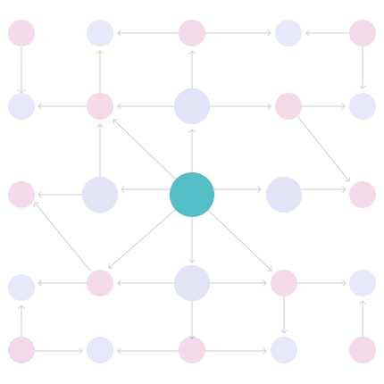
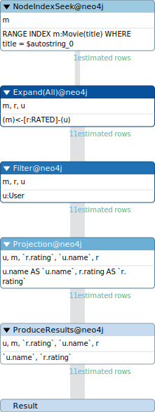
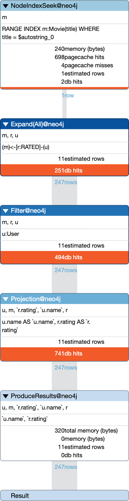
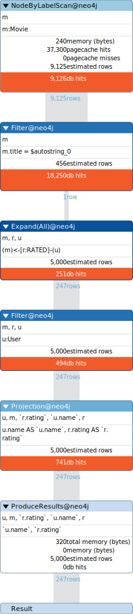

= Optimizing Query Performance
:type: lesson
:order: 4

[.slide.discrete]
== Introduction

So far in this module, you have learned how to access and interpret query logs to identify slow queries. Query logs become most valuable when you use them to systematically improve your database performance.

In this lesson, you will learn how to use query logs to identify problematic queries, and tips on how to optimize them.

[.slide]
== Understanding Query Optimization

**Query optimization** is the process of improving query performance by identifying slow queries and applying specific techniques to make them faster. Slow queries impact user experience and consume valuable database resources.

The most important metric for prioritization is **total time spent**, calculated as frequency multiplied by duration. A query running 1,000 times at 500ms has more total impact than a query running once at 60 seconds, despite being individually faster.

[.slide.col-2]
== How Cypher Queries Work

[.col]
====
Cypher queries execute in two phases: finding **anchor nodes** then expanding **relationships**.

**Anchor nodes** are the starting points. Neo4j locates these nodes first, then expands outward by _traversing_ relationships.

====

[.col]
====

====

[.slide.discrete]
=== Quick tips

* The fewer anchor nodes you have, the faster your query will run.
* Filter data as early as possible to reduce work in later stages.
* The fewer relationships you traverse, the faster your query will run.
* The more specific the relationship types you use, the faster your query will run.
* Using indexes helps Neo4j quickly find anchor nodes.

[.slide]
== Identifying Queries to Optimize

Query logs help you find queries that need optimization. Use the filter to show queries with a minimum duration above 1000ms to focus on slow queries.

The **Summary tab** shows aggregated data for each unique query. Sort by total time spent to identify queries with the highest overall impact on your database. Look for queries that appear frequently and calculate their total impact by multiplying frequency by average duration.

User-facing queries should be prioritized over background jobs. A slow query in your application's main workflow directly hurts user experience. Background processing jobs can often tolerate longer execution times.

[.slide]
== Analyzing Query Performance

For each slow query, examine the key metrics in the query logs. The **duration** tells you how long the query takes and whether it's consistently slow or variable. The **planning time** reveals whether the query is parameterized.

High planning time above 100ms often indicates non-parameterized queries that cannot reuse execution plans.

**Page faults** indicate that data is not in cache and must be read from disk. High page faults suggest missing indexes or insufficient memory. Review the execution pattern to understand when the query runs, how often, and what triggers it.

[.slide]
== Optimizing Queries

You can prefix your queries with **EXPLAIN** and **PROFILE** to understand query execution. `EXPLAIN` shows the planned execution steps without running the query. `PROFILE` executes the query and returns detailed statistics about actual performance.

[.slide.col-2]
=== Explain

`EXPLAIN` shows the planned execution steps without running the query.

[.col]
====

[source,cypher]
----
EXPLAIN
MATCH (u:User)-[r:RATED]->(m:Movie)
WHERE m.title = 'Toy Story'
RETURN u.name, r.rating
----
====

[.col]
====

====

[.slide.col-2]
=== Profile

[.col]
====
`PROFILE` shows the actual number of database hits, rows returned, and time spent in each operation. Look for operations with high database hits or rows to identify bottlenecks.

[source,cypher]
----
PROFILE
MATCH (u:User)-[r:RATED]->(m:Movie)
WHERE m.title = 'Toy Story'
RETURN u.name, r.rating
----

// When reading execution plans, start from the bottom operator and read upward. The bottom operators show how Neo4j finds anchor nodes, and operators higher up show how relationships are expanded and filtered.

====

[.col]
====

====

[.slide.col-2]
== Example 1: Missing Index

[.col]
====

Consider this query that appears frequently in your query logs with high duration and page faults:

[source,cypher]
----
MATCH (u:User)-[r:RATED]->(m:Movie)
WHERE m.title = 'The Matrix'
RETURN u.name, r.rating
----

Running `PROFILE` on this query shows high database hits because Neo4j must scan all `Movie` nodes and check the `title` property of each one.

====

[.col]
====

====

[.slide]
=== Solution

Create an index on the `title` property to enable fast lookups:

[source,cypher]
----
CREATE INDEX movie_title FOR (m:Movie) ON (m.title)
----

[.slide.col-2]
=== Affect

[.col]
====
After creating the index, you will now see the NodeByLabelScan operator replaced with the NodeIndexSeek operator.
====

[.col]
====

====

// After creating the index, the same query now takes only 5ms. The optimized version should also use parameters and return only needed properties instead of the entire node:

// [source,cypher]
// ----
// MATCH (m:Movie)
// WHERE m.title = $title
// RETURN m.title, m.released, m.tagline
// ----

////
[.slide]
== Example 2: Multiple MATCH Clauses

This query uses two separate MATCH clauses to find actors and directors:

[source,cypher]
----
MATCH (m:Movie {title: 'The Matrix'})
MATCH (m)<-[:ACTED_IN]-(actor:Person)
MATCH (m)<-[:DIRECTED]-(director:Person)
RETURN m.title, collect(actor.name) AS actors, collect(director.name) AS directors
----

The second and third MATCH clauses create a cartesian product, causing Neo4j to process all combinations of actors and directors. Use a **list comprehension** to collect each relationship type separately:

[source,cypher]
----
MATCH (m:Movie)
WHERE m.title = $title
RETURN m.title,
  [(m)<-[:ACTED_IN]-(actor:Person) | actor.name] AS actors,
  [(m)<-[:DIRECTED]-(director:Person) | director.name] AS directors
----

The optimized query eliminates the cartesian product, uses a parameter, and processes each relationship type independently. This reduces duration from 2000ms to 50ms.

[.slide]
== Example 3: Filtering on Relationship Properties

This query finds users who gave 5-star ratings by filtering on a relationship property:

[source,cypher]
----
MATCH (u:User)-[r:RATED]->(m:Movie)
WHERE r.rating = 5
RETURN u.name, m.title
----

This query must traverse all `RATED` relationships and check each rating property. When this pattern appears frequently in your query logs, consider modeling the rating as a **specific relationship type** instead.

Create new `RATED_5` relationships for highly-rated movies:

[source,cypher]
----
MATCH (u:User)-[r:RATED]->(m:Movie)
WHERE r.rating = 5
MERGE (u)-[:RATED_5]->(m)
----

Now the optimized query can match the specific relationship type directly:

[source,cypher]
----
MATCH (u:User)-[:RATED_5]->(m:Movie)
RETURN u.name, m.title
----

////

[TIP,role="hint transcript-only"]
.Modeling for performance
====
You can learn more about effective graph modeling in link:/courses/modeling-fundamentals[Graph Data Modeling Fundamentals^].
====

[.slide]
== Query Optimization Checklist

When analyzing slow queries, check for these common issues:

* **Variable length paths have upper limits**: Use `[\*1..5]` instead of `[*]` to prevent excessive traversals
* **Node labels are specified**: Use `MATCH (u:User)` instead of `MATCH (u)` to avoid scanning all nodes
* **Properties have indexes**: Create indexes on properties used in `WHERE` clauses and lookups
* **Relationship types are specified**: Always provide relationship types to narrow traversals
* **Relationship directions are specified**: Always specify the direction of the relationship when it is known
* **Queries use parameters**: Replace literal values with `$parameter` to enable plan caching
* **Return only needed properties**: Use `RETURN u.name, m.title` instead of `RETURN u, m` to reduce data transfer
* **Result sets are limited**: Add `LIMIT` clauses to prevent returning excessive data

[.quiz]
== Check Your Understanding

include::questions/1-query-prioritization.adoc[leveloffset=+1]

include::questions/3-profile-vs-explain.adoc[leveloffset=+1]

[.summary]
== Summary

Query optimization uses query logs to identify and fix performance problems. Prioritize queries by total time spent, which is frequency multiplied by duration, to find queries with the highest overall impact.

Use `EXPLAIN` and `PROFILE` to understand query execution before making changes. Common optimizations include adding indexes for property lookups, using list comprehensions instead of multiple MATCH clauses to avoid cartesian products, and modeling frequently filtered relationship properties as specific relationship types. Always measure baseline performance before optimizing and validate improvements in query logs after deployment.
