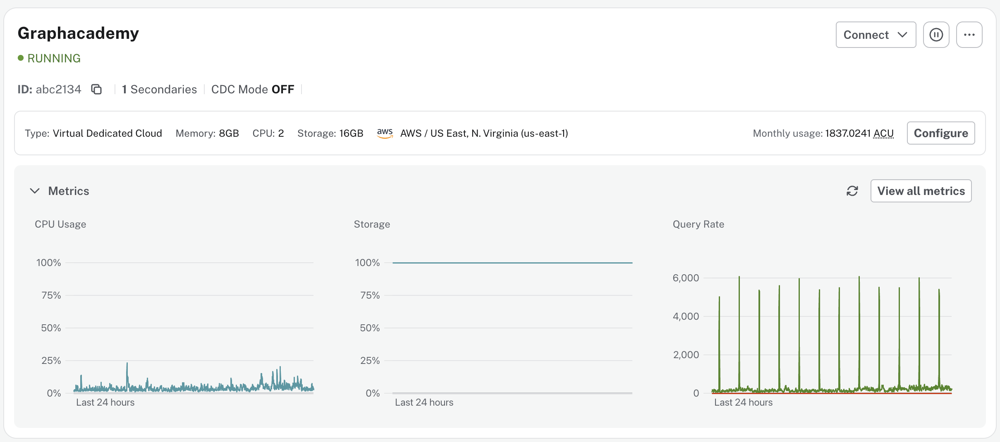
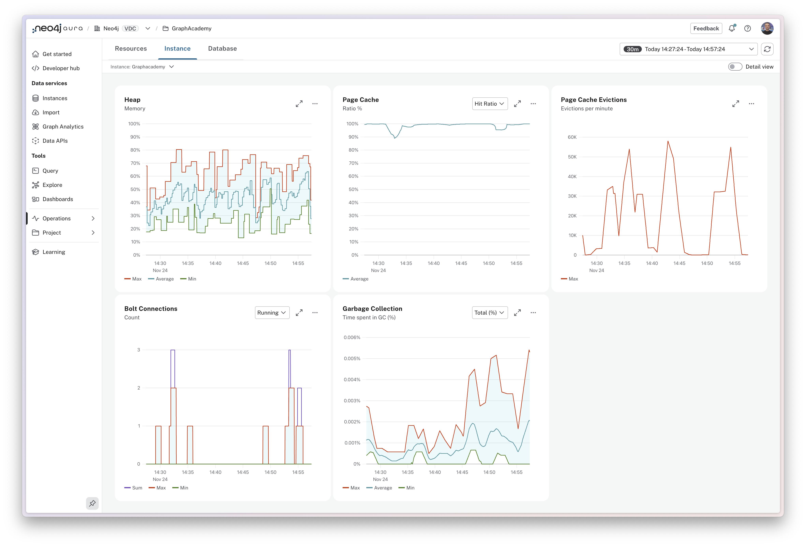
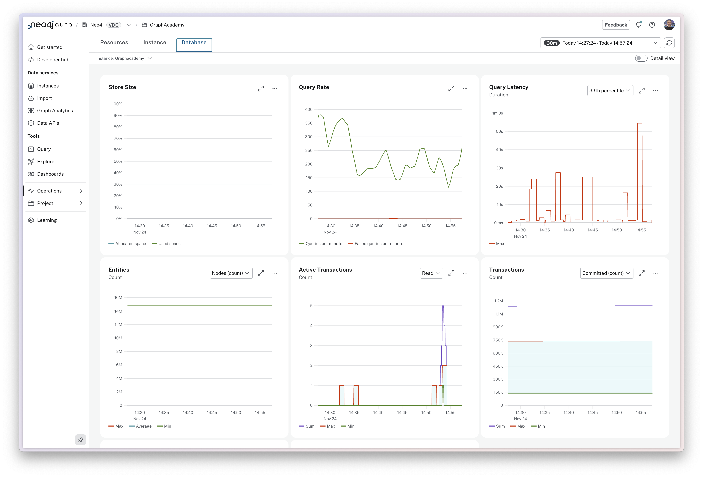
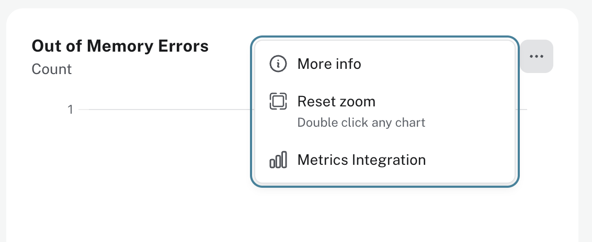

= Viewing your metrics
:type: lesson
:order: 1

[.slide.discrete]
== Introduction

The Metrics dashboard is your primary tool for monitoring the health and performance of your Aura instances.

In this lesson, you'll learn how to navigate the Metrics dashboard and understand the three main monitoring categories: Resources, Instance, and Database.

[.slide.col-2.reverse]
== Accessing instance metrics

[.col]
====
image::images/instance-card.png[Metrics section at the bottom of an instance card]
====

[.col]
====
You can access the top-level metrics for an instance, CPU Usage, Storage, and Query Rate for the last 24 hours, by expanding the **Metrics** section at the bottom of each instance card.
====

[.slide.col-2.reverse]
=== Viewing all metrics

[.col]
====

====

[.col]
====
From the expanded **Metrics** section, you can access the full set of metrics for the instance by clicking the **View all metrics** button.

This page can also be accessed directly from the left menu by expanding the **Operations** menu and selecting **Metrics**.
====

[.slide.col-2.reverse]
== Metrics Dashboard

[.col]
====
image::images/metrics-resources.png[Metrics dashboard]
====

[.col]
====
Metrics for your Neo4j Aura instances are split into three categories that can be accessed from the tabs at the top of the dashboard.
====

[.slide.col-2.reverse.discrete]
=== Resources

[.col]
====
image::images/metrics-resources.png[The resources tab]
====

[.col]
====
The **Resources** tab provides access to the resource utilization metrics for your instance.

* **CPU Usage**: The minimum, maximum, and average percentage of your CPU capacity being used within the timeframe.
* **Storage**: The percentage of disk space that is being used to store your data.
* **Out of Memory Errors**: The number of times your instance has run out of memory.  This is a critical metric and should be monitored closely.
====

[.slide.col-2.reverse.discrete]
=== Instance

[.col]
====

====

[.col]
====
The **Instance** tab provides access to the instance-level metrics that monitor the health and performance of your deployment.

* **Heap**: Shows min, max, and average heap memory use for query execution and managing your graph.
* **Page Cache**: Percentage of time needed data is found in memory, boosting query speed by reducing disk reads.
* **Page Cache Evictions**: Times per minute data is swapped out of memory—frequent spikes may mean your page cache is too small.
* **Bolt Connections**: Number of connections actively running Cypher transactions.
* **Garbage Collection**: Percentage of time spent freeing memory. Higher values suggest workloads are straining available memory.

====

[.slide.col-2.reverse.discrete]
=== Database

[.col]
====

====

[.col]
====
The **Database** tab provides access to metrics around the data stored in your instance.

* **Store Size**: Percentage of allocated and used space—shows your instance’s total data size.
* **Query Rate**: Queries executed per minute.
* **Query Latency**: How long queries take to run. 50th percentile is typical; 75th and 99th spotlight slower queries and trends.
* **Entities**: Total nodes and relationships, so you can track your graph’s growth.
* **Active Transactions**: Transactions currently underway per minute.
* **Transactions**: Total number of transactions run since startup.
* **Replan Events**: How often Cypher rebuilds query plans—frequent replans may mean inefficient queries or recent schema changes.

====

[.slide.col-2.reverse]
== Individual cards

[.col]
====
image::images/card-with-tooltip.png[Card with tooltip,width=90%]
====

[.col]
====
As you hover over a card, a tooltip will appear with the current value of the metric.

A dotted line will appear on the other cards in the view to allow you quickly view the values of the other cards at that time.
====

[.slide.col-2.reverse.discrete]
=== Context menu

[.col]
====

====

[.col]
====
Each card  has a context menu that is accessed by clicking the three dot icon in the top right corner of the card.

// The menu allows you to:

* **More info**: Access a text description of the metric and its purpose.
* **Reset zoom**: Reset the zoom level of the chart to the default.
* **Metrics Integration**: Access additional information on how to use this metric with external monitoring tools.
====

[TIP,role=transcript-only]
.View reports in full screen
====
The arrows icon in the top right corner of the card allows you to expand the card to fill the screen.
====

[.slide]
== Understanding your metrics

As we move through the module, you will learn how to interpret each of these metrics and how to use them to identify and troubleshoot issues with your Aura instances.

[.quiz]
== Check Your Understanding

include::questions/1-dashboard-navigation.adoc[leveloffset=+1]

[.summary]
== Summary

You now know how to navigate the Metrics dashboard for your Aura instances.

You've learned about the three main monitoring categories - Resources, Instance, and Database - and how to use dashboard controls to customize your view.

In the next lesson, you'll learn how to monitor CPU usage and identify performance bottlenecks.

