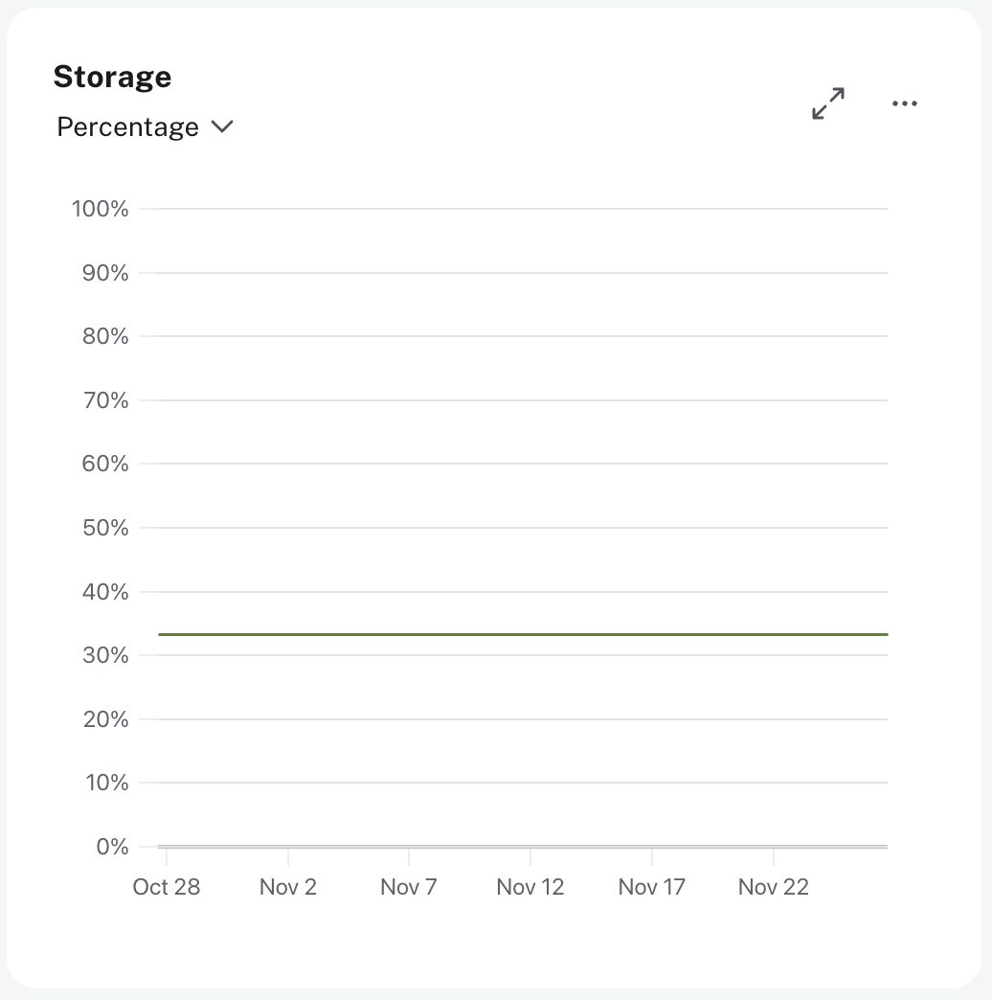
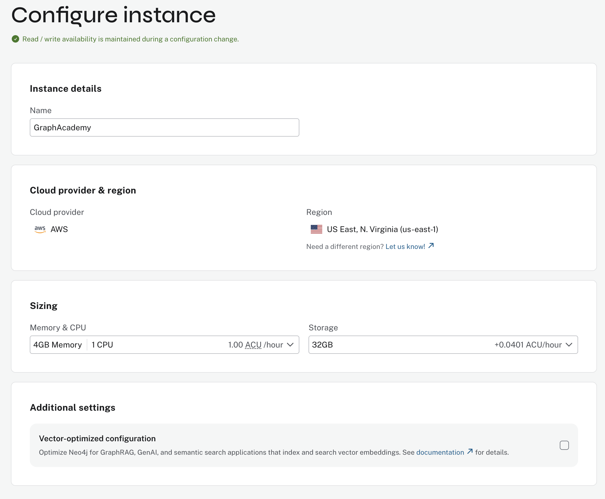

= Monitoring storage consumption
:type: lesson
:order: 5

// UI Description:
// Amount of disk space reserved to store user database data, in bytes. Ideally, the database should all fit into memory (page cache) for the best performance. Keep an eye on this metric to make sure you have enough storage for today and for future growth. Check this metric with page cache usage to see if the data is too large for the memory and consider increasing the size of your instance in this case.

[.slide.discrete]
== Introduction

Now that you understand how to monitor query rates and CPU utilization, you'll learn how to monitor storage consumption to identify growth trends and plan for future capacity.

Storage monitoring helps you avoid running out of disk space and ensures your database has room to grow as your application scales.

[.slide.col-2.reverse]
== Monitoring Storage

[.col]
====

====

[.col]
====
The **Storage** metric shows the total size of the data stored in your instance, and the percentage of the total allocated space that is currently in use.

Storage is consumed by:

* Node and relationship data
* Property values
* Indexes (especially full-text and vector indexes)
* Transaction logs
====

[.slide]
== Understanding storage growth

Over the lifecycle of an application, you should see a steady increase in storage usage as the data grows.

While the raw metric is important to understand the total size of your graph, it is also important for considering the size of your **page cache**.

The page cache holds an in-memory version of your graph data, which is used to speed up query performance.

If your graph is too large for the page cache, you will start to see performance degradation as queries are forced to read from disk.

You will learn more about page cache usage and evictions in the next module.

You should monitor storage for:

* **Linear growth**: Steady data addition over time is normal. A steep increase in storage is good news for your business, but may mean you need to consider scaling your instance storage to handle the increased load.
* **Sudden jumps**: Large data imports or batch operations may increase the store size significantly and bring it closer to or over the allocated space.

[.slide]
== Deciding when to scale

You should consider scaling your instance when:

* **Storage reaches 70-80% of capacity**: This gives you time to plan and execute changes before reaching critical levels
* **Growth rate suggests limits within 30 days**: Calculate your average daily/weekly growth to predict when you'll hit limits
* **Storage grows faster than expected**: Investigate unexpected increases that deviate from your baseline
* **You're planning a large data import**: Proactively check capacity before bulk operations

This may mean that you need to move to a different instance size or tier.

[.slide.col-2.reverse.discrete]
=== Scaling your instance

[.col]
====

====

[.col]
====
To resize your instance, navigate to the Instances page, locate your instance and click the **Configure** button.

You will be taken to a new screen where you can increase the size of your instance.

Select the Memory & CPU and Storage combination that gives you sufficient storage capacity and room for future growth.

You may need to increase the Memory & CPU combination to select a larger storage capacity.
====

[IMPORTANT,role=transcript-only]
.Proactive monitoring is key
====
Don't wait until you hit storage limits. Set up regular checks of your storage metrics and growth trends. Proactive planning prevents emergency situations and service disruptions.
====

[.quiz]
== Check Your Understanding

include::questions/1-storage-query.adoc[leveloffset=+1]

[.summary]
== Summary

You now know how to monitor storage consumption for your Aura instances.

You've learned to identify normal patterns, understand storage growth trends, and take action when approaching storage limits.

Key takeaways:

* Monitor storage proactively and take action at 70-80% capacity
* Scale your instance or upgrade your tier when needed
* Optimize existing storage before scaling when possible
* Implement data retention policies to manage growth

In the next module, you'll learn about instance-level performance metrics including memory usage, page cache, and garbage collection.

