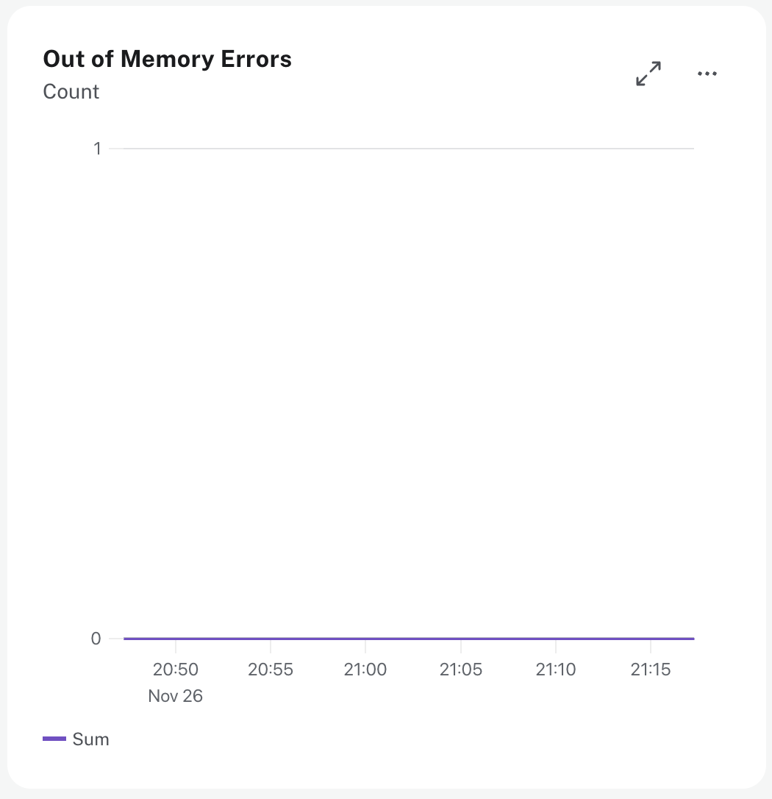

= Out of Memory Errors
:type: lesson
:order: 9

== Introduction

// UI Description: The total number of Out of Memory Errors for the instance. Consider increasing the size of the instance if any OOM errors.

Out of Memory errors are critical failures that occur when the Java Virtual Machine (JVM) cannot allocate memory for an operation, even after attempting garbage collection.

In this lesson, you will learn how to identify, monitor, and respond to Out of Memory errors in your Aura instance.

== Understanding Out of Memory Errors

When an Out of Memory error occurs, the JVM attempts to allocate memory for an operation but finds insufficient space available. The garbage collector runs to free up memory, but if it cannot reclaim enough space, the JVM throws an `OutOfMemoryError`. The operation fails immediately, and any queries or transactions in progress may be terminated.

Out of Memory errors have immediate and severe consequences for your database. Queries and transactions fail, and application performance degrades significantly. These errors will find their way into your application, making this a critical incident that requires immediate attention.

=== Common Causes of Out of Memory Errors in Neo4j

Out of Memory errors occur when memory demand exceeds available capacity. Understanding the common causes helps you prevent and resolve these critical incidents.

**Query-level issues** can be a frequent source of Out of Memory errors. Queries that return millions of nodes or relationships without `LIMIT` clauses consume enormous amounts of memory. Collecting entire graph traversals into memory rather than processing them incrementally also leads to memory exhaustion.

**Memory-intensive operations** create additional pressure. Cartesian products from missing join conditions generate massive intermediate result sets. Complex aggregations on large datasets consume excessive memory. Inefficient path-finding without constraints similarly causes problems.

**Long-running transactions** compound the problem. They hold memory for extended periods. When transactions remain open too long, they accumulate changes in memory before commit. Multiple large operations within a single transaction can quickly exhaust available heap space.

**Increased concurrent query load** can push an instance beyond its memory capacity.

=== How Out of Memory Errors Appear in Application Code

When an Out of Memory error occurs, your application code receives an error indicating that the operation failed due to memory exhaustion. All Neo4j errors include a **GQL status code** that corresponds to the ISO GQL standard link:https://neo4j.com/docs/status-codes/current/errors/gql-errors/[Status Codes for Errors & Notifications^].

When an Out of Memory error occurs, you'll typically see one of the following GQL status codes in your application error logs:

* `25N16` - **Transaction termination transient error**: The transaction has been terminated due to a transient error such as memory exhaustion. Retry your operation in a new transaction link:https://neo4j.com/docs/status-codes/current/errors/gql-errors/25N16/[25N16^].
* `51N36` - **Out of memory**: There is not enough memory to perform the current task link:https://neo4j.com/docs/status-codes/current/errors/gql-errors/51N36/[51N36^].
* `51N73` - **Transaction memory limit reached**: The transaction uses more memory than is allowed link:https://neo4j.com/docs/status-codes/current/errors/gql-errors/51N73/[51N73^].

The key indicator is the error message mentioning that the transaction has been terminated.

This termination occurs when the database cannot allocate sufficient memory to complete the operation, even after attempting garbage collection. The GQL status code provides additional context about the specific type of resource constraint that caused the failure.

== Monitoring Out of Memory Errors

The Out of Memory metric shows the number of times your instance has run out of memory within the selected time period, displaying a count of Out of Memory errors over time. This allows you to identify when memory exhaustion occurs and whether it's a recurring pattern or an isolated incident.

The expected value is zero errors. Any non-zero value indicates a critical issue requiring immediate investigation.

== Mitigating Out of Memory Errors

The approach to mitigating Out of Memory errors depends on whether they occur at scheduled times or intermittently throughout the day.

=== Scheduled Out of Memory Errors

If Out of Memory errors occur at predictable, scheduled times, they're likely caused by batch operations or scheduled jobs that process large amounts of data. In these cases, the solution is to optimize the queries rather than scaling the instance.

For read queries, use the `EXPLAIN` or `PROFILE` clause to review the query plan and identify any expensive operations that may be causing the Out of Memory error.  Look for operators with a high number of database hits or high memory usage.   Make sure that queries include an appropriate `LIMIT` clause to restrict the result set size.

Break large write operations into smaller batches using `CALL { } IN TRANSACTIONS OF 1000 ROWS` to process data incrementally rather than loading everything into memory at once.

=== Intermittent Out of Memory Errors

If Out of Memory errors occur intermittently throughout the day without a clear pattern, this suggests the instance size is insufficient for peak load.

Scale your instance to a larger size that provides adequate headroom for your workload, then monitor the Out of Memory error metric to confirm the issue is resolved.

[.quiz]
== Check Your Understanding

include::questions/1-read-queries.adoc[leveloffset=+1]

include::questions/2-write-queries.adoc[leveloffset=+1]

[.summary]
== Summary

In this lesson, you learned how to identify, monitor, and respond to Out of Memory errors in Aura.

Out of Memory errors are critical failures that occur when the JVM cannot allocate memory even after garbage collection, causing queries and transactions to fail. Common causes include queries without `LIMIT` clauses, memory-intensive operations, long-running transactions, and undersized instances.

The Out of Memory metric shows the count of Out of Memory errors over time, with zero being the expected value. Any non-zero value requires immediate investigation.

To mitigate Out of Memory errors, optimize queries for scheduled occurrences by using `LIMIT` clauses, batching operations, and paginating results. For intermittent Out of Memory errors, scale your instance to provide more memory capacity.

In the next module, you'll learn about instance-level performance metrics including memory usage, page cache, and garbage collection.
