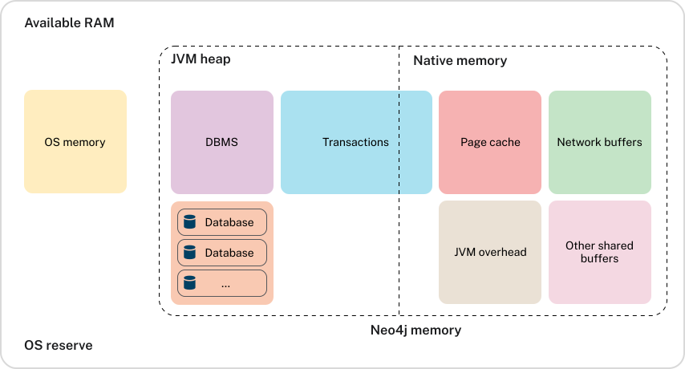

= Heap Memory Usage
:type: lesson
:order: 1

[.discrete]
== Introduction

The heap is a critical memory area where Neo4j stores temporary data during query execution and transaction processing.

In this lesson, you'll learn how to monitor heap memory usage and identify when memory pressure is affecting your performance.

== Understanding Heap Memory

// UI Description: The percentage of configured heap memory in use. The heap space is used for query execution,
// transaction state, management of the graph etc. The size needed for the heap is very dependent on the nature
// of the usage of Neo4j. For example, long-running queries, or very complicated queries, are likely to require
// a larger heap than simpler queries. To improve performance, the heap should be large enough to sustain
// concurrent operations. This value should not exceed 80% for long periods, short spikes can be normal.
// In case of performance issues, you may have to tune your queries, and monitor their memory usage, to determine
// whether the heap needs to be increased. If the workload of Neo4j and performance of queries, indicates that
// more heap space is required, consider increasing the size of your instance. This helps avoid unwanted pauses
// for garbage collection.

**Heap memory** is where Neo4j stores data during query execution and transaction processing. When you execute a read query, intermediate results accumulate in the heap until they're ready to stream back to your application. Complex queries with many operators consume more heap memory than simple queries.

When you write data to Neo4j, the database holds changes in memory to maintain ACID guarantees. The entire unit of work stays in the heap until it's complete and ready to write to the transaction log. This prevents transactions from accumulating too many changes in memory before commit.

The heap also stores transaction state, cached query plans, and internal data structures. The memory you need depends on your query complexity, number of concurrent queries, transaction size, and working set size.

[TIP]
.ACID Compliance
====
Neo4j is an ACID compliant database. This is a key feature that helps databases maintain data integrity and consistency.

The acronym stands for:

* Atomicity - All operations in a transaction succeed or every operation is rolled back.
* Consistency - On the completion of a transaction, the database is structurally sound.
* Isolation - Transactions do not contend with one another. Contentious access to data is moderated by the database so that transactions appear to run sequentially.
* Durability - The results of applying a transaction are permanent, even in the presence of failures.
====

== Monitoring Heap Memory

The Heap Memory metric shows the **percentage of configured heap memory in use**. The expected baseline is 20-50% during regular operations. Temporary spikes to 60-80% during complex queries are normal and healthy.

The key indicator of problems is **sustained high usage** above 80%. Short spikes are acceptable, but if heap usage stays above 80% for extended periods, you have memory pressure that will cause increased garbage collection, slower queries, and risk of Out of Memory errors.

[TIP]
.Understanding heap spikes
====
Occasional spikes to 70-80% are normal during complex queries. The concern is sustained high usage, not temporary peaks.
====

== Mitigating Heap Memory Issues

When you see sustained heap usage above 80%, start by **optimizing your queries**. Use `LIMIT` clauses to avoid returning large result sets. Break complex queries into smaller operations. Use `CALL { } IN TRANSACTIONS OF 1000 ROWS` for batch operations to process data in smaller chunks.

**Transaction management** is equally important. Keep transactions short-lived and commit them promptly. Long-running transactions hold memory and prevent the garbage collector from reclaiming space. Stream results when possible using your Neo4j driver instead of collecting all results in memory.

== When to Scale Your Instance

After optimizing your queries and transactions, you may still see sustained heap usage above 80%. This indicates your workload legitimately requires more memory than your current instance provides. Scaling is the right choice when optimization efforts have been exhausted.

Scale your instance when heap usage remains consistently above 80% despite query optimization. You should also scale if you've optimized queries but they still fail with Out of Memory errors during normal operations. Performance degradation that persists after optimization is another clear indicator.

However, **always optimize first** before scaling. Inefficient queries will consume any amount of memory you provide. If you scale without fixing query issues, you'll only delay the problem and waste resources.

[TIP]
.Optimizing queries
====
Use query optimization tools like `EXPLAIN` and `PROFILE` to verify your queries are efficient before scaling.
Any expensive operations are highlighted in orange on the query plan.
====

[.quiz]
== Check Your Understanding

include::questions/1-heap-threshold.adoc[leveloffset=+1]

include::questions/2-heap-optimization.adoc[leveloffset=+1]

[.summary]
== Summary

The Heap Memory metric shows the percentage of configured heap memory in use. Expected baseline is 20-50% with temporary spikes to 60-80% during complex queries. Sustained usage above 80% indicates memory pressure that requires optimization or scaling.

Optimize queries first using `LIMIT` clauses and batch operations. Keep transactions short-lived. Scale your instance only after optimization if heap usage remains consistently high.

In the next lesson, you'll learn about garbage collection and how excessive heap usage impacts it.

