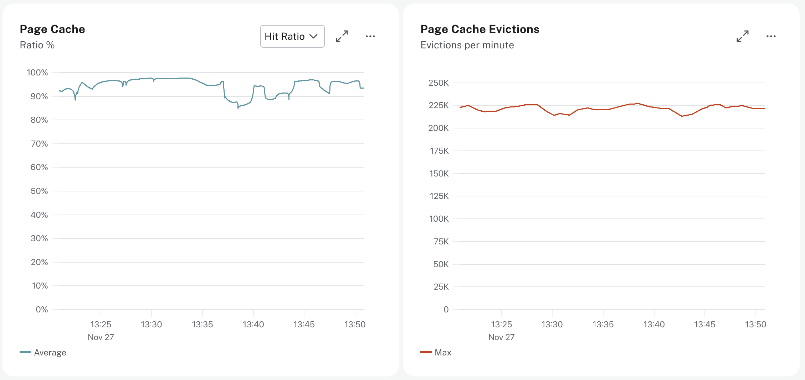

= Page Cache Performance and Evictions
:type: lesson
:order: 3

[.discrete]
== Introduction

In the link:/courses/aura-administration/3-monitoring-resources/5-storage/[storage lesson^], you learned that ideally your graph should fit into the page cache for optimal performance. In this lesson you'll learn how to monitor the page cache to ensure your graph data is being served from memory rather than disk.

The **page cache** stores frequently accessed graph data in memory. When your storage size exceeds the available page cache, queries must read from disk, which dramatically reduces performance.

== Understanding the Page Cache

The page cache stores graph data including nodes, relationships, properties, and indexes in memory.

When a query needs data, Neo4j first checks if it's in the page cache. **Cache hits** are fast because the data is already in memory. If the data is not cached in memory, this is referred to as a **cache miss**. Cache misses result in slower query execution because the data must be read from disk.

== Monitoring Page Cache Metrics

// UI Description: The percentage of times data required during query execution was found in memory vs needing
// to be read from disk. Ideally the whole graph should fit into memory, and this should consistently be between
// 98% and 100%. If this value is consistently or significantly under 100%, check the page cache usage ratio to
// see if the graph is too large to fit into memory. A high amount of insert or update activity on a graph can
// also cause this value to change.

Aura provides three key page cache metrics split across two charts that work together to indicate performance of the page cache.

== Page Cache Chart

The **Page Cache** metric chart allows you to switch between hit ratio and usage ratio.

The **hit ratio** is the percentage of times data was found in the page cache versus needing to be read from disk. The expected value is 98-100%. This is your most important page cache metric.

The **usage ratio** is the percentage of allocated page cache currently in use. When this reaches 100%, the hit ratio may start declining.

// UI Description: The percentage of the allocated page cache in use. If this is close to or at 100%, then it is
// likely that the hit ratio will start dropping, and you should consider increasing the size of your instance
// so that more memory is available for the page cache.

=== Page Cache Evictions

The **evictions per minute** metric shows how often data in memory is being replaced.

Low eviction rates indicate healthy performance. High eviction rates indicate the page cache is not large enough to hold all of your data in memory. A spike in evictions can mean your workload is temporarily exceeding available memory, which may cause performance degradation or query execution errors.

// UI Description: The number of times data in memory is being replaced per minute. A spike can mean your workload
// is exceeding the instance's available memory, and you may notice a degradation in performance or query execution
// errors. Consider increasing the size of your instance to improve performance if this metric remains high.

== Managing Page Cache Performance

The **hit ratio** is your primary indicator of page cache health. If the hit ratio falls below 98%, investigate using the usage ratio and evictions metrics.

Check the **usage ratio** to see how full the page cache is. A usage ratio at or near 100% means the page cache is full and Neo4j is evicting data from memory to make room for new data. As your data grows, the usage ratio will increase until it reaches capacity.

Check the **evictions per minute** to see how often data is being replaced. High evictions combined with low hit ratio indicate the page cache cannot hold your frequently accessed data.

Write activity can also affect the hit ratio. A high amount of insert or update activity causes the hit ratio to fluctuate as new data loads into the page cache. This is normal during data imports or bulk operations and does not necessarily indicate a scaling issue.

== Scaling your instance

If your usage ratio is high but page cache evictions are low, you don't necessarily need to scale your instance. As data gets replaced, older data that is no longer frequently accessed will be evicted from the page cache.

Temporary spikes in evictions may occur during workload bursts and typically resolve on their own.

However, if page cache evictions remain consistently high, this indicates your instance needs more memory to hold your frequently accessed data.

[TIP]
.Scaling your instance
====
You can scale your instance by clicking the **Configure** button in the Instance details page and increasing the memory.
====

[.quiz]
== Check Your Understanding

include::questions/1-cache-hit-ratio.adoc[leveloffset=+1]

include::questions/2-cache-metrics.adoc[leveloffset=+1]

[.summary]
== Summary

In this lesson, you learned how to monitor page cache performance using three key metrics:

* **Hit ratio** - The percentage of times data was found in memory versus read from disk (expected value: 98-100%)
* **Usage ratio** - The percentage of allocated page cache currently in use
* **Evictions per minute** - How often data in memory is being replaced

The hit ratio is your primary indicator of page cache health. If the hit ratio falls below 98%, check the usage ratio and evictions to diagnose the issue. Scale your instance when evictions are high, indicating the page cache cannot hold your frequently accessed data.

In the next lesson, you will learn how to monitor Bolt connections to understand application connectivity patterns.

