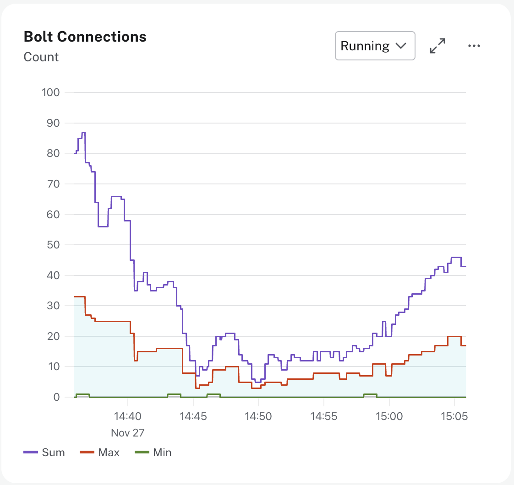

= Bolt Connections
:type: lesson
:order: 5

[.discrete]
== Introduction

**Bolt** is the protocol used by applications to connect to Neo4j. Monitoring Bolt connections helps you identify connection pooling issues and optimize application connectivity.

In this lesson, you'll learn how to monitor Bolt connections to ensure your applications are connecting to Neo4j efficiently.

== Understanding Bolt Connections

Bolt connections represent client applications connected to your database. Each connection can be actively executing queries or sitting idle in a connection pool waiting to be used.

Applications use **connection pools** to reuse connections for multiple queries. This reduces the overhead of establishing new connections for every query. A well-configured connection pool maintains idle connections ready for immediate use.

== Monitoring Bolt Connection Metrics

// UI Description: The total number of Bolt connections that are currently executing Cypher transactions and
// returning results. This is a set of snapshots over time and may appear to spike if workloads are all
// completed quickly

// UI Description: The total number of Bolt connections that are connected to the Aura database but not currently
// executing Cypher or returning results.

// UI Description: The total number of Bolt connections opened since startup. This includes both successful and
// failed connections. This value may drop if background maintenance is performed by Aura.

// UI Description: The rate of of Bolt connections opened per minute. This includes both successful and failed connections.

// UI Description: The total number of Bolt connections closed since startup. This includes both properly and
// abnormally ended connections. This value may drop if background maintenance is performed by Aura.

// UI Description: The rate of Bolt connections being closed per minute. This includes both properly and
// abnormally ended connections.

Aura provides several Bolt connection metrics to help you understand how applications connect to your database.

**Running connections** shows the number of connections currently executing queries. This value changes constantly as queries start and finish. It should scale with your workload, increasing during high activity and decreasing during low activity.

**Idle connections** shows the number of connections sitting in connection pools waiting to be used. A stable number of idle connections indicates healthy connection pooling. These connections are ready for immediate use when a query needs to execute.

**Opened and closed metrics** track the number and rate of connections being created and terminated. The opened count includes both successful and failed connection attempts. The closed count includes both properly closed connections and abnormal terminations.

A healthy application maintains balanced open and close rates over time. High connection churn with many connections constantly opening and closing indicates the application may not be using connection pooling properly.

== Managing Connection Health

Healthy connection patterns show stable idle connections in the pool, running connections that scale with workload, and balanced open and close rates. This indicates applications are reusing connections efficiently rather than creating new connections for every query.

High connection churn occurs when connections constantly open and close with few idle connections maintained. This indicates connection pooling may not be configured properly. Connection churn increases overhead and reduces performance because establishing new connections is expensive.

If you see many more connections opened than closed over time, this may indicate a connection leak. Applications should close connections properly using try-finally blocks or context managers. Connection leaks can lead to pool exhaustion where no connections are available for new queries.

Each Aura instance has connection limits based on instance tier and size. When limits are approached, new connection attempts may fail and users experience connectivity issues. Monitor your connection metrics during peak hours to ensure you stay well below these limits.

== Scaling Your Instance

If your applications frequently hit connection limits, first review your connection pool configuration.
Configure minimum and maximum pool sizes based on your application's concurrent query needs and connection timeout settings.

If connection pools are optimized and limits are still reached, scale your instance to support more concurrent connections.

[TIP]
.Configuring connection pools
====
Refer to your Neo4j driver documentation for connection pool configuration options specific to your programming language.
====

[.quiz]
== Check Your Understanding

include::questions/1-connection-patterns.adoc[leveloffset=+1]

include::questions/2-connection-churn.adoc[leveloffset=+1]

[.summary]
== Summary

In this lesson, you learned how to monitor Bolt connection metrics to ensure your applications connect to Neo4j efficiently:

* **Running connections** - Connections currently executing queries that should scale with workload
* **Idle connections** - Connections waiting in pools, ready for immediate use
* **Opened and closed metrics** - Track connection creation and termination rates

Healthy connection patterns show stable idle connections, running connections that scale with workload, and balanced open and close rates. High connection churn with many connections constantly opening and closing indicates connection pooling is not configured properly.

In the next lesson, you will learn about garbage collection metrics and their impact on performance.

