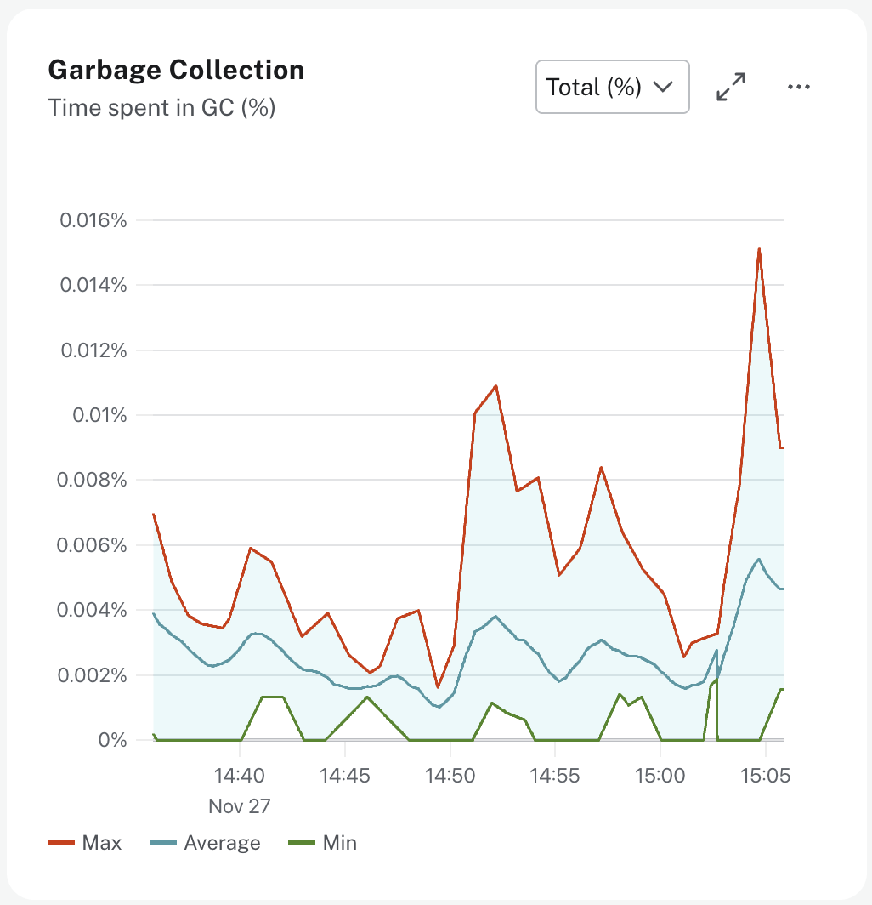

= Monitoring Garbage Collection
:type: lesson
:order: 4

[.slide.discrete]
== Introduction

Heap memory usage directly relates to how often the Java Virtual Machine must perform garbage collection. When heap usage is high, garbage collection runs more frequently, which can cause query pauses and performance degradation.

In this lesson, you will learn how to monitor garbage collection metrics and understand their impact on database performance.

[.slide]
== Understanding Garbage Collection

Neo4j runs on the **Java Virtual Machine**, which automatically reclaims memory from objects that are no longer needed. This process is called **garbage collection**.

The JVM pauses during garbage collection to clean up unused memory. During these pauses, query execution may be delayed. The goal is to minimize the frequency and duration of these pauses to maintain consistent performance.

The JVM divides memory into two generations. **Young generation** handles short-lived objects like temporary query results. **Old generation** handles long-lived objects like cached data and transaction state.

[.slide.col-2.reverse]
== Monitoring Garbage Collection

[.col]
====

====

[.col]
====
Aura provides several garbage collection metrics on the **Instance** tab.
====

[.slide.discrete]
=== Young Generation Metrics

link:https://neo4j.com/docs/aura/metrics/metrics-integration/reference/#_garbage_collection_young_generation[Young generation garbage collection^] typically completes quickly in milliseconds. These collections happen frequently but have minimal impact on performance.

**Young Gen (%)** shows the time spent in young generation garbage collection as a percentage. High values indicate that the instance is running low on memory for the workload.

**Young Gen (Cumulative)** shows the total time since startup spent clearing up heap space for short-lived objects. Monitor the rate of increase rather than the absolute value.

[.slide.discrete]
=== Old Generation Metrics

link:https://neo4j.com/docs/aura/metrics/metrics-integration/reference/#_garbage_collection_old_generation[Old generation garbage collection^] can take seconds to complete. The Aura instance waits while garbage collection runs, causing noticeable query pauses.

**Old Gen (%)** shows the time spent in old generation garbage collection as a percentage. High values indicate that there are long-running processes or queries that could be optimized, or that your instance is running low on CPU or memory.

**Old Gen (Cumulative)** shows the total time since startup spent clearing up heap space for long-lived objects. Frequent old generation collections indicate performance issues.

[.slide.discrete]
=== Total Garbage Collection Time

**Total Garbage Collection Time (%)** shows the overall time spent in garbage collection as a percentage of runtime. High values indicate memory pressure and the need to scale your instance.

[.slide]
== Mitigating Garbage Collection Issues

When you observe high garbage collection time, the root cause typically falls into one of two categories.

[.slides-only]
====
1. Query-level issues
2. Memory-intensive workloads
====

[.slide.discrete]
=== Query-Level Issues

Queries that create many temporary objects increase garbage collection frequency. Limit result set sizes with `LIMIT` to reduce object creation. Use aggregations instead of collecting all results in memory.

Use `CALL { } IN TRANSACTIONS` for batch operations to process data in smaller chunks. This prevents memory from filling up with intermediate results.

[.slide.discrete]
=== Memory-Intensive Workloads

If your workload naturally requires significant memory, schedule memory-intensive operations during off-peak hours. This prevents garbage collection from impacting user queries during busy periods.

[.slide]
== When to Scale Your Instance

Consider increasing the size of your instance when garbage collection time shows consistently high values. If heap usage exceeds 80% and garbage collection time is elevated, your instance needs more memory.

Frequent old generation garbage collection indicates that long-lived objects are consuming most of the heap. This pattern suggests the instance is undersized for your workload.

[WARNING]
.Impact on Query Performance
====
Old generation garbage collection pauses can take several seconds to complete. During these pauses, all queries wait, which can cause timeouts or failed transactions. This directly impacts user experience and application reliability.
====

[.quiz]
== Check Your Understanding

include::questions/1-gc-indicators.adoc[leveloffset=+1]

[.summary]
== Summary

You learned how to monitor young generation and old generation garbage collection metrics for your Aura instances.

High garbage collection time indicates memory pressure. Old generation garbage collection causes noticeable performance pauses that can impact user experience.

When garbage collection time is consistently high and heap usage exceeds 80%, consider increasing the size of your instance.

In the next module, you will learn about database-level metrics including store size, query latency, and transaction patterns.
