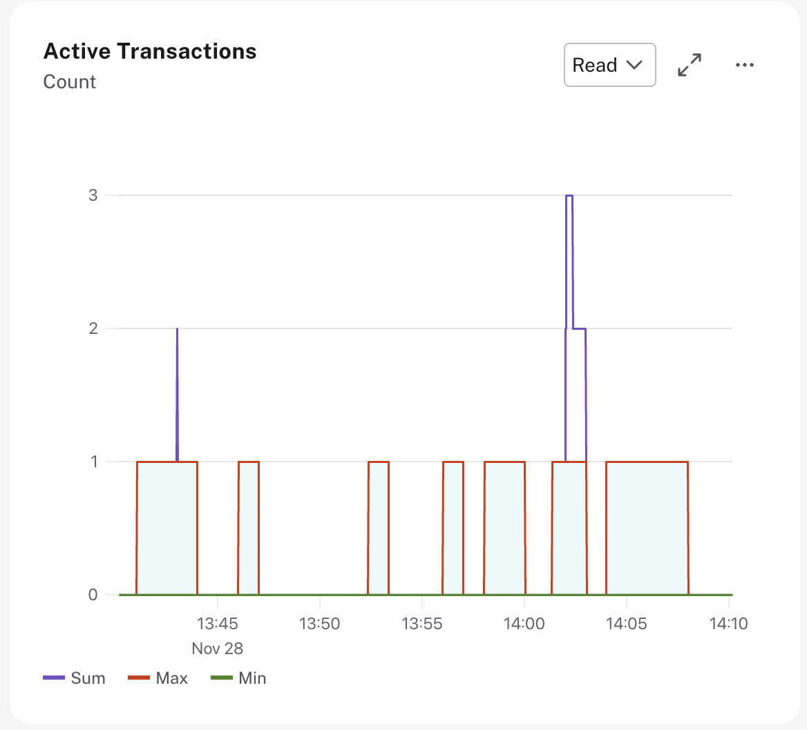
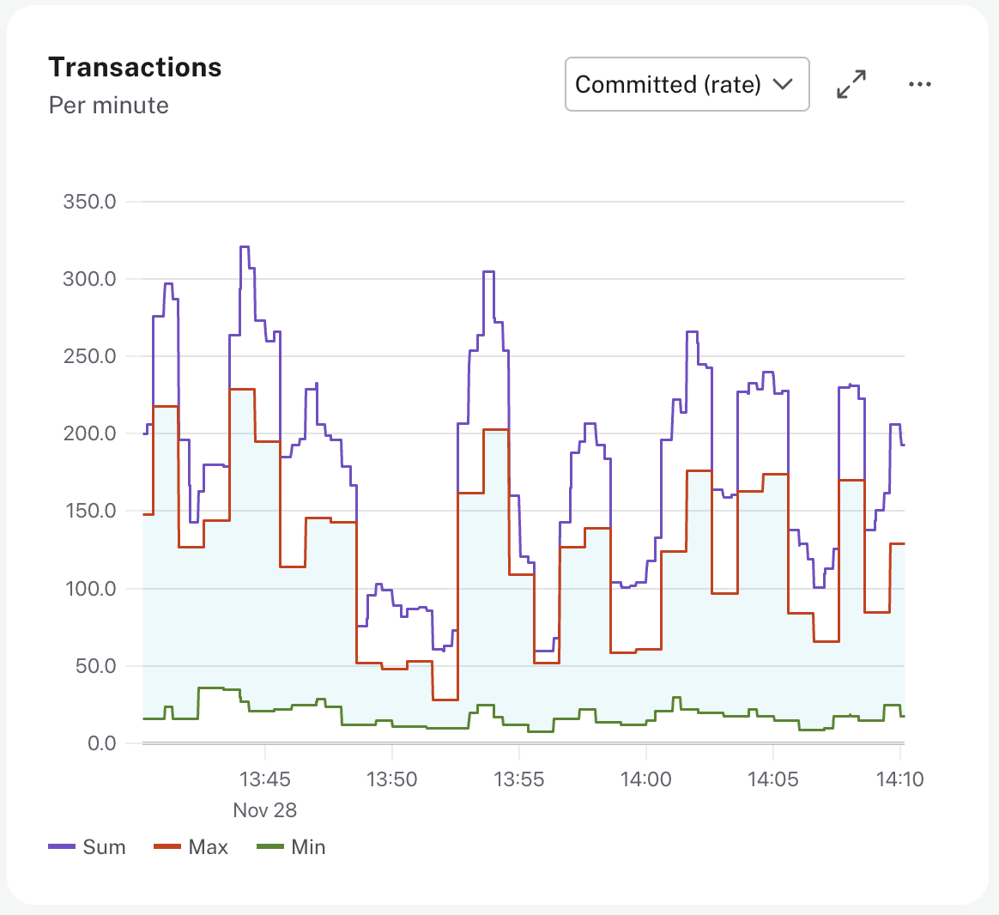
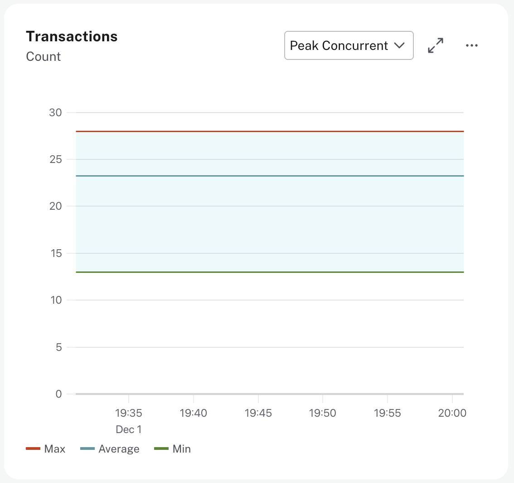
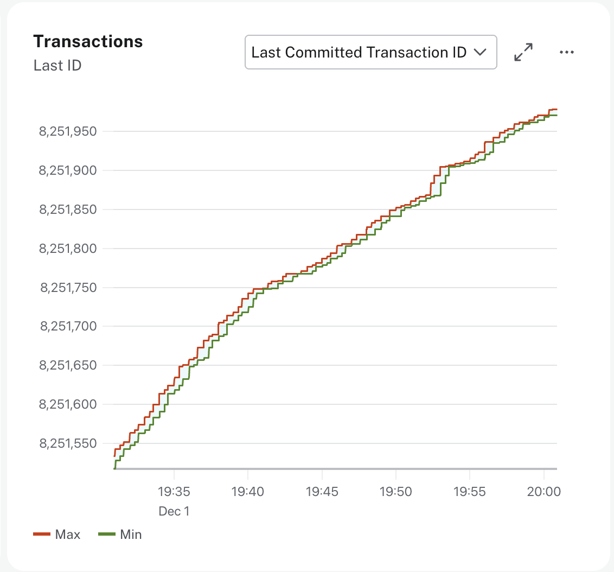

= Transaction monitoring
:type: lesson
:order: 3

[.slide.discrete]
== Introduction

So far you've learned how to monitor query rates and latency at the database level. To understand what's happening inside your database, you need to go deeper—every query executes within a transaction, and monitoring transaction patterns reveals connection leaks and application bugs that query metrics alone can't detect.

In this lesson, you will learn how to monitor active transactions, transaction rates, and identify transaction problems.

[.slide]
== Understanding how transactions work

Every operation in Neo4j occurs within a **transaction**. A transaction is the unit of work that groups one or more operations together to ensure data consistency.

Neo4j executes two types of transactions. **Write transactions** modify data by creating, updating, or deleting nodes and relationships. **Read transactions** only query data without making changes. Read transactions can run concurrently, while write transactions need to be executed sequentially.

All modifications performed in a transaction are kept in memory until the transaction commits or rolls back. This means large data updates should be split into multiple smaller transactions to avoid running out of memory.

Monitoring transaction counts helps you identify connection leaks, application bugs, and performance issues before they impact users.

[.slide]
== Monitoring Transaction Metrics

Aura provides several metrics to help you monitor transaction patterns and identify issues.

[.slide.col-2.reverse]
=== Active Transactions

[.col]
====

====

[.col]
====

**Active transactions** shows the number of currently executing transactions. This metric is broken down into **read transactions** and **write transactions** to help you understand your workload distribution.

// UI Description (Read): The number of currently active read transactions.
// UI Description (Write): The number of currently active write transactions.

The expected pattern is for active transactions to fluctuate with workload and return to a low baseline between operations. Most databases see more read transactions than write transactions during normal operation.

If active transaction counts remain high or continuously grow, transactions may not be closing properly. This indicates a potential connection leak or missing commit statements in your application code.
====

[.slide.col-2.reverse]
=== Transaction Rates

[.col]
====

====

[.col]
====

**Committed transactions** shows both the total count since server startup and the rate per minute. This metric tracks successful transaction completion and should match your application activity patterns.

// UI Description (Committed count): The total number of committed transactions since the server was started.
// This value may drop if background maintenance is performed by Aura.

// UI Description (Committed rate): The number of transactions being committed per minute.

**Rolled back transactions** shows both the total count and the rate per minute. Rollbacks indicate transaction failures or explicit rollback calls in your code.

// UI Description (Rollbacks count): The total number of rolled-back transactions. This value may drop if
// background maintenance is performed by Aura.

// UI Description (Rollbacks rate): The number of transaction rollbacks happening per minute.

As a general guideline, rollbacks should be very low, for example less than 1% of committed transactions. Occasional rollbacks are normal, but high rollback rates indicate application errors, constraint violations, or concurrent write conflicts.

====

[.slide.col-2.reverse]
=== Peak Concurrent Transactions

[.col]
====

====

[.col]
====
**Peak concurrent transactions** shows the highest number of concurrent transactions detected since server startup. This helps you understand your maximum transaction concurrency.

// UI Description: The highest number of concurrent transactions detected since the server started. This value
// may drop if background maintenance is performed by Aura.

Monitor this value to plan capacity and identify unusual spikes in concurrent activity.
====

[.slide.col-2.reverse]
=== Last Committed Transaction ID

[.col]
====

====

[.col]
====
**Last committed transaction ID** tracks the ID of the last committed transaction. For Business Critical instances with clustering, track this metric for each primary cluster member.

// UI Description: The id of the last committed transaction. Track this for primary cluster members of your Aura
// instance. It should show overlapping, ever-increasing lines and if one of the lines levels off or falls behind,
// it is clear that this cluster member is no longer replicating data, and action is needed to rectify the situation.

The expected pattern shows overlapping, ever-increasing lines for all cluster members. If one line levels off or falls behind, that cluster member is no longer replicating data and requires attention.

[NOTE]
.Background maintenance
=====
Some transaction count values may drop if background maintenance is performed by Aura. This is normal and doesn't indicate a problem.
=====
====

[.slide]
== Identifying Transaction Issues

You should monitor transaction metrics to identify application bugs, connection leaks, and configuration problems before they impact users.

To inspect currently running transactions, you can use the Cypher command `SHOW TRANSACTIONS` to see transaction IDs, execution time, and current status. This helps identify long-running transactions that may be causing issues.

[.slide.discrete]
=== High Rollback Rate

As a general guideline, if rollbacks represent a significant percentage of committed transactions, for example more than 5%, you should investigate the causes. These thresholds will vary depending on your specific application patterns.

High rollback rates indicate general connectivity issues, constraint violations trying to create duplicate data, or concurrent update conflicts between transactions.

Review your query logs for error messages. You can filter query logs by clicking the **Fetch logs** button and setting **Status** to Failed.  The GQL status codes will provide additional context about why the query failed.

[.slide.discrete]
=== Growing Active Transaction Count

Active transaction counts naturally fluctuate with workload. Increases can indicate large data loads or high read activity, which is normal behavior.

However, if active transactions continuously grow without returning to baseline during periods of low activity, this may indicate transactions are not being closed properly. Locks and memory acquired by transactions are only released upon completion, so unclosed transactions can hold resources and potentially block other operations.

Review your application code to ensure all transactions explicitly commit or rollback, and that connections are properly closed in finally blocks or using context managers.

[.slide.discrete]
=== Transaction Timeouts

If users report transaction timeout errors and you see long-running active transactions, queries are taking too long to complete. In this case, you should also observe high memory usage and possible Out of Memory errors discussed earlier in the course.

Since all modifications are held in memory during a transaction, large updates can exhaust available heap space. This is a sign that the query should be optimized or the operation should be batched into smaller transactions.

Review which queries are timing out and optimize them before considering scaling. For large data modifications, consider batching operations into smaller transactions. Add appropriate indexes and use `EXPLAIN` to verify query plans use those indexes.

[.slide.discrete]
=== Replication Issues in Clusters

For Business Critical instances, if one cluster member's last committed transaction ID stops advancing while others continue, that member is no longer replicating data. This indicates a cluster synchronization issue that requires immediate attention.

Contact Neo4j support for assistance with cluster replication issues.

[.slide]
== Applying transaction best practices

Keep transactions short by committing or rolling back promptly. Avoid holding transactions open during user input or long-running operations outside the database.

Always close sessions and transactions when finished. Use try-with-resources in Java or context managers in Python to ensure proper cleanup even if errors occur.

Here's an example using the try-with-resources pattern with the Java driver:

[source,java]
.Self-closing sessions with try-with-resources
----
try (var session = driver.session()) {
    try (var tx = session.beginTransaction()) {
        tx.run("CREATE (p:Person {name: $name})",
               Map.of("name", "Alice"));
        tx.commit();  // Explicitly commit
    }  // Transaction automatically closed here
}  // Session automatically closed here
----

[.slide.discrete]
=== Self-closing sessions

Once the code block is exited, the session and transaction are automatically closed.

Use write transactions for write operations whenever possible. This allows Neo4j to route the write to the leader.

Explicitly specify read transactions in your application code to route queries across the available instances in clustered environments.

Monitor rollback rates regularly to catch application issues early. Alert on growing active transaction counts to identify connection leaks before they cause problems.

[.slide]
== When You Should Scale

High transaction rates alone don't indicate you need to scale. Review whether high rates correlate with high CPU usage, memory pressure, or slow query performance.

If committed transaction rates are high but other metrics show healthy performance, your instance is handling the load well. Scaling is not necessary.

Consider scaling only when transaction activity combined with other metrics shows resource pressure. For example, high transaction rates with high CPU usage and increasing query latency indicates the instance is undersized.

Before scaling, optimize your transaction patterns. Ensure transactions are short, properly closed, and using appropriate read/write distinctions. Application-level optimization often resolves transaction issues more effectively than scaling.

[.quiz]
== Check Your Understanding

include::questions/1-rollback-rate.adoc[leveloffset=+1]

include::questions/2-active-transactions.adoc[leveloffset=+1]

[.summary]
== Summary

Transaction monitoring helps you understand database activity and identify application issues. As a general guideline, rollback rates should be very low, and growing active transaction counts indicate transactions not closing properly. For clustered instances, monitor the last committed transaction ID to identify replication issues. Always optimize transaction patterns and application code before considering scaling.

In the next lesson, you will apply your transaction monitoring knowledge to diagnose a real-world rollback issue.
