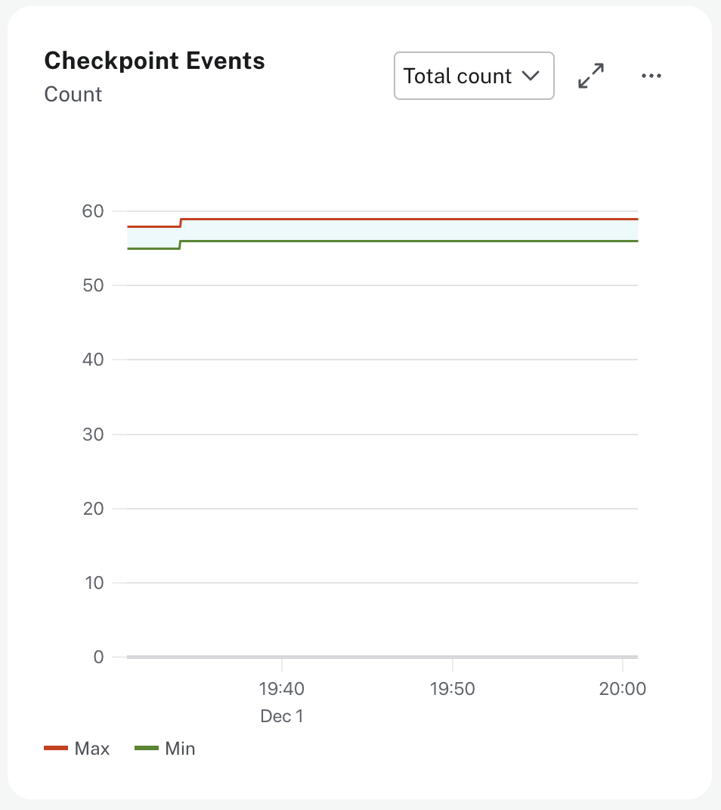
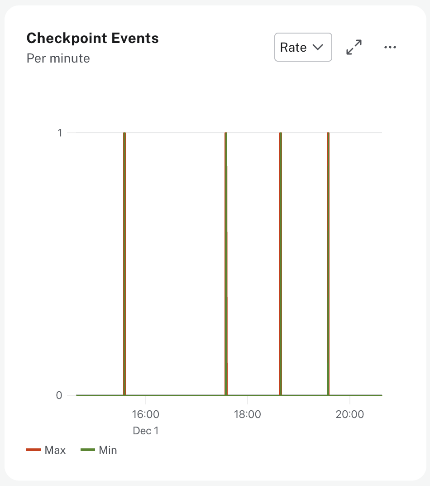
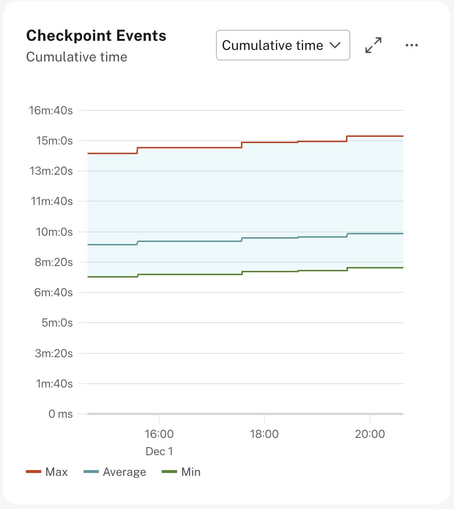
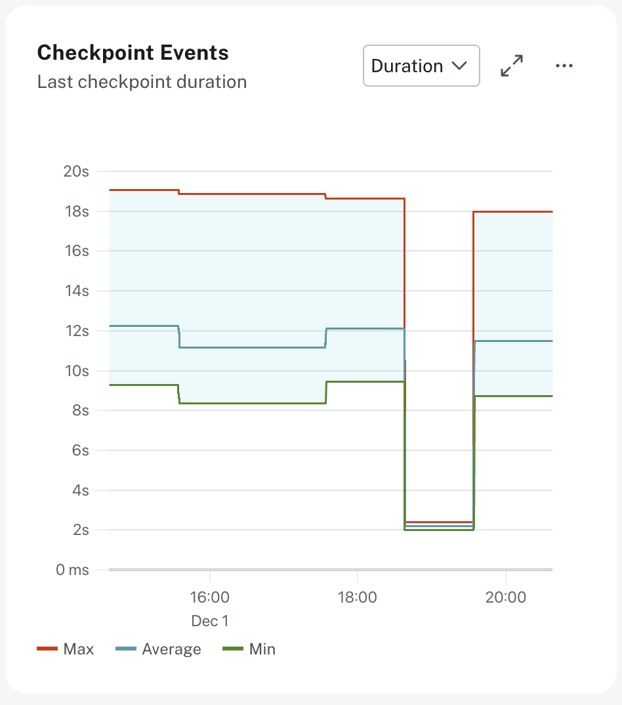
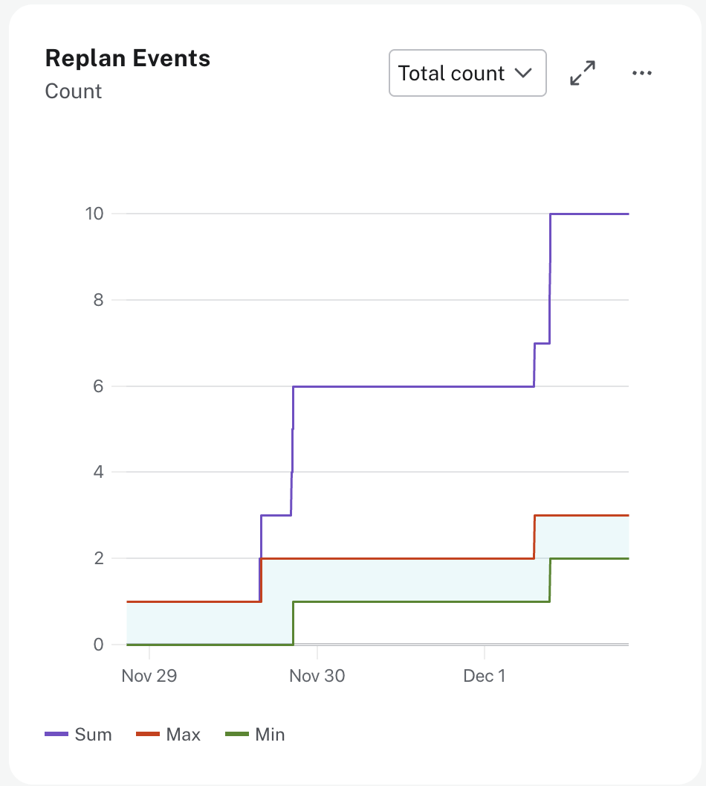
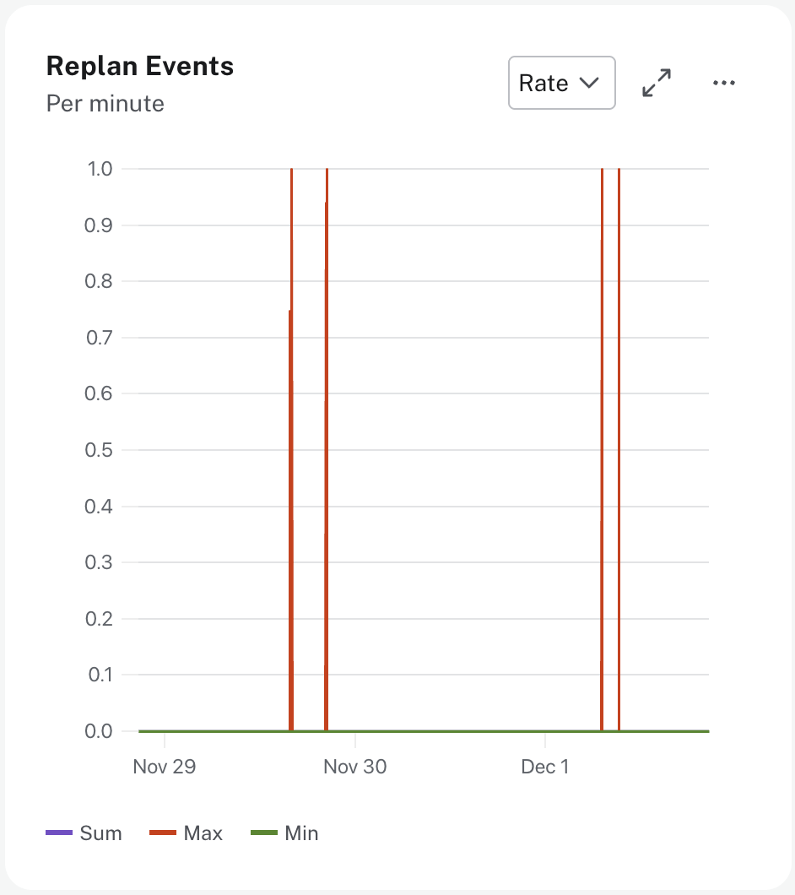

= Checkpoint and Replan Events
:type: lesson
:order: 7

[.slide.discrete]
== Introduction

Neo4j performs internal operations that help maintain database health and optimize query performance.

In this lesson, you will learn how to monitor checkpoint and replan events to understand your database activity.

[.slide]
== Understanding Checkpoints and Replan Events

**Checkpoints** are the process of flushing pending updates from memory to disk. They ensure your data is safe and durable by creating recovery points that allow Neo4j to restart quickly after an unexpected shutdown. This is a normal, essential operation that occurs automatically.

**Replan events** occur when Neo4j recreates the execution plan for a Cypher query. Neo4j caches query plans for efficiency, rebuilding them when database statistics change significantly—such as when the number of nodes, relationships, or index characteristics evolve—to ensure optimal performance as your data grows.

[.slide]
== Monitoring Checkpoints

The Monitoring dashboard shows four checkpoint metrics that help you understand database write activity and health.

[.slide.col-2.reverse]
=== Checkpoint Events - Total Count

[.col]
====

====

[.col]
====
**Total checkpoint events** shows the total number of checkpoint events executed since the server started.

// UI Description (Total count): The total number of checkpoint events executed since the server started.
// This value may drop if background maintenance is performed by Aura.

The count depends on your write activity—busier databases checkpoint more often. This is a cumulative counter that helps you understand overall checkpoint frequency.
====

[.slide.col-2.reverse]
=== Checkpoint Events - Rate

[.col]
====

====

[.col]
====
**Checkpoint rate** shows the number of checkpoint events per minute.

// UI Description (Rate): The number of checkpoint events happening per minute.

A consistent, moderate rate is normal and healthy. The rate naturally correlates with write transaction volume.
====

[.slide.col-2.reverse]
=== Checkpoint Cumulative Time

[.col]
====

====

[.col]
====
**Cumulative checkpoint time** shows the total time in milliseconds spent in checkpointing since the server started.

// UI Description (Cumulative time): The total time in milliseconds spent in checkpointing since the server
// started. This value may drop if background maintenance is performed by Aura.

This metric helps you understand the overall time investment in checkpointing operations over the lifetime of the instance.
====

[.slide.col-2.reverse]
=== Last Checkpoint Duration

[.col]
====

====

[.col]
====
**Last checkpoint duration** shows the duration of the most recent checkpoint event in milliseconds.

// UI Description (Duration): The duration of the last checkpoint event in milliseconds. Checkpoints should
// typically take several seconds to several minutes. Values over 30 minutes warrant investigation.

Checkpoints typically run every 15 minutes or every 100,000 transactions, whichever comes first. The duration can range from several seconds to several minutes, which is normal and healthy. As a general guideline, if you see checkpoint duration consistently over 10 minutes in Aura, this suggests an opportunity to review storage performance or optimize your write patterns. (For self-managed Neo4j deployments, the threshold is typically 30 minutes.) These thresholds will vary depending on your specific workload.

[NOTE]
.Background maintenance
====
Checkpoint count and cumulative time values may drop if background maintenance is performed by Aura. This is normal and doesn't indicate a problem.
====
====

[.slide]
== Monitoring Replan Events

The Monitoring dashboard shows two replan metrics that help you understand query plan caching efficiency.

[.slide.col-2.reverse]
=== Replan Events - Total Count

[.col]
====

====

[.col]
====
**Total replan events** shows the total number of times Cypher has replanned a query since the server started.

// UI Description (Total count): The total number of times Cypher has replanned a query since the server started.
// If this spikes or is increasing, check that the queries executed are using parameters correctly. This value
// may drop if background maintenance is performed by Aura.

A low count with occasional spikes is normal and healthy. You'll naturally see replanning when executing new queries for the first time, after schema changes, or when database statistics change significantly as your data grows—this is Neo4j adapting to your evolving database.
====

[.slide.col-2.reverse]
=== Replan Events - Rate

[.col]
====

====

[.col]
====
**Replan rate** shows the number of replanning events per minute.

// UI Description (Rate): The number of replanning events per minute.
// If this spikes or is increasing, check that the queries executed are using parameters correctly.

As a general guideline, consistently high replan rates suggest an optimization opportunity: your queries may benefit from using parameters instead of literal values. What constitutes "high" will vary depending on your query patterns.
====

[.slide]
== Troubleshooting Checkpoint and Replan Issues

Monitor checkpoint and replan metrics to identify database health issues and optimization opportunities.

[.slide.discrete]
=== Long Checkpoint Duration

As a general guideline, if **checkpoint duration** is consistently over **10 minutes** in Aura, you should investigate potential causes.  These thresholds will vary depending on your specific write patterns and storage configuration.  For self-managed Neo4j, the threshold is typically 30 minutes.

Long checkpoints can indicate **heavy write load**, **storage I/O limitations**, or **large transaction logs** waiting to be flushed. Review your write patterns and consider batching large updates into smaller transactions.

If checkpoints are slow during periods of normal activity, this may indicate **storage performance issues**. Contact Neo4j support for assistance with persistent checkpoint performance problems.

[.slide.discrete]
=== High Replan Rates

A low **replan rate** with occasional spikes is normal—you'll naturally see replanning when executing **new queries**, after **schema changes**, or when **database statistics** change significantly as data volumes grow.

As a general guideline, if replan rates are consistently high, this suggests an optimization opportunity. High replan rates typically indicate queries using **literal values** instead of **parameters**.

Review your **query logs** to identify frequently executed queries. Look for queries with **hardcoded values** that could be replaced with parameters. This simple change can significantly improve query performance and reduce planning overhead.

[.quiz]
== Check Your Understanding

include::questions/1-checkpoint-duration.adoc[leveloffset=+1]

include::questions/2-replan-cause.adoc[leveloffset=+1]

[.summary]
== Summary

Checkpoints flush pending updates from memory to disk, creating recovery points that enable faster database restarts. They typically run every 15 minutes or every 100,000 transactions, with typical duration of seconds to a few minutes. As a general guideline, duration consistently over 10 minutes in Aura warrants investigation (30 minutes for self-managed Neo4j). Replan events occur when Neo4j recreates query execution plans as database statistics change or when new queries are executed. Both are normal operations that help maintain database health and performance. High replan rates often indicate queries using literal values instead of parameters, which can be optimized as covered earlier in the course.

