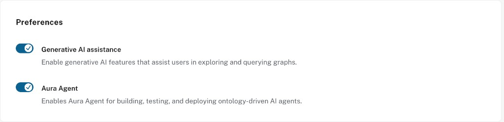
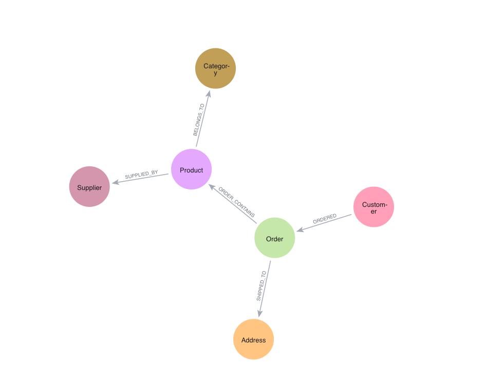
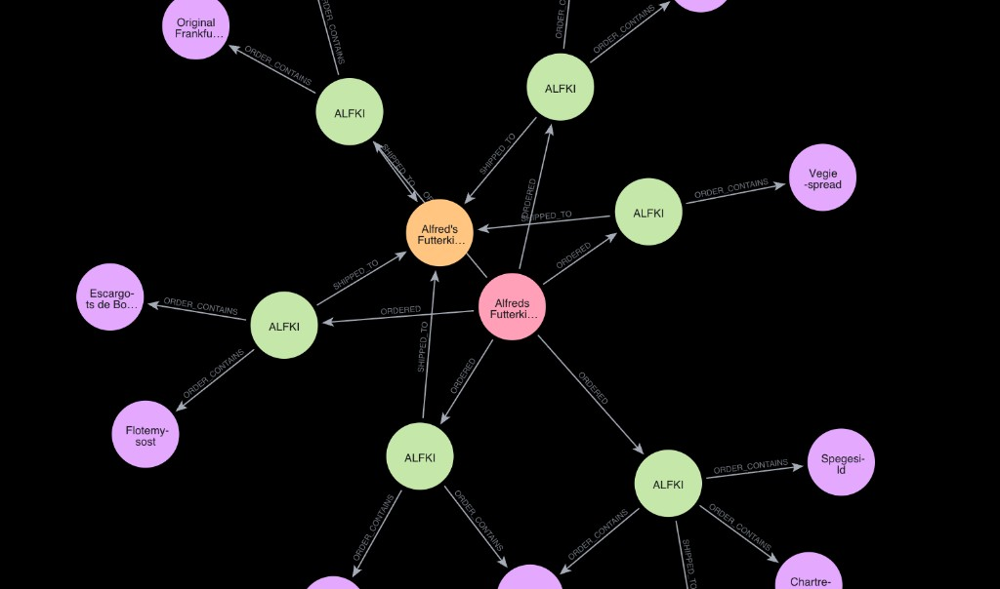
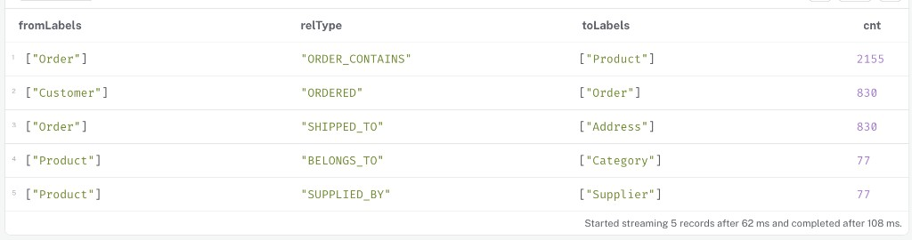
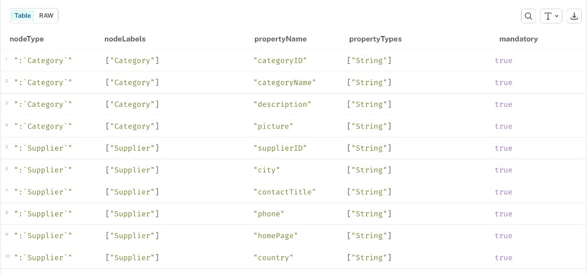

= Set Up Your Aura Database
:order: 2
:type: lesson
:disable-cache: true

Before building agents, you need a running AuraDB instance with the Northwind dataset loaded and Generative AI enabled in your organization settings.

== What you need

To create an Aura Agent, you need:

* A knowledge graph in a **running AuraDB instance** 
* **Generative AI assistance** enabled in your Organization settings
* **Aura Agent** toggled on (available once Generative AI assistance is enabled)
* **Project Admin** role in your Aura project

== Create an AuraDB instance

Create an account on link:https://console.neo4j.io/graphacademy[Neo4j Aura^] and complete the onboarding process.

[TIP]
.Single Sign-On
====
You can use the same account as your GraphAcademy login.
====

To create a new instance:

. Select **Instances** in the navigation menu.
. Click **Create Instance**.
. Choose a tier as per your preference. For example, select **AuraDB Free** to create a new free instance.

A modal window will appear with your username and password.

[IMPORTANT]
.Save your credentials
====
Click **Download and continue** and keep the file safe. You will need these credentials to connect to your instance throughout the workshop.
====

It will take a few minutes for the instance status to change from **Creating** to **Running**.

== Enable Generative AI

Aura Agents requires two toggles to be on in your organization settings. Open the organization menu and go to **Preferences**:

image::images/organization-settings-menu.png["Aura console navigation showing the organization settings menu"]

In the **Preferences** section, enable both toggles:

. **Generative AI assistance**: enables all GenAI features in Aura, including Text2Cypher in the Query tool and embeddings in Import. Without this, no GenAI features work, and Aura Agents cannot run.
. **Aura Agent**: makes the Agents section visible in the console and allows you to create and run agents. You can only enable this after Generative AI assistance is on. If this is off but Generative AI assistance is on, the rest of Aura's GenAI features still work, but you won't see the Agents section.

[NOTE]
.Check your project role
====
To check your role, go to **Project** → **Users** in the Aura Console left navigation:

image::images/project-users-menu.png[Aura Console left navigation with Project expanded and Users highlighted]

Your role is listed in the **Project role** column next to your email address:

image::images/project-users-list.png[Project users list showing User, Project role, and Status columns]

If you are not a Project Admin, ask your Organisation Admin to update your role using the **Invite** button on this page.
====

== Load the Northwind dataset

Download the Northwind model, open the Import tool, click the **...** menu, select **Open model (with data)**, and click **Run Import**.

link:https://cdn.graphacademy.neo4j.com/courses/workshop-modeling/modules/6-final-review/lessons/1-recommendation-query/data/complete-model.zip[Download Northwind dataset^, role="btn"]

console::Open Import Tool[tool=import,connect-url={connect-url}]

After the import, the Northwind data model looks like this:

Northwind is a retail dataset with customers, orders, products, categories, and suppliers. This course uses it as the example knowledge graph throughout.

== Explore the data

Open the Query tool and run these queries to familiarize yourself with the graph before building an agent on top of it.

Zoom in to a 1–2 hop neighbourhood around a Customer to see its orders, products, and addresses:

[source,cypher,role=noplay]
----
MATCH (c:Customer)
WITH c LIMIT 1
MATCH p=(c)-[*1..2]-(n)
RETURN p
LIMIT 80;
----

A 1-2 hop neighbourhood around a Customer looks like this:

Do the same centered on a Product to surface supplier and category connections:

[source,cypher,role=noplay]
----
MATCH (p:Product)
WITH p LIMIT 1
MATCH path=(p)-[*1..2]-(n)
RETURN path
LIMIT 150;
----

Explore the relationship patterns in the graph, with counts:

[source,cypher,role=noplay]
----
MATCH (a)-[r]->(b)
RETURN labels(a) AS fromLabels, type(r) AS relType, labels(b) AS toLabels, count(*) AS cnt
ORDER BY cnt DESC
LIMIT 25;
----

In your query results, you will see the relationship patterns between the node labels displayed in the table format.

Then list the node labels to see what types of data exist:

[source,cypher,role=noplay]
----
CALL db.labels();
----

You will see all the node labels in the graph in the query results.

image::images/northwind-labels.png[Query results listing all node labels in the Northwind graph]

Drill into the properties on each label to see what fields are available:

[source,cypher,role=noplay]
----
CALL db.schema.nodeTypeProperties();
----

Your query should return the node labels and their properties with data types: 

So far, you have explored the graph and the data in the graph. Now, let's pick a specific relationship and traverse it to see actual data:

[source,cypher,role=noplay]
----
MATCH (a:Order)-[r:SHIPPED_TO]->(b:Address)
RETURN a, r, b
LIMIT 100;
----

Your query should return the Order nodes connected to an Address node through the SHIPPED_TO relationship, make a note of this result and come back later to compare to your agent's output.

image::images/northwind-orders-shipped-to.png[Graph visualisation showing Order nodes connected to Address nodes through SHIPPED_TO relationships]

read::Mark as completed[]

[.summary]
== Summary

You now have a running AuraDB instance loaded with the Northwind dataset and Generative AI enabled.

In Module 2, you will design and build a Northwind analyst agent with Cypher Template and Text2Cypher tools.
