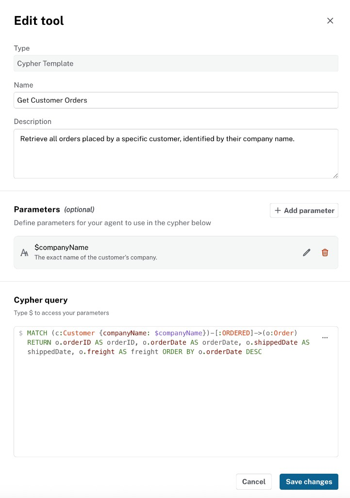

= Available Tools
:order: 2
:type: lesson
== Introduction

The tools you configure on an Aura Agent determine what data it can retrieve and how. Choosing the correct tool for each question type is the primary design decision when building an agent.

The knowledge graph your agent queries contains two kinds of information:

* **Structured, connected data**: nodes and relationships that tools query with Cypher
* **Facts and domain state**: the specific data about your business or domain that makes answers accurate and relevant

In this lesson, you will learn:

* What each tool does and when to use it
* What to put in a tool description so the LLM selects correctly

From the **Agent tools** panel, click **Add tool** to see the three tool types:

image::images/add-tool-menu.png[Agent tools panel showing Add tool dropdown with Cypher Template, Text2Cypher, and Similarity Search options]

== Cypher Template

A **Cypher Template** is a pre-written, parameterized Cypher query. You define the query once; the LLM extracts parameter values from the user's question and runs it.

Use a Cypher Template for common, repeated questions with known structure: "Get customer ALFKI", "List products in Beverages", "Top 10 customers by order count." Because the query is pre-written, results are deterministic: the same question always runs the same Cypher.

The tool description tells the LLM when to invoke this tool. State what the tool returns, what kinds of questions trigger it, and what parameters it accepts.

Each parameter has a name, data type, and description. The LLM uses the description to extract the correct value from the user's question.

image::images/edit-parameter.png[Edit parameter popover showing name, data type, and description fields for a companyName string parameter]

Example description for a "Get Customer" tool:
----
Return customer details and recent orders for a customer ID such as ALFKI.
Parameter: customer_id — the Northwind customer ID to look up.
----

Start with Cypher Templates for your core question types. Each template you add reduces how often the agent needs to generate Cypher dynamically.

== Text2Cypher

Text2Cypher converts a natural language question into a Cypher query at runtime and executes it against your graph.

Use Text2Cypher as a fallback for ad-hoc questions, aggregations, and structural queries that vary too much to write templates for: "Which suppliers deliver to more than three regions?", "Top products by revenue last month."

Text2Cypher uses a fine-tuned LLM to generate Cypher at runtime. That makes it flexible but probabilistic. The generated query may not always be correct, and the same question can produce different Cypher across calls. It is also more computationally expensive than running a pre-written template, so avoid it for questions you can anticipate. Reserve Text2Cypher for questions where a Cypher Template is not practical.

The tool description needs to do two things: tell the agent when to use this tool and when not to, and include schema hints — node labels and relationship types — so the generated Cypher matches your graph structure.

image::images/text2cypher-tool-edit.png[Edit tool dialog for a Text2Cypher tool showing Type, Name, and Description fields]

Example:
----
Use this tool only when no other tool covers the question.
The graph contains: Customer, Order, Product, Category, Supplier nodes.
Relationships: PURCHASED (Customer→Order), PART_OF (Product→Category), SUPPLIES (Supplier→Product).
----

[NOTE]
.Text2Cypher in production
====
Text2Cypher relies on a language model and can produce queries with errors. Test generated queries in the reasoning panel before relying on them for production use.
====

== Similarity Search

Similarity Search finds graph nodes that are semantically similar to the user's question using vector embeddings. It converts the user's input into a vector embedding, then compares it against embeddings stored as node properties to surface semantically related results.

Similarity Search works well when you can't describe what you're looking for with exact words — for example, "products like spicy condiments" or "find items similar to this description."

image::images/similarity-search-tool-edit.png[Edit tool dialog for a Similarity Search tool showing Type, Name, Description, Embedding provider, Embedding model, Index, and Top K fields]

Your graph must have vector embeddings on the nodes you want to search, and a vector index must exist. Supported embedding providers include OpenAI (through Azure) and Vertex AI.

This course focuses on Cypher Template and Text2Cypher. Similarity Search is available when your graph has embeddings; no hands-on challenge is included for it here.

== Choosing Between Tools

When you can anticipate a question in advance, use a Cypher Template. For Northwind, a "Get Customer" tool might run:

[source,cypher]
----
MATCH (c:Customer {customerID: $id})
RETURN c.companyName, c.contactName, c.city, c.country
----

The query is pre-written and runs identically every time, so the information retrieved is consistent and predictable.

If the question varies too much to write a template for, use Text2Cypher. Aggregations like "Top 10 products by revenue" are a natural fit: the structure changes depending on what the user asks, so generating Cypher at runtime is more practical. That said, if "top products" is a common question in your use case, you can parameterize it — a Cypher Template with a `category` parameter handles "top products in Beverages" consistently and is often a better choice than generating the aggregation each time.

For questions that require traversing relationships, a Cypher Template is more reliable than Similarity Search. A "Get Customer Orders" template can follow `PURCHASED` to orders, then `ORDERS` to products in a single query, returning exactly the connected data the agent needs. Similarity Search finds semantically similar nodes but does not traverse relationships. It answers "what is similar?" not "what is connected?"

[cols="1,2,2"]
|===
|Tool |Best for |Example

|**Cypher Template**
|Predictable questions with known parameters; multi-hop retrievals that need consistent results
|"Get customer ALFKI", "List products in Beverages", "Top products in [category]"

|**Text2Cypher**
|Ad-hoc questions and aggregations that vary too much to template
|"Top 10 products by revenue across all categories", "Which suppliers serve multiple regions?"

|**Similarity Search**
|Concept and semantic matching (requires embeddings)
|"Products similar to spicy condiments"
|===

Start with Cypher Templates for your known question types. Add Text2Cypher as a fallback. Add Similarity Search only when your graph has embeddings.

[.quiz]
== Check your understanding

include::questions/1-components.adoc[leveloffset=+1]

include::questions/1-graph.adoc[leveloffset=+1]

include::questions/1-tools.adoc[leveloffset=+1]

[.summary]
== Summary

In this lesson, you learned the three available tools: Cypher Template for deterministic queries, Text2Cypher for dynamic generation, and Similarity Search for semantic matching. Clear tool descriptions are how you guide the LLM to select the correct tool.
