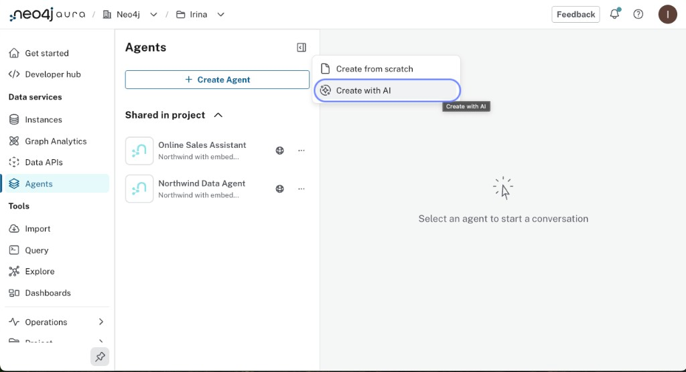
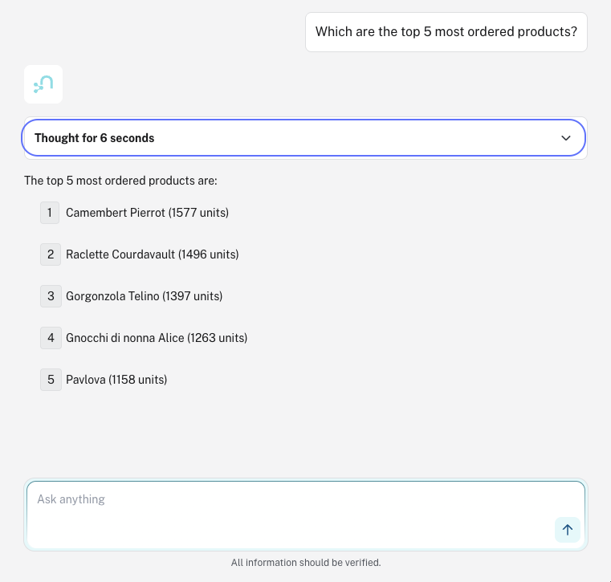

= Create an Agent with AI
:order: 3
:type: challenge

In this challenge, you will create an agent with AI, test it, and review the output.

== Create with AI

Open the Aura Console → **Data Services** → **Agents** → **Create Agent** → **Create with AI**.

In the **Create with AI** dialog, select your AuraDB instance, then write a prompt describing what the agent should do.

Here is an example using the Northwind dataset:

// [copy]
// ----
// You're an expert customer service agent for Northwind Traders, a food distribution company.
// Your role is to answer questions about customers, orders, products, categories, and suppliers.
// Decline off-topic or harmful requests.
// ----

// video::https://cdn.graphacademy.neo4j.com/courses/ai-agents/create-with-ai.mp4["Create with AI", role="cdn", width=100%]

image::images/create-with-ai-dialog.png[Create with AI dialog showing instance selection, embedding options, and prompt field with instructions entered]

After entering the prompt, click **Create Agent** to generate the agent.

After creation, your agent opens in the configuration page with a live preview panel on the right:

image::images/agent-preview.png[Agent configuration page after creation, showing name, description, prompt, access settings, and the preview panel with chat input]

On the left hand side of the dialog, you can set the **Agent name** and **Description** fields. 

Here is how you can set these using the example prompt above:

* **Agent name**: [copy]#Northwind Customer Service#
* **Description**: [copy]#A customer service agent for Northwind Traders that answers questions about customers, orders, products, categories, and suppliers. Declines off-topic or harmful requests.#

== Test the agent

Open the preview panel and try retrieving some information from the graph. 

For the Northwind example, you can try:

[copy]#Which are the top 5 most ordered products?#

== Trace through the query

For your question, expand the panel and analyze the reasoning. 

Example question:

[copy]#Who has ordered Pavlova repeatedly?#

Every agent response has a **Thought** section. Expand it to see the full execution trace.

// image::images/agent-reasoning.png[Reasoning panel showing the LLM reasoning text and the tool being applied]

The trace has two parts:

**Reasoning**: the LLM's internal thought before it acts.
Read this to understand why a specific tool was chosen.
The LLM matches the question against each tool description and picks the best fit.
If the wrong tool was selected, this text shows you exactly which description misled it.

**Applying agent tool**: what was sent to the tool and what came back.
This shows the tool name, the parameter values the LLM extracted from your question, and the raw output: either the Cypher query and its results, or the vector similarity results.

image::images/reasoning-text2cypher-detail.png[Text2Cypher tool detail showing the natural language input, the generated Cypher query, and the query results]

For a Text2Cypher tool, you can read the generated Cypher directly.
Verify that the relationship types and node labels match your schema.
If the Cypher references a relationship that does not exist, for example `ORDERED_BY` instead of `PLACED`, the tool description is missing schema context.

Now try two more questions and trace through each one:

* [copy]#What products do they order most?#
* [copy]#Which sales representative do they work with?#

Compare the reasoning text between responses.
Notice how the LLM explains its tool selection differently depending on how specific the question is.

== Review the generated tools

Aura analyzes the prompt and the instance schema, then generates a set of tools.

image::images/create-with-ai-generated-tools.png[Generated agent tools showing Cypher Template tools, a Similarity Search tool, and a Text2Cypher fallback]

[NOTE]
.Similarity Search tool
====
The generator may include a **Similarity Search** tool if it detects potential embedding fields in the schema.
The Northwind dataset does not have vector embeddings, so delete any Similarity Search tool before testing. It cannot return results without a vector index.
====

// In the agent configuration page, the generated tools appear in the **Tools** section below the prompt.
// Click the pencil icon next to a tool to open its edit dialog.
// For each tool you open, check three things:

// * **Description**: does it accurately describe what the tool returns? The LLM selects tools by description alone, so vague descriptions cause wrong tool selection.
// * **Cypher query**: does it match the relationship patterns you saw in the Query tool?
// * **Parameters**: do they have clear descriptions so the LLM can extract the correct values from the user's question?

// image::images/get-customer-orders-cypher-template-tool.png[Cypher Template tool edit dialog showing name, description, parameter, and Cypher query fields]

// If a generated description is too vague, edit it to be more specific.
// If a generated query references a label or relationship that does not exist in your schema, correct it.

// == Optionally: add a tool

// If the agent cannot find a customer by name, add a Cypher Template tool to handle that case.

// . Click **Add Tool** → **Cypher Template**.
// . Set the **Name**:
// +
// [copy]#Search for customer by name#
// . Set the **Description**:
// +
// [copy]#Search for customers using case-insensitive partial name match#
// . Add a parameter: name [copy]#name#, type **string**, description [copy]#The customer name to search for#
// . Enter the Cypher query:
// +
// [source,cypher,role=noplay]
// ----
// MATCH (c:Customer)
// WHERE lower(c.companyName) CONTAINS lower($name)
// RETURN c.customerID, c.companyName, c.contactName, c.phone
// ----
// . Click **Save**.
// . Click **Update agent** to apply your changes.

// image::images/update-agent.png[Agent configuration page showing the Update agent button in the top right corner]

// image::images/add-parameter.png[Adding a parameter with name, type, and description fields]

// Test: [copy]#Find the customer with the name holdings#

// Review the **Thought** section to confirm the agent used the new tool.

// [.quiz]
// == Check your understanding

// include::questions/3-reasoning-panel.adoc[leveloffset=+1]

[.summary]
== Summary

In this challenge, you created an agent using the Create with AI option, reviewed the generated tools, and tested the agent's reasoning.

In Module 2, you will design and build an agent with Cypher Template and Text2Cypher tools.
