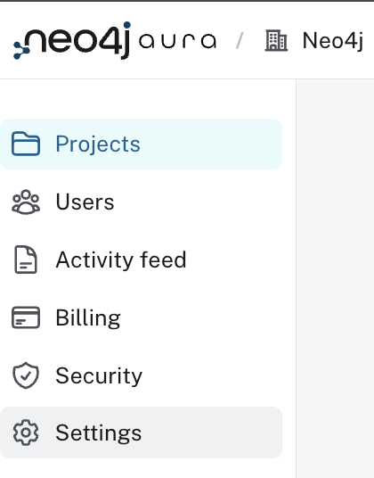
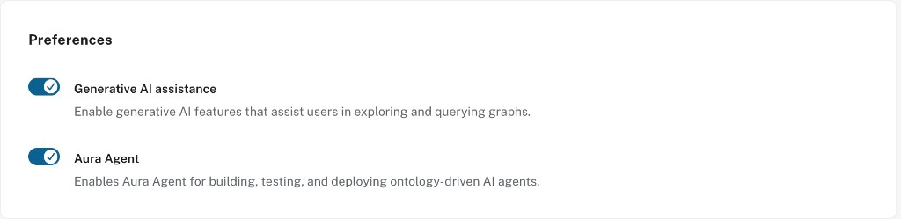

= Your First Agent
:order: 3
:type: challenge
:disable-cache: true

In this challenge, you will create an Aura Agent connected to the Northwind knowledge graph and ask it questions. The goal is to see a working agent before diving into full tool configuration in Module 2.

== Goal

Create an agent with a single Text2Cypher tool and verify it can answer questions over Northwind data.

== Step 1: Create an AuraDB Instance

If you do not already have a running AuraDB instance, create one:

. Go to link:https://console.neo4j.io/graphacademy[Aura Console^] and click **New Instance**
. Select **AuraDB Free** and follow the prompts
. Save your credentials when prompted — you will need them if you connect to the instance directly

== Step 2: Load Northwind Data

Open the **Query** tool for your instance and run the Northwind setup script. Copy the URL below and paste it into your browser to open the raw Cypher file, then copy its contents into the Query tool:

link:https://raw.githubusercontent.com/neo4j-graph-examples/northwind/main/import/northwind-data.cypher[northwind-data.cypher^]

image::images/query-tool-northwind.png[Query tool open with the northwind-data.cypher script pasted in, ready to run]

After running the script, verify the data loaded correctly by running this query:

[source,cypher]
----
MATCH (n)
RETURN labels(n)[0] AS label, count(n) AS count
ORDER BY count DESC
----

You should see rows for Customer, Order, Product, Category, and Supplier.

== Step 3: Enable Tool Authentication

Before creating an agent, confirm the required settings are active in your Aura organization.

Click your organization name in the top-left, then select **Settings** from the left sidebar:

Under **Preferences**, check that both toggles are **on**:

* **Generative AI assistance**
* **Aura Agent**

These are on by default for most organizations. If either is off, enable it before continuing.

Then, under your Northwind instance's **Security Settings**, enable **Allow tools to connect**. This lets agents query your instance.

video::https://cdn.graphacademy.neo4j.com/courses/ai-agents/tool-authentication.mp4["Tool Authentication", role="cdn", width=100%]

== Create the Agent

. Navigate to **Data Services** → **Agents** → **Create Agent**
. Select **Create from scratch**
. Select your Northwind instance
. Fill in:
** **Name**: `Northwind Analyst`
** **Description**: `Answers questions about the Northwind retail dataset — customers, orders, products, and suppliers.`
** **Instructions**: `You are a Northwind retail analyst. Answer questions about customers, orders, products, categories, and suppliers using the tools available.`
. Leave access as **Internal**
. Click **Add Tools** and add a **Text2Cypher** tool:
** **Name**: `Query Northwind`
** **Description**: `Use this tool for any question about the Northwind graph. The graph contains: Customer, Order, Product, Category, Supplier nodes. Relationships: PURCHASED (Customer→Order), PART_OF (Product→Category), SUPPLIES (Supplier→Product), ORDERS (Order→Product).`
. Click **Save Agent**

== Try It

Ask your agent these questions in the preview panel:

* "Which customers have placed the most orders?"
* "What products are in the Beverages category?"
* "Which suppliers provide products in more than one category?"
* "How many orders were shipped to Germany?"
* "Which products have never been ordered?"

Expand the **Thought** section on each response to see which tool the agent selected and what Cypher it generated. Because this agent has only a Text2Cypher tool, every question generates Cypher at runtime — check the generated queries to verify they match your intent before trusting the answers.

[.summary]
== Summary

You created your first Aura Agent and ran it against real graph data. In Module 2, you will build a more complete agent with Cypher Template tools for consistent, deterministic retrieval.

read::Mark as completed[]
