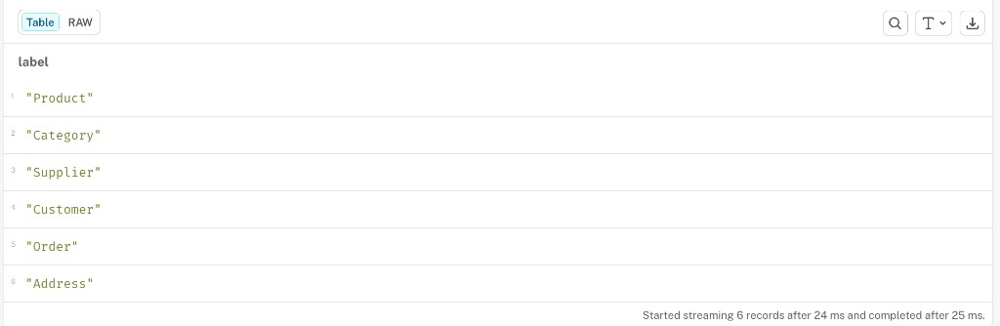
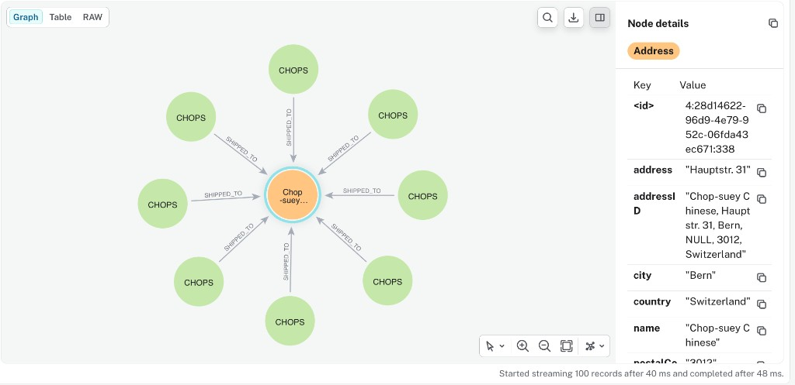
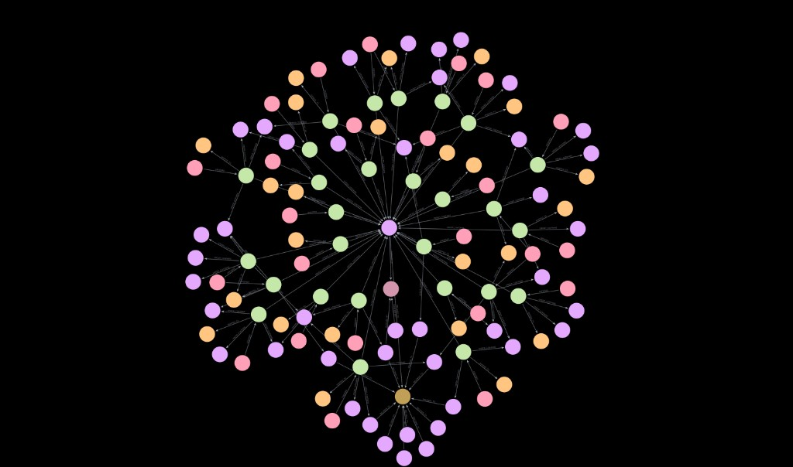

= Your First Agent
:order: 3
:type: challenge
:disable-cache: true

Try creating an agent on your own AuraDB instance and test it with Text2Cypher.

If you need to load a dataset, download the Northwind model, then open the Import tool, click the **...** menu, select **Open model (with data)**, and click **Run Import**.

link:https://cdn.graphacademy.neo4j.com/courses/workshop-modeling/modules/6-final-review/lessons/1-recommendation-query/data/complete-model.zip[Download Northwind dataset^, role="btn"]

console::Open Import Tool[tool=import,connect-url={connect-url}]

== Explore your data

Before creating an agent, spend a few minutes in the Query tool getting to know your graph.

List all node labels:

[source,cypher]
----
CALL db.labels();
----

See all properties and their types across every label:

[source,cypher]
----
CALL db.schema.nodeTypeProperties();
----

image::images/northwind-node-properties.png[Query results showing nodeType, nodeLabels, propertyName, propertyTypes, and mandatory columns for Category and Supplier nodes]

Query the relationship patterns to see how labels connect and how many of each relationship exist:

[source,cypher]
----
MATCH (a)-[r]->(b)
RETURN labels(a) AS fromLabels, type(r) AS relType, labels(b) AS toLabels, count(*) AS cnt
ORDER BY cnt DESC
LIMIT 25;
----

image::images/northwind-relationship-patterns.png[Query results showing Northwind relationship patterns: ORDER_CONTAINS, ORDERED, SHIPPED_TO, BELONGS_TO, and SUPPLIED_BY with node counts]

Traverse a specific relationship to see the data in graph form:

[source,cypher]
----
MATCH (a:Order)-[r:SHIPPED_TO]->(b:Address)
RETURN a, r, b
LIMIT 100;
----

Explore the neighbourhood around a Customer to see orders, products, and addresses within 1–2 hops:

[source,cypher]
----
MATCH (c:Customer)
WITH c LIMIT 1
MATCH p=(c)-[*1..2]-(n)
RETURN p
LIMIT 80;
----

image::images/northwind-customer-neighbourhood.png[Graph visualization showing a Customer node connected to Orders, Products, and Addresses within 1-2 hops]

Do the same centered on a Product to surface supplier and category connections:

[source,cypher]
----
MATCH (p:Product)
WITH p LIMIT 1
MATCH path=(p)-[*1..2]-(n)
RETURN path
LIMIT 150;
----

Use this pattern as a template to explore any relationship in your graph:

----
MATCH (a:SomeLabel)-[r:SOME_REL]->(b:OtherLabel)
RETURN a, r, b
LIMIT 100;
----

== Create your agent

Once you are comfortable with the data, create a new agent, add a Text2Cypher tool, and ask it a question in natural language.

[.summary]
== Summary

In Module 2, you will build a fully configured agent with Cypher Template and Text2Cypher tools.

read::Mark as completed[]
