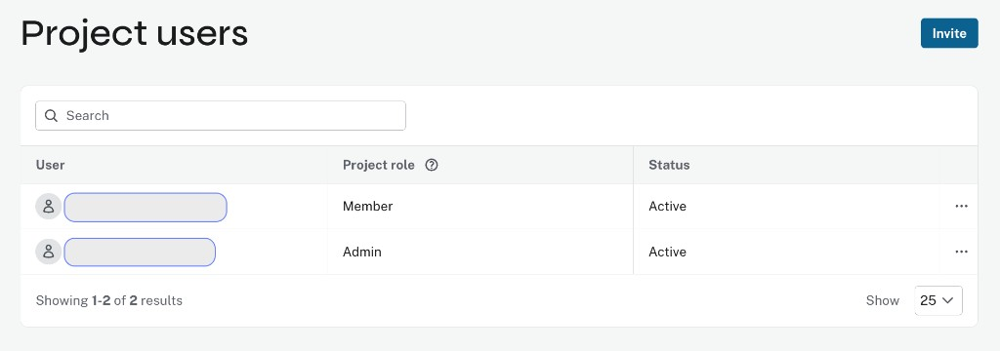
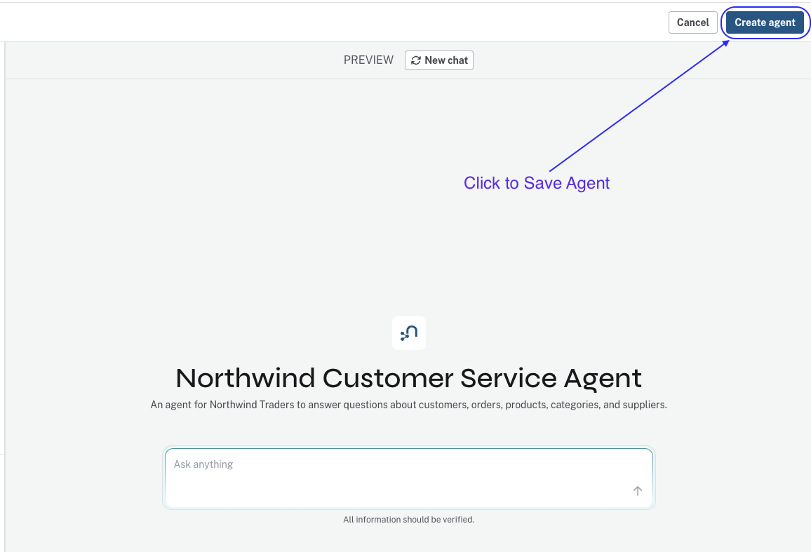

= Introduction to Aura Agents
:order: 1
:type: lesson
== Introduction

Neo4j Aura Agents let you build retrieval systems that query your knowledge graph from the Aura console without writing code.

In this lesson, you will learn:

* What Neo4j Aura Agents are
* When to use Aura Agents
* How Aura Agents work

== What are Aura Agents?

A **Neo4j Aura Agent** is a no/low-code platform in the Aura Console where natural language questions turn into graph queries run against your graph. You connect the agent to an AuraDB instance (your knowledge graph or any graph stored in AuraDB), ask a question, and the agent handles the rest. You build and test agents visually in the Console.

Aura Agents are useful when you want to expose knowledge graph data using natural language, without writing application code.

== How Aura Agents work

Aura Agents use reasoning to break down each request into a sequence of steps.

This is often called chain-of-thought or multi-step reasoning: the agent doesn’t jump straight to an answer, it retrieves the information step by step:

* **Interpret user input**: Obtain the request, decide what information is needed from the graph, and determine which tool is most likely to answer.
* **Execute tools**: Call the selected tool or tools. Each tool runs against your graph and returns data, and the agent may call more than one tool before answering.
* **Generate response**: Build a natural language answer from the retrieved data.

The agent chooses which tool to call; the tools do not choose themselves. Tools only retrieve data; the agent uses that data to construct the response.

== Available tools

Aura Agents use three read-only tool types to query your graph. Depending on your data and the question, the agent will select the most appropriate tool that would likely answer the question. It could be one, two, or all three of the following:

* **Cypher Template**: Runs predefined Cypher queries with parameters you define. This tool is used when you ask questions that can be answered with a fixed query, such as "Get customer ALFKI".
* **Text2Cypher**: Generates Cypher from natural language at runtime using your schema. This tool is used when you ask questions that are not covered by the Cypher Template tools, such as "What are the top 10 products by revenue across all categories?".
* **Similarity Search**: Finds nodes by similarity. Use this tool when you ask questions that are not covered by the Cypher Template or Text2Cypher tools, such as "What are the products similar to the product with the name 'Chai'?".

// An Aura Agent does not answer in one step. It follows four steps:

// * **Receive user input**: User prompt
// * **Translate user input into a query**: Translate the user input into a query for the knowledge graph
// * **Retrieve data**: Query the knowledge graph
// * **Generate response**: Generate a natural language response based on the retrieved data

// The diagram below illustrates this workflow: from user input through reasoning, tool selection and execution, to final output.

// image::images/agent-process.svg[Agent workflow: user input, reasoning, tool selection, tool execution, and final output]

// At each step, the agent builds context: it identifies what the user needs, picks the tool most likely to answer it, runs the query, and incorporates the results before generating a response.

== Getting access to Aura Agents

To use Agents, ensure both of the following are enabled:

* **Generative AI assistance** — in your organization settings.
* **Aura Agent** — in your project settings.

Before starting the course, check that both toggles are **ON**. This course uses manual agent creation (Create with AI and Create from scratch) in the Aura Console.

image::images/enable-aura-agent.png[Project settings showing the Aura Agent toggle enabled]

To create an agent, you need to be a **Project Admin**.

[NOTE]
.Check your project role
====
To check your role, go to **Project** → **Users** in the Aura Console left navigation:
====

image::images/project-users-menu.png[Aura Console left navigation with Project expanded and Users highlighted]

Your role is listed in the **Project role** column next to your email address:

[WARNING]
.Project Members cannot create agents
====
Project Members cannot create agents, but they can view and use agents created by other Project Admins.
====

== Creating an agent with AI

The **Create with AI** option generates a working agent from a user-provided prompt and the instance schema.

A **prompt** is a description of what the agent should do, so the agent can understand the user's requirements and answer the upcoming question.

For example, if you want to create an agent that answers questions about your customers, you can provide a prompt like this:

[copy]
----
You are a customer service agent for Northwind Traders, a food distribution company.
You are to answer questions about customers, orders, products, categories, and suppliers.
You are to decline off-topic or harmful requests.
----

The agent will use the schema of your connected knowledge graph to build tools that query the relevant parts of your graph that match the user's prompt.

Once you create the agent, you can test it by opening the preview panel and asking it a question, as well as review the reasoning and tool usage.

The preview panel lets you ask the agent questions and see responses. There you can also adjust the agent's name and description, view the reasoning and tool usage, and edit the prompt to refine the agent's behavior.

video::https://cdn.graphacademy.neo4j.com/courses/ai-agents/create-with-ai.mp4["Create with AI", role="cdn", width=100%]

After reviewing and testing the agent, click on **Create Agent** to save it.

In the end, you will have a working agent that you can use to answer questions about your data using natural language.

[TIP]
.Two paths to Neo4j agents
====
The Aura Agents covered in this course are no/low-code agents built, configured, and tested in the Aura Console. For a code-based approach with Python and LangChain, see link:/courses/genai-integration-langchain/[Using Neo4j with LangChain^] or link:/courses/genai-fundamentals/[Neo4j and GenAI Fundamentals^].
====

[.quiz]
== Check your understanding

include::questions/1-agents.adoc[leveloffset=+1]

[.summary]
== Summary

In this lesson, you learned what Aura Agents are, how they work, and when to use them.

In the next lesson, you will learn how to:

* Create an agent with AI
* Test it and review the output
