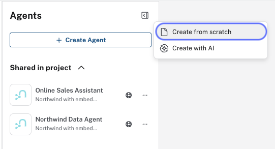
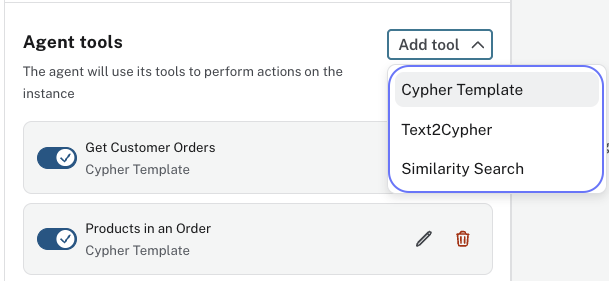
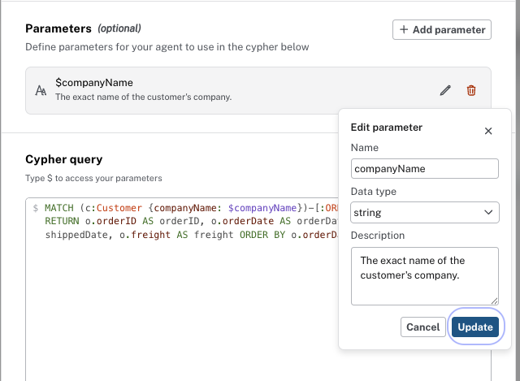
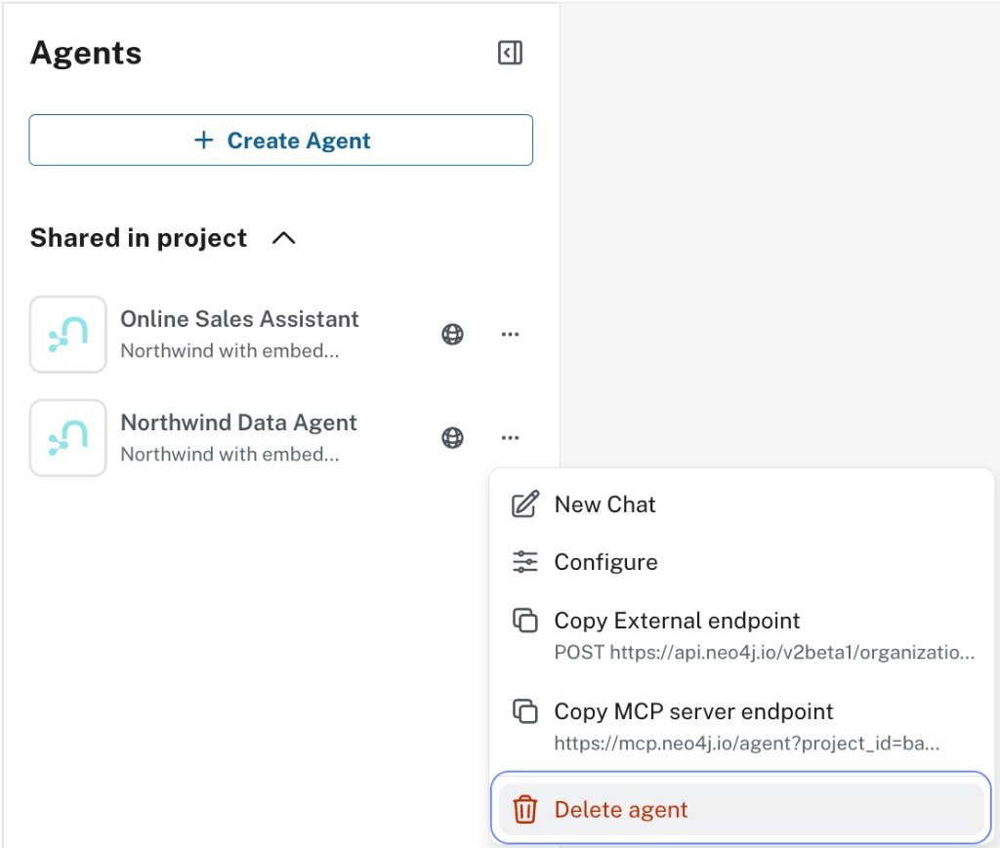

= Designing and managing agents
:order: 2
:type: lesson

To build an effective agent, you need a clear design.

An agent with poorly scoped tools, vague descriptions, or missing relationship context will give inconsistent results even with good data.

In this lesson, you will learn how to define role and scope, map question types to Cypher Template or Text2Cypher, write tool descriptions so the LLM selects the correct tool, and edit, delete, and manage tools and agents.

== Role and scope

Define what the agent does and, equally important, what it does not do.

One focused agent per task works better than a general-purpose agent.
A narrow scope makes tool selection easier for the LLM and makes the agent's behavior more predictable.

For example, a Northwind Analyst agent answers questions about customers, orders, products, categories, and suppliers.
It does not answer questions about pricing strategy, HR, or anything outside the graph.

Encoding that boundary in the instructions keeps the agent on task. For example, instruct it to politely decline off-topic requests.

== Question types

Before building tools, decide which tool type fits each question your agent needs to answer.

=== Is the query structure fixed?

If the `MATCH` pattern, `WHERE` conditions, and `RETURN` clause are all known in advance and only the values change, use a **Cypher Template**.

For example, "Top 10 customers by order count" has a fixed `COUNT`, `ORDER BY`, and `LIMIT $n` — write it as a template. Cypher Templates work well for anticipated, repeatable questions and can use multi-hop patterns to retrieve data across the graph.

=== Does the query structure change with each question?

If the query cannot be pre-written because the structure itself depends on what the user asks, use **Text2Cypher**.

For example, "Which customers ordered products from more than 2 different suppliers?" — the filter count, the multi-hop path, and the aggregation all vary with the question.

=== Is the question vague or open-ended?

If the question is exploratory and can be answered by finding nodes semantically similar to the user's input, use a **Similarity Search** tool.

For example, "What products are similar to Chai?" or "Find suppliers that deal in dairy." These questions don't have a fixed Cypher structure and aren't looking for a specific known value — they need vector search to find relevant matches.

Similarity Search requires your graph nodes to have vector embeddings stored as properties, and a vector index built on those embeddings. Generating embeddings means converting text properties into numerical vectors using an embedding model — this is a separate data preparation step before you configure the tool.

To learn more, see link:/courses/llm-vectors-unstructured/[Introduction to Vector Indexes and Unstructured Data^].

== Tool descriptions

The LLM selects tools based solely on their descriptions. It never inspects the Cypher query or the parameter names.
A description like "get customer data" is too vague to be useful: if three tools all retrieve data, the LLM has no basis for choosing between them.

Write descriptions that answer two questions:

* What does this tool return?
* When should the LLM use it instead of the other tools?

Compare these two descriptions for the same tool:

[cols="1,2"]
|===
|Description |Problem

|`Get customer data`
|Too vague: could match any question mentioning a customer

|`Return customer details and recent orders for a specific customer ID, for example ALFKI`
|Specific: names the parameter type, gives an example value, scopes what it returns
|===

For your Text2Cypher fallback, the description must state when to use it (and when not). The tool automatically receives the database schema. Add domain-specific context: relevant entities, categorical property patterns, and which attributes are suitable for aggregation. That helps the LLM generate more accurate Cypher.

[source,text]
----
Use this tool ONLY when no other tool covers the question.
The graph contains: Customer, Order, Product, Category, Supplier nodes.
Relationships: PLACED (Customer→Order), CONTAINS (Order→Product), IN_CATEGORY (Product→Category), SUPPLIES (Supplier→Product).
----

The "ONLY when no other tool covers" constraint prevents the LLM from defaulting to Text2Cypher for questions your templates handle.

== Creating an agent

Once you have defined a role, scope, and tool set for your agent, you create it in the Aura Console under **Data Services** → **Agents** → **Create Agent** → **Create from scratch**.

Give the agent a name, connect it to your AuraDB instance, and write instructions that define its role, scope, and what to decline.

image::images/create-agent-from-scratch.png[Create from scratch dialog showing name, instance, and instructions fields]

== Adding a tool

With the agent open, click **Add Tool** and select the tool type: **Cypher Template**, **Text2Cypher**, or **Similarity Search**.

Fill in the name, description, and any required configuration for that tool type. After adding or changing tools, click **Update agent** to save — the agent keeps using the previous configuration until you do.

== Editing a tool

Click the pencil icon next to any tool to open the edit dialog. You can update the name, description, parameters, and Cypher query.

image::images/tool-edit-delete.png[Tool list showing pencil icon to edit and trash icon to delete a tool]

For Cypher Template tools, click the pencil icon next to a parameter to update its name, data type, or description.

Click **Update agent** after any change to save.

== Deleting a tool

Click the trash icon next to a tool to remove it, then click **Update agent** to persist the change.

== Deleting an agent

Open the **...** menu next to the agent in the Agents list and select **Delete agent**.

image::images/agent-context-menu.png[Agent list showing the context menu with New Chat, Configure, Copy External endpoint, Copy MCP server endpoint, and Delete agent options]

[WARNING]
.Deletion is permanent
====
Deleting an agent cannot be undone. All tools, instructions, and configuration are permanently removed.
====

== Creating an agent with AI

Aura Agent also offers a **Create with AI** option. Instead of configuring an agent manually, you provide a prompt describing the agent's role and scope, and the platform reads your instance schema and generates a set of tools automatically.

This is useful for getting started quickly — the AI produces an initial tool set that you can then review, edit, and refine using the same techniques covered in this lesson.

In the next challenge, you will use Create with AI to build your first agent, then evaluate the tools it generates against the design principles here.

[.quiz]
== Check your understanding

include::questions/1-role-scope.adoc[leveloffset=+1]

[.summary]
== Summary

A well-designed agent has a narrow scope, uses Cypher Templates for predictable questions, and has specific tool descriptions that give the LLM enough context to make the correct tool selection.

In the next challenge, you will create an agent with AI and review the tools it generates against this design.
