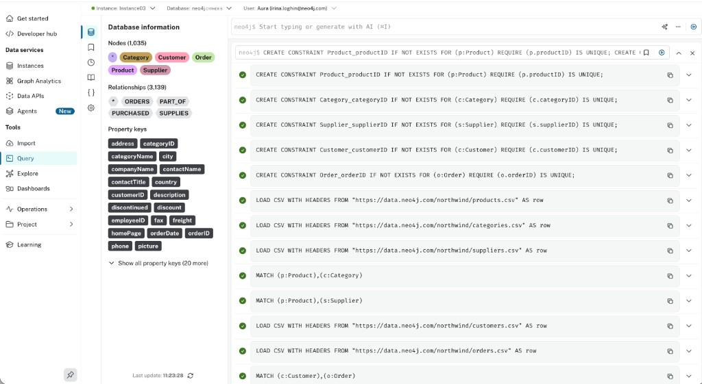

= Create your first agent
:order: 2
:type: challenge
:optional: true

In this challenge, you will create an agent with AI using your own knowledge graph, test it, and review the output. Use any graph you have in AuraDB; the steps are the same regardless of schema.

[NOTE]
.Want a working example?
====
If you prefer to follow along with a ready-made dataset, use Northwind. Download the script from the https://github.com/neo4j-graph-examples/northwind/blob/main/scripts/northwind.cypher[Northwind dataset repository]. In the Aura Console, open your instance → **Tools** → **Query**. Open the downloaded `northwind.cypher` file, copy its contents into the query editor, and run the script. When it finishes, the Database information panel will show node labels and relationship types. The example prompts and questions below use Northwind, you can adapt them to your own graph.
====

== Before you start

* Have a Neo4j Aura instance running with a graph loaded (your own data or Northwind).
* In **Settings**, confirm **Enable GenAI Assistance** and **Enable Aura Agent** are ON (organization and project settings as described in the Introduction to Aura Agents lesson).
* Be a **Project Admin**.

== Confirm your data is loaded

Before creating an agent, confirm your instance has data. In the Aura Console, open your instance and go to **Tools** → **Query**. Run a query (for example, `MATCH (n) RETURN count(n)`) to confirm nodes exist. You should see the **Database information** panel on the left listing node labels, relationship types, and property keys, and the query editor showing your executed commands (e.g. green checkmarks). If you loaded data from CSV or a script, the query history will show the load and constraint commands.

== Create with AI

Open the Aura Console → **Data Services** → **Agents** → **Create Agent** → **Create with AI**.

image::images/create-with-ai-online-sales-assistant-agent.png[Agents list with Create Agent dropdown open, highlighting the Create with AI option]

In the **Create with AI** dialog, select your AuraDB instance, then write a prompt describing what the agent should do. The prompt should define the agent's role, what data it can answer questions about, and that it should decline off-topic or harmful requests.

[NOTE]
.Example prompt (Northwind)
====
If you use Northwind, you could use a prompt like:

[copy]
----
You're an expert customer service agent for Northwind Traders, a food distribution company.
Your role is to answer questions about customers, orders, products, categories, and suppliers.
Decline off-topic or harmful requests.
----
====

// video::https://cdn.graphacademy.neo4j.com/courses/ai-agents/create-with-ai.mp4["Create with AI", role="cdn", width=100%]

image::images/create-with-ai-dialog.png[Create with AI dialog showing instance selection, embedding options, and prompt field with instructions entered]

After entering the prompt, click **Create Agent** to generate the agent.

After creation, your agent opens in the configuration page with a live preview panel on the right:

image::images/agent-preview.png[Agent configuration page after creation, showing name, description, prompt, access settings, and the preview panel with chat input]

On the left side of the dialog, set the **Agent name** and **Description** to match your agent's role and scope.

If you used the Northwind example prompt above, you could set **Agent name** to `Northwind Customer Service` and **Description** to a short summary of what the agent does and that it declines off-topic requests.

== Test the agent

Open the preview panel and ask questions that your graph can answer. Retrieve information that exercises the generated tools.

If you are using Northwind, you can try:

[copy]#Which are the top 5 most ordered products?#

image::images/which-are-top5-ordered-products-prompt.png[Agent response showing top 5 most ordered products]

== Trace through the query

For your question, expand the panel and analyze the reasoning.

Ask a question that requires the agent to use a specific tool (for example, one that needs a parameter). If you are using Northwind, you could try:

[copy]#Who has ordered Pavlova repeatedly?#

Every agent response has a **Thought** section. Expand it to see the full execution trace.

// image::images/agent-reasoning.png[Reasoning panel showing the LLM reasoning text and the tool being applied]

The trace has two parts:

**Reasoning**: the LLM's internal thought before it acts.
Read this to understand why a specific tool was chosen.
The LLM matches the question against each tool description and picks the best fit.
If the wrong tool was selected, this text shows you exactly which description misled it.

**Applying agent tool**: what was sent to the tool and what came back.
This shows the tool name, the parameter values the LLM extracted from your question, and the raw output: either the Cypher query and its results, or the vector similarity results.

image::images/reasoning-text2cypher-detail.png[Text2Cypher tool detail showing the natural language input, the generated Cypher query, and the query results]

For a Text2Cypher tool, you can read the generated Cypher directly.
Verify that the relationship types and node labels match your schema.
If the Cypher references a relationship that does not exist, for example `ORDERED_BY` instead of `PLACED`, the tool description is missing schema context.

Try two more questions that exercise different tools or parameters. If you are using Northwind, examples:

* [copy]#What products do they order most?#
* [copy]#Which sales representative do they work with?#

Compare the reasoning text between responses.
Notice how the LLM explains its tool selection differently depending on how specific the question is.

read::Mark as completed[]

[.summary]
== Summary

In this challenge, you created an agent with AI using your knowledge graph, reviewed the generated tools, and tested the agent's reasoning.

In Module 2, you will design and build an agent with Cypher Template and Text2Cypher tools.
