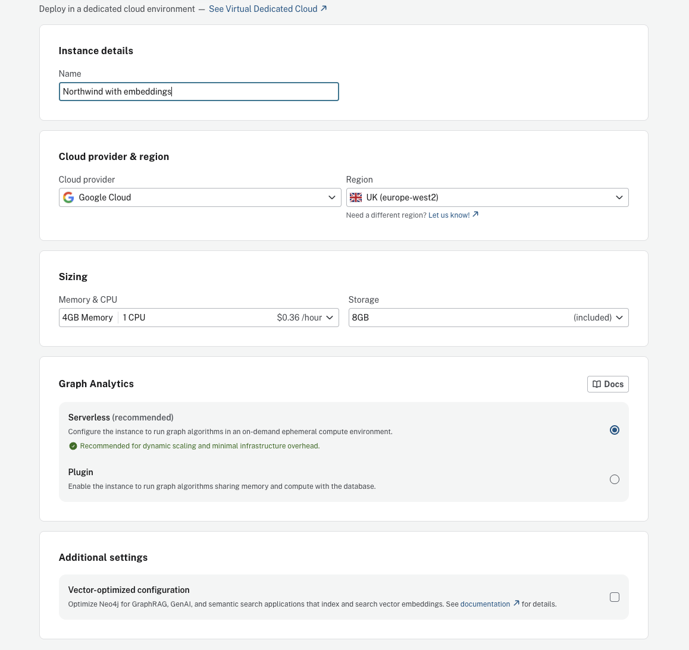

= Set Up Northwind with Embeddings
:order: 0
:type: lesson
:slides: true

[.slide.discrete]
== Introduction

The Northwind dataset and embeddings are used in later lessons to build and test an agent. Setting them up now ensures you can run both Cypher and similarity search tools.

In this lesson, you will learn how to set up the Northwind dataset with embeddings so your agent can run both Cypher queries and semantic similarity searches.

[.slide]
== Overview

You will complete three steps:

. Create an AuraDB instance with vector-optimized configuration
. Load the Northwind dataset with embeddings
. Enable tool authentication so agents can query the instance

Before diving into the steps, the following sections explain what embeddings are and why they matter for agents.

[.slide]
== What Are Embeddings?

An **embedding** is a numerical vector that captures the semantic meaning of text. Machine learning models like OpenAI's `text-embedding-ada-002` convert text into high-dimensional vectors, typically 1536 dimensions, where similar meanings produce vectors that are close together.

For example, "spicy sauce" and "hot condiment" are different strings, but their embeddings are similar because they share semantic meaning. This lets you search by concept rather than exact keywords.

[.slide]
== When Agents Can Use Embeddings

Agents do not require embeddings, but when embeddings are available, they can leverage them for the **Similarity Search** tool.

With embeddings in your knowledge graph, the Similarity Search tool can answer questions like "Find products similar to hot sauce" by comparing vector distances — even when no product contains those exact words.

Without embeddings, the Similarity Search tool is unavailable, but agents still work with Cypher Template and Text2Cypher tools. To learn how to create embeddings for your own data, see the link:/courses/llm-vectors-unstructured/[Vector Indexes and Unstructured Data^] course or the link:https://neo4j.com/blog/developer/new-cypher-ai-procedures/[New Cypher AI Procedures^] blog post.

[.slide]
== How the Vector Index Works

A **vector index** organizes embeddings for fast nearest-neighbor lookup. Without an index, the database compares every embedding on every query, which does not scale.

The Northwind script creates an index called `product_text_embeddings` that enables sub-second similarity search.

[.slide]
== Step 1: Create an AuraDB Instance

. Go to the link:https://console.neo4j.io/graphacademy[Aura Console^] and create a new AuraDB instance
. Name it something descriptive like "Northwind with embeddings"
. Select your cloud provider and region
. Under **Additional settings**, enable **Vector-optimized configuration**

The vector-optimized setting ensures your instance is configured for embedding storage and similarity search.

[.slide]
== Step 2: Load Northwind with Embeddings

Download the link:https://github.com/neo4j-product-examples/graphrag-examples/blob/main/patterns-app/load-data/northwind-data.cypher[northwind-data.cypher^] script from the GraphRAG examples repo.

The script does three things in one run:

* Loads Northwind data: Product, Category, Supplier, Customer, Order, and Address nodes with their relationships
* Creates `Product.text` and `Product.textEmbedding` properties using `genai.vector.encode` with OpenAI
* Creates the `product_text_embeddings` vector index

Before running, replace the `:param openAIKey` placeholder with your link:https://platform.openai.com/api-keys[OpenAI API key^].

[.slide]
== Step 3: Enable Tool Authentication

Agents need permission to query your instance. Without this step, your instance will appear unavailable when you create an agent.

. Go to **Aura Console** → **Organization** → **Security Settings**
. Enable **Allow tools to connect with permissions from the user's project role**
. Select your Northwind instance from the list

video::https://cdn.graphacademy.neo4j.com/courses/ai-agents/tool-authentication.mp4["Enabling tool authentication in the Aura Console",role="cdn", width=100%]

[.quiz]
== Check Your Understanding

include::questions/1-embeddings.adoc[leveloffset=+1]

[.summary]
== Summary

In this lesson, you learned how to create an AuraDB instance, load the Northwind dataset with embeddings, and enable tool authentication.
