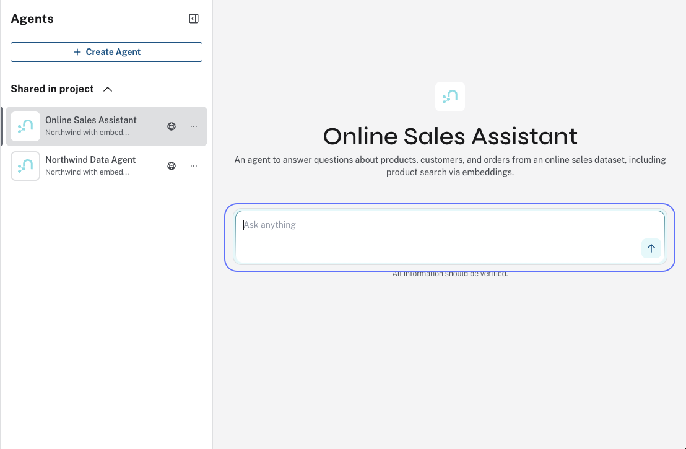

= Design Aura Agents
:order: 1
:type: lesson
== Introduction

Prompt design drives how well the agent chooses tools and stays in scope. Clear role, scope, and tool descriptions reduce wrong tool selection and off-topic answers.

In this lesson, you will learn how to write effective prompts and configure agents for predictable behavior.

== What Makes a Good Agent Prompt

An agent prompt tells the LLM who it is and what it should do. A complete prompt includes:

* **Role**: What the agent represents, such as "retail analyst for Northwind"
* **Scope**: What questions it can answer and what is out of bounds
* **Tools**: Which tools are available and when to use each one
* **Examples** (optional): Sample question-answer pairs for complex tasks

== Best Practices

**Keep the scope focused.** One main task per agent works better than a do-everything agent. If you need different capabilities, create multiple agents.

**Write clear tool descriptions.** The LLM picks tools based on their descriptions. If a description is vague, the agent may select the wrong tool.

**Include the graph schema in your prompt.** Mentioning node labels and relationship types helps the LLM construct valid queries.

**Test edge cases.** Try ambiguous questions, queries that return no results, and off-topic requests.

**Add safeguards.** Include instructions for handling harmful or irrelevant queries.

== Example: Northwind Retail Analyst

Here is a sample configuration for a Northwind agent:

[cols="1,3"]
|===
|Element |Value

|**Goal**
|Answer questions about customers, orders, products, and sales patterns

|**Tools**
|Get Customer, Top Customers by Order Count, Products by Category

|**Prompt**
|"You are a Northwind retail analyst. You have access to Cypher tools to query the graph. Answer questions about customers, orders, products, and sales."

|**Safeguard**
|"If the question is off-topic or asks for harmful content, politely decline."
|===

Once you save the agent, it displays a chat interface. Users see the description and can start asking questions.

== From Schema and Use Case to Agent

[source,mermaid]
.From schema, use case, prompts, and tools to a ready-to-deploy agent
----
%%{init: {
  "theme": "base",
  "securityLevel": "strict",
  "fontFamily": "Public Sans, Arial, Helvetica, sans-serif",
  "themeVariables": {
    "background": "#F5F7FA",
    "primaryTextColor": "#014063",
    "fontSize": "14px",
    "primaryColor": "#eef6f9",
    "primaryBorderColor": "#014063",
    "lineColor": "#485662"
  }
}}%%
flowchart LR
    SCHEMA["Graph Schema"]
    USECASE["Use Case Description"]

    PROMPTS["Prompts"]
    TOOLS["Tools"]
    AGENT["Ready to Deploy Agent"]

    SCHEMA -->|feeds into| TOOLS
    USECASE -->|feeds into| PROMPTS
    USECASE -->|feeds into| TOOLS
    PROMPTS --> AGENT
    TOOLS --> AGENT

    style SCHEMA fill:#edf6e8,stroke:#006E58
    style USECASE fill:#eef6f9,stroke:#014063
    style PROMPTS fill:#E7FAFB,stroke:#006E58
    style TOOLS fill:#E7FAFB,stroke:#006E58
    style AGENT fill:#014063,stroke:#014063,color:#fff
----

The graph schema informs your tools: Cypher patterns, node labels, relationships. The use case description drives both prompts (role, scope, examples) and tool selection. Prompts and tools together produce a ready-to-deploy agent. See link:https://neo4j.com/docs/aura/aura-agent/[Aura Agent documentation^] for prompt and tool configuration details.

[.quiz]
== Check Your Understanding

include::questions/1-prompts.adoc[leveloffset=+1]

[.summary]
== Summary

In this lesson, you learned how to design agents with clear prompts, focused scope, and effective tool descriptions.
