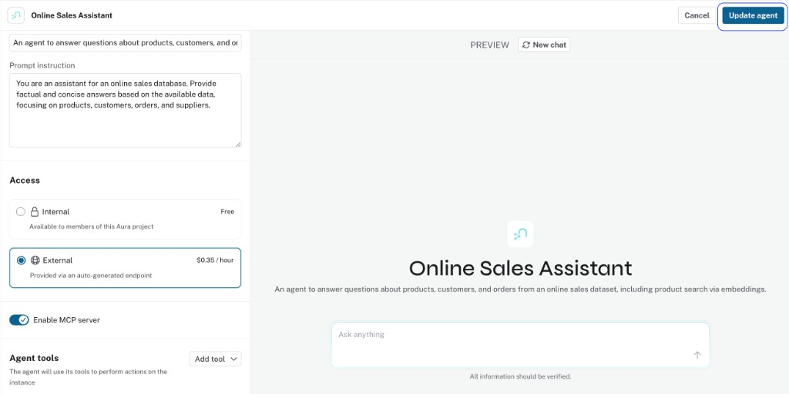

= Create your own Cypher Template tool
:order: 2
:type: challenge
:disable-cache: true

You now know when and how to use Cypher Template tools.

In this challenge, you will add a Cypher Template tool to the agent you created in the first module.

== Goal

Create a Cypher Template tool that lets your agent answer a question it cannot handle well with the generated tools alone. Choose a question type that fits your graph, write the Cypher, define the parameter, and test it.

== Before You Start

* Complete the previous lesson, Introduction to Aura Agents, and the Create an Agent with AI challenge so you have an agent on your own graph or Northwind.
* Open that agent in the Aura Console: **Data Services** → **Agents**, then select your agent.
* Click **Add Tool** → **Cypher Template** to start adding a new tool.

image::../1-cypher-template/images/add-tool-menu.png[Add Tool menu with Cypher Template option]

== Your Task

Add one Cypher Template tool. You decide:

. **What question it answers**. +
For example: get an entity by ID or name, list items in a category, or top N by some measure. Adapt to your schema.
. **The parameters it requires**: +
name, type, and description.
. **The Cypher query**: +
Remember to use parameter placeholders like `$parameter_name` for the values the LLM will extract.

**Guidelines:**

* The tool description tells the LLM when to use it. Be specific about the question type.
* The parameter description tells the LLM what value to extract. Include an example value: for Northwind you might use "The customer ID, for example ALFKI or QUICK," or the equivalent for your graph.
* Test your Cypher in the Query tool first if you are unsure about the schema. In the Aura Console, open **Tools** → **Query** to see the Database information panel with node labels, relationship types, and property keys, then run your Cypher.

[%collapsible]
.Example tool: Getting customers and Orders in Northwind
====
If you are using Northwind, why not create a tool to get customers and their orders?

* **Name:** [copy]#Get Customer#
* **Description:** [copy]#Return customer details and recent orders for a customer ID, for example ALFKI.#
* **Parameter:** name [copy]#customer_id#, type **string**, description [copy]#The customer ID to look up, for example ALFKI or QUICK#
* **Cypher:**

[source,cypher,role=noplay,options="nowrap"]
----
MATCH (c:Customer {id: $customer_id})-[:PLACED]->(o:Order)
RETURN c.id, c.companyName, c.contactName,
  collect(o.orderId)[0..5] AS recentOrders
----

image::../5-bp-create-from-scratch/images/get-customer-orders-cypher-template-tool.png[Cypher Template tool configuration showing name, description, parameters, and Cypher query]
====

== Test your tool

After saving your tool, click **Update agent** to apply your changes.

Then ask a question that should trigger your new tool. Expand the **Thought** section to confirm the agent selected it and passed the correct parameter value.

read::Mark as completed[]

[.summary]
== Summary

You created your own Cypher Template tool and added it to your agent. You defined the name, description, parameter, and Cypher query.

In the next lesson, you will learn about Text2Cypher and when to use it.
