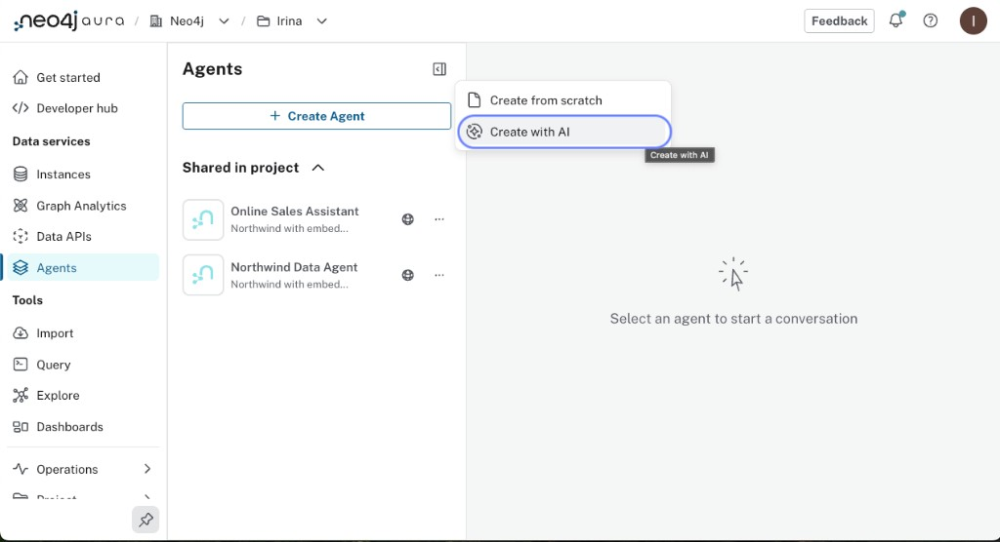
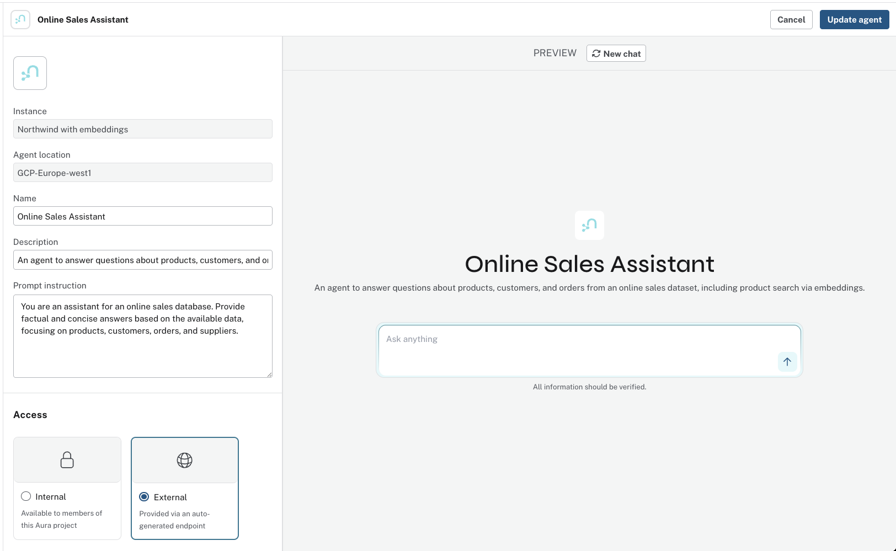
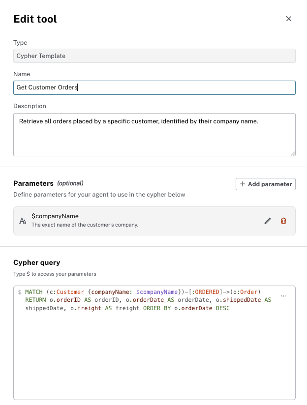
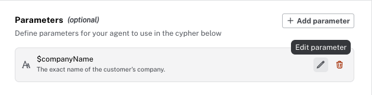

= Implementing Simple Agents with Cypher and Tools
:order: 2
:type: lesson
:slides: true

[.slide.discrete]
== Introduction

In this lesson, you will build a Northwind Analyst agent step by step.

**Prerequisites**: Complete the previous lesson so you have Northwind loaded with embeddings and tool authentication enabled.

[.slide]
== What You Will Build

A "Northwind Analyst" agent configured with:

* Name, description, and instructions that define its role
* Cypher Template tools for querying customers, orders, and products
* Optional GraphRAG for community summarization

[.slide]
== Available Tool Types

Aura Agents support three tool types:

* **Cypher Template**: Runs a predefined Cypher query with parameters you specify
* **Text2Cypher**: Converts natural language to Cypher dynamically
* **Similarity Search**: Finds semantically related nodes using vector similarity

[TIP]
.Read-only tools
====
All tools are read-only; they query the graph but do not modify data.
====

For Northwind, Cypher Template tools handle most queries. The key to good tool selection by the LLM is writing clear tool descriptions.

[.slide]
== When to Use Each Tool

[cols="1,2,2"]
|===
|Tool |Best For |Example Questions

|**Cypher Template**
|Predictable queries with known parameters
|"Get customer ALFKI", "Top 10 products by revenue"

|**Text2Cypher**
|Unpredictable queries, ad-hoc exploration
|"How many orders shipped late last month?", "Which suppliers serve multiple regions?"

|**Similarity Search**
|Semantic matching, finding related items
|"Products similar to spicy condiments", "Find items like hot sauce"
|===

Start with Cypher Templates for your core use cases. Add Text2Cypher as a fallback for questions you did not anticipate. Add Similarity Search when you have embeddings and need semantic retrieval.

[.slide]
== How Tools Connect to the Knowledge Graph

[source,mermaid]
.Knowledge graph to tools to result
----
%%{init: {
  "theme": "base",
  "securityLevel": "strict",
  "fontFamily": "Public Sans, Arial, Helvetica, sans-serif",
  "themeVariables": {
    "background": "#F5F7FA",
    "primaryTextColor": "#014063",
    "fontSize": "14px",
    "primaryColor": "#eef6f9",
    "primaryBorderColor": "#014063",
    "lineColor": "#485662"
  }
}}%%
flowchart LR
    KG["Knowledge Graph"]

    SIM["Similarity Search"]
    TTQ["Text to Query"]
    PT["Parameterized Templates"]

    RESULT["Result"]

    KG --> SIM
    KG --> TTQ
    KG --> PT
    SIM --> RESULT
    TTQ --> RESULT
    PT --> RESULT

    style KG fill:#edf6e8,stroke:#006E58
    style SIM fill:#E7FAFB,stroke:#006E58
    style TTQ fill:#E7FAFB,stroke:#006E58
    style PT fill:#E7FAFB,stroke:#006E58
    style RESULT fill:#014063,stroke:#014063,color:#fff
----

Each tool type queries the knowledge graph differently. **Similarity Search** uses vector distances. **Text to Query** generates Cypher from natural language. **Parameterized Templates** run predefined queries with user-provided values. All three return results that the agent uses to answer questions.

[.slide]
== Lab: Create the Northwind Analyst Agent

=== Step 1: Open Aura Console and Start Agent Creation

. Go to the link:https://console.neo4j.io[Aura Console^]
. Confirm **Generative AI assistance** is enabled under Organization settings
. Navigate to **Data Services** → **Agents** → **Create Agent**

image::images/create-from-scratch-menu.png[Create Agent menu showing Create from scratch and Create with AI options]

You have two options:

* **Create from scratch**: Configure everything manually
* **Create with AI**: Describe your use case and let Neo4j generate a starting configuration

For this lab, either option works. The steps below assume you are configuring manually.

=== Step 2: Configure the Agent

Select your Northwind instance from the list. If it does not appear, check that tool authentication is enabled.

image::images/create-agent-from-scratch.png[Create Agent dialog selecting the Northwind with embeddings instance]

Fill in the basic configuration:

[cols="1,3"]
|===
|Field |Value

|**Agent Name**
|`Northwind Analyst`

|**Description**
|`A retail analyst agent with access to the Northwind knowledge graph.`

|**Instructions**
|See below

|**Target Instance**
|Your Northwind instance

|**GraphRAG**
|Enable if available
|===

For **Instructions**, enter:

[source]
----
You are a Northwind retail analyst with access to a knowledge graph of products, customers, orders, suppliers, and categories. You are a Neo4j expert and can use the Cypher tools to query the graph. You can answer questions about customers, orders, products, categories, suppliers, and their relationships. You can also support business analysts researching sales patterns, top products, and customer behavior.
----

The configuration page includes a live preview panel where you can test your agent before saving.

=== Step 3: Add Tools

Click **Add Tools** to open the tool configuration. You will add several Cypher Template tools and optionally a Similarity Search tool.

==== Cypher Template Tools

A Cypher Template tool runs a predefined query with parameters. For each tool, you provide a name, description, parameter definitions, and the Cypher query.

When you define parameters, specify a name, data type, and description. The LLM uses the description to extract the right value from the user's question.

After adding parameters, you can edit them to refine the description or change the type.

image::images/edit-cypher-template-tool-parameter.png[Editing a parameter in a Cypher Template tool]

Add the following tools. Click **Save** after each one.

**Get Customer**

* Parameter: `customer_id` (string)
* Purpose: Return customer details and recent orders

[source,cypher]
----
MATCH (c:Customer {customerID: $customer_id})-[:PLACED]->(o:Order)
RETURN c.customerID, c.companyName, c.contactName, collect(o.orderID)[0..5] AS recentOrders
----

**Top Customers by Order Count**

* Parameter: `limit` (int, default 10)
* Purpose: Return customers with the most orders

[source,cypher]
----
MATCH (c:Customer)-[:PLACED]->(o:Order)
WITH c, count(o) AS orderCount
RETURN c.companyName, c.customerID, orderCount
ORDER BY orderCount DESC LIMIT $limit
----

**Products by Category**

* Parameter: `category` (string)
* Purpose: List products in a category

[source,cypher]
----
MATCH (p:Product)-[:PART_OF]->(c:Category)
WHERE c.categoryName CONTAINS $category
RETURN p.productName, c.categoryName
LIMIT 20
----

**Get Product**

* Parameter: `product_id` (string)
* Purpose: Return product details and category

[source,cypher]
----
MATCH (p:Product)-[:PART_OF]->(c:Category)
WHERE p.productID = $product_id
RETURN p.productID, p.productName, p.unitPrice, c.categoryName
----

Add more tools as needed: **Get Orders for Customer**, **Top Products by Revenue**, **Customers with Multiple Suppliers**.

==== Similarity Search Tool (Optional)

If your graph has embeddings and a vector index, add a Similarity Search tool. This tool finds semantically related nodes.

image::images/similarity-search-tool.png[Similarity Search tool configuration showing embedding provider, model, index, and Top K]

Configure the embedding provider, model, vector index name (`product_text_embeddings`), and how many results to return.

==== Text2Cypher Tool (Optional)

A Text2Cypher tool converts natural language to Cypher at runtime. This is useful when you cannot predict all possible questions.

[NOTE]
.Text-to-Cypher or Cypher Template?
====
Text2Cypher relies on an LLM and can produce inconsistent results, so it is not recommended for critical queries.  For more predictable results, or commonly asked questions, use a Cypher Template.
====

image::images/text-2-cypher-tool.png[Text2Cypher tool configuration showing name and description]

=== Step 4: Save and Test

Click **Save Agent** to finalize your configuration.

Test your agent with questions like:

* "Which are the top 5 most ordered products?"
* "Who has ordered Pavlova repeatedly?"
* "List products in the Beverages category"

image::images/which-are-top5-ordered-products-prompt.png[Agent response showing top 5 most ordered products with units]

For multi-hop questions, the agent selects the appropriate tool and follows relationships to find the answer.

image::images/who-has-ordered-pavlova-repeatedly.png[Agent response listing customers who ordered Pavlova repeatedly with order counts]

=== Understanding Agent Reasoning

Expand the **Thought** section in the agent's response to see its reasoning process. This shows which tool the agent selected and why.

image::images/agent-reasoning.png[Agent response showing the thought process and tool selection]

Use this to debug when the agent selects the wrong tool. Common fixes:

* Improve tool descriptions so the LLM can distinguish between tools
* Add examples to the agent instructions
* Create more specific tools for common queries

[.quiz]
== Check Your Understanding

include::questions/1-tools.adoc[leveloffset=+1]

[.summary]
== Summary

In this lesson, you learned how to implement a simple agent with Cypher Template, Similarity Search, and Text2Cypher tools.
