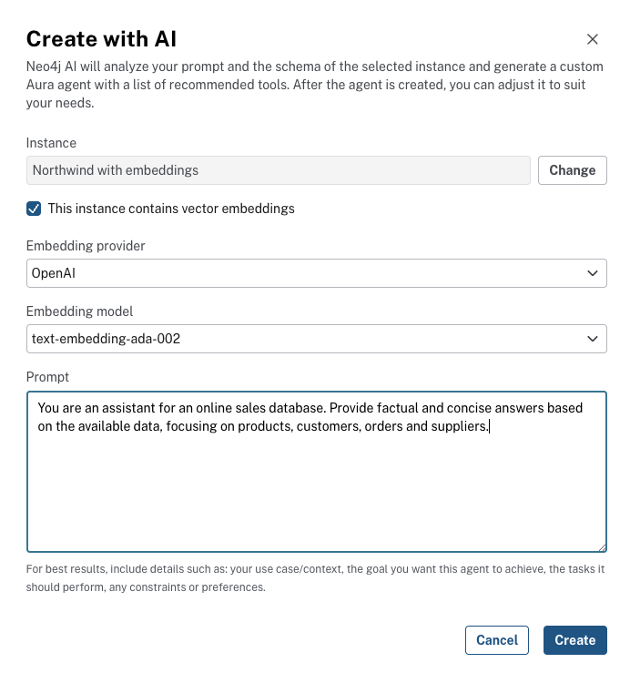

= Design and Implement an Agent
:order: 1
:type: lesson
== Introduction

Building a useful agent starts with a clear design: what role the agent plays, what questions it should answer, and which tools cover those questions. This lesson walks through both design principles and the full implementation in the Aura Console.

In this lesson, you will design a Northwind Analyst agent and build it with Cypher Template and Text2Cypher tools.

**Prerequisites**: A running Northwind AuraDB instance with data loaded and tool authentication enabled. If you completed the Module 1 challenge, you already have this.

== Design: What Makes a Good Agent

Before opening the Aura Console, decide three things:

* **Role and scope**: What does this agent do and what is out of bounds? One focused task per agent works better than a do-everything agent.
* **Question types**: Which questions will users ask? Group them into predictable queries (good for Cypher Templates) and ad-hoc queries (good for Text2Cypher).
* **Tool descriptions**: The LLM selects tools based solely on their descriptions. Vague descriptions cause wrong tool selection.

For the Northwind Analyst agent:

[cols="1,3"]
|===
|Element |Value

|**Role**
|Northwind retail analyst

|**Scope**
|Questions about customers, orders, products, categories, and suppliers. Decline off-topic or harmful requests.

|**Cypher Template tools**
|Get Customer, Top Customers by Order Count, Products by Category, Get Product

|**Text2Cypher tool**
|Fallback for ad-hoc questions not covered by templates
|===

Include node labels and relationship types in your prompt instructions — this helps Text2Cypher generate valid Cypher.

== Step 1: Create the Agent

. Go to link:https://console.neo4j.io/graphacademy[Aura Console^] → **Data Services** → **Agents** → **Create Agent**
. Select **Create from scratch**

image::images/create-from-scratch-menu.png[Create Agent menu showing Create from scratch and Create with AI options]

. Select your Northwind instance

image::images/create-agent-from-scratch.png[Create Agent dialog selecting the Northwind instance]

. Fill in the basic configuration:

[cols="1,3"]
|===
|Field |Value

|**Agent Name**
|`Northwind Analyst`

|**Description**
|`A retail analyst agent with access to the Northwind knowledge graph.`

|**Instructions**
|See below
|===

For **Instructions**, enter:

[source]
----
You are a Northwind retail analyst with access to a knowledge graph of products, customers, orders, suppliers, and categories. You are a Neo4j expert and can use the Cypher tools to query the graph. You can answer questions about customers, orders, products, categories, suppliers, and their relationships. You can also support business analysts researching sales patterns, top products, and customer behavior. If the question is off-topic or harmful, politely decline.
----

The configuration page includes a live preview panel where you can test your agent before saving.

image::images/agent-preview.png[Agent configuration page showing name, description, prompt instruction, access settings, and preview panel]

=== Alternative: Create with AI

Instead of **Create from scratch**, you can select **Create with AI**. Describe your agent's purpose and the data in your graph, and Aura generates an initial set of tools and instructions.

In the **Create with AI** dialog, select your instance, optionally specify an embedding provider and model if your graph has vector embeddings, then write a prompt describing what the agent should do. Include your use case, the data it should answer questions about, and any constraints.

image::images/create-agent-with-ai.png[Create with AI dialog showing instance selection, vector embeddings checkbox, embedding provider and model dropdowns, and a prompt field]

Aura analyzes your prompt and the instance schema, then generates a starting set of tools and instructions. The tool types it selects depend on two things: whether your instance has vector embeddings (which enables Similarity Search tools) and what the schema suggests about common query patterns.

video::https://cdn.graphacademy.neo4j.com/courses/ai-agents/create-with-ai.mp4["Create with AI", role="cdn", width=100%]

image::images/create-with-ai-generated-tools.png[Generated agent tools showing Cypher Template tools for customer orders, products, and suppliers, a Similarity Search tool, and a Text2Cypher fallback]

Review each generated tool: check the descriptions and Cypher queries against your schema, and add or remove tools to match your use case.

**Create from scratch** gives you full control from the start and is the approach this lesson uses. **Create with AI** is useful when you want a working draft to iterate on, especially for a new graph you have not modeled into tools yet.

== Step 2: Add Cypher Template Tools

Click **Add Tools**. For each tool, provide a name, description, parameters, and a Cypher query. Click **Save** after each one.

image::images/get-customer-orders-cypher-template-tool.png[Cypher Template tool configuration showing name, description, parameters, and Cypher query]

When you define a parameter, specify its name, data type, and description. The LLM uses the description to extract the correct value from the user's question.

image::images/add-parameter.png[Adding a parameter with name, type, and description fields]

**Get Customer**

[source,text]
.Copy this configuration
----
Name: Get Customer
Description: Return customer details and recent orders for a customer ID, for example ALFKI.
Parameter: customer_id, string, the customer ID to look up
----

[source,cypher,options="nowrap"]
.Copy this Cypher query
----
MATCH (c:Customer {customerID: $customer_id})
  -[:PURCHASED]->(o:Order) // <1>
RETURN c.customerID, c.companyName, c.contactName,
  collect(o.orderID)[0..5] AS recentOrders // <2>
----

<1> Match the Customer by ID and traverse PURCHASED relationships to their Orders
<2> Return customer fields and up to 5 recent order IDs

**Top Customers by Order Count**

[source,text]
.Copy this configuration
----
Name: Top Customers by Order Count
Description: Return customers with the most orders, limited by a count.
Parameter: limit, int, default 10, number of top customers to return
----

[source,cypher,options="nowrap"]
.Copy this Cypher query
----
MATCH (c:Customer)-[:PURCHASED]->(o:Order) // <1>
WITH c, count(o) AS orderCount // <2>
RETURN c.companyName, c.customerID, orderCount
ORDER BY orderCount DESC LIMIT $limit // <3>
----

<1> Match customers and their orders through PURCHASED
<2> Group by customer and count orders
<3> Sort by order count descending, limit by parameter

**Products by Category**

[source,text]
.Copy this configuration
----
Name: Products by Category
Description: List products in a category, supports partial name match such as Beverages or Beverage.
Parameter: category, string, category name or partial name to match
----

[source,cypher,options="nowrap"]
.Copy this Cypher query
----
MATCH (p:Product)-[:PART_OF]->(c:Category) // <1>
WHERE c.categoryName CONTAINS $category // <2>
RETURN p.productName, c.categoryName
LIMIT 20
----

<1> Match products and their category through PART_OF
<2> Filter by category name, supports partial match

**Get Product**

[source,text]
.Copy this configuration
----
Name: Get Product
Description: Return product details and category for a product ID.
Parameter: product_id, string, the product ID to look up
----

[source,cypher,options="nowrap"]
.Copy this Cypher query
----
MATCH (p:Product)-[:PART_OF]->(c:Category) // <1>
WHERE p.productID = $product_id // <2>
RETURN p.productID, p.productName, p.unitPrice,
  c.categoryName
----

<1> Match product and its category through PART_OF
<2> Filter by product ID parameter

== Step 3: Add a Text2Cypher Tool

A Text2Cypher tool handles questions your templates do not cover. Add it as a fallback.

[NOTE]
.Choosing between Cypher Template and Text2Cypher
====
Text2Cypher produces probabilistic output — the generated query may have errors. Use Cypher Templates for your known question types and Text2Cypher only for questions you cannot anticipate.
====

image::images/text-2-cypher-tool.png[Text2Cypher tool configuration showing name and description]

[source,text]
.Copy this configuration
----
Name: Query Northwind
Description: Use this tool ONLY when no other tool covers the question. The graph contains: Customer, Order, Product, Category, Supplier nodes. Relationships: PURCHASED (Customer→Order), PART_OF (Product→Category), SUPPLIES (Supplier→Product), ORDERS (Order→Product).
----

== Step 4: Save and Test

Click **Save Agent**.

Test with these questions:

* "Which are the top 5 most ordered products?"
* "Who has ordered Pavlova repeatedly?"
* "List products in the Beverages category"

image::images/which-are-top5-ordered-products-prompt.png[Agent response showing top 5 most ordered products with units]

image::images/who-has-ordered-pavlova-repeatedly.png[Agent response listing customers who ordered Pavlova repeatedly with order counts]

Expand the **Thought** section on each response to see the reasoning process: which tool was selected and why.

image::images/agent-reasoning.png[Reasoning panel with callouts showing (1) the LLM's reasoning text and (2) the Text2Cypher tool being applied]

The panel has two parts: the **Reasoning** section shows the LLM's internal thought process as it decides which tool to invoke, and the **Applying agent tool** section shows the tool name, the input sent to it, and the Cypher output returned.

image::images/reasoning-text2cypher-detail.png[Text2Cypher tool application showing Input with the natural language query and Output with the generated Cypher and query results]

This makes tool selection transparent and gives you a direct way to debug wrong answers — you can read the generated Cypher and verify it matches your intent.

If the agent selects the wrong tool, improve the tool description so the LLM can distinguish between them. Specific descriptions reduce wrong-tool selection.

[.quiz]
== Check Your Understanding

include::questions/1-tools.adoc[leveloffset=+1]

[.summary]
== Summary

In this lesson, you designed and implemented a Northwind Analyst agent with Cypher Template and Text2Cypher tools. In the next challenge, you will build a complete agent from scratch.
