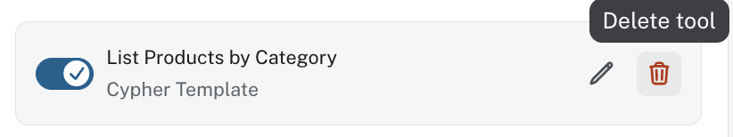
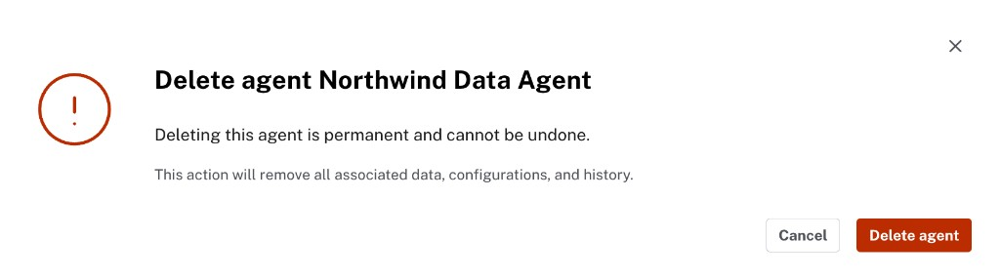

= Configuration Methods
:order: 4
:type: lesson

Once you have built an agent, you can refine it by editing tools, adding new ones, or removing what you no longer need.
This lesson walks through the configuration methods: edit, add, delete tools, and delete an agent.

[NOTE]
.Permission required
====
The Project Admin role is required to change agent configuration.
====

== Edit tools

Open any tool in the agent configuration and click the pencil icon to edit it.
You can change the name, description, parameters, and Cypher query.

For Cypher Template tools, the edit dialog shows the same fields as when you created the tool: Name, Description, Parameters, and the Cypher query.
To edit a parameter, click the pencil icon next to it in the Parameters list and update the name, data type, or description.

image::images/edit-parameter-dialog.png[Edit parameter dialog showing Name, Data type, and Description fields]

You can also rename a tool by editing its **Name** field.
A clearer name helps the LLM when it compares tool descriptions to the user's question.

== Add tools

In the agent configuration page, click **Add Tool** in the Tools section.
Choose **Cypher Template**, **Text2Cypher**, or **Similarity Search** (when your graph has vector embeddings).

image::images/add-tool-menu.png[Add Tool menu showing Cypher Template, Text2Cypher, and Similarity Search options]

Fill in the tool fields as you did when building from scratch: name, description, parameters for Cypher Templates, and schema context for Text2Cypher.

== Delete tools

To remove a tool, click the trash icon next to it in the tool list.

The tool is removed as soon as you delete it.
Click **Update agent** to persist the change.

== Delete an agent

To delete an agent, open the **...** menu next to the agent in the Agents list and select **Delete agent**.

image::images/delete-agent-confirmation.png[Delete agent confirmation dialog stating the action is permanent and cannot be undone]

A confirmation dialog will appear. Deletion is permanent and removes all associated configuration and history.

Click **Delete agent** to confirm.

[WARNING]
.Deletion is permanent
====
Deleting an agent cannot be undone. All tools, instructions, and configuration are permanently removed.
====

[.quiz]
== Check your understanding

include::questions/1-configuration-methods.adoc[leveloffset=+1]

[.summary]
== Summary

You learned how to edit tools (including renaming them and editing parameters), add new tools, delete tools, and delete an agent.
Always click **Update agent** after changing tool configuration.
In the next lesson, you will build the same agent from scratch for full control over every tool and instruction.
