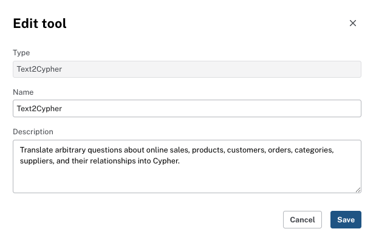

= Experimenting with Text2Cypher
:order: 4
:type: challenge

In this challenge, you will use your agent to trigger Text2Cypher, inspect the generated Cypher in the reasoning panel, and verify or improve the Text2Cypher tool description.

== Goal

Your challenge is to create a Text2Cypher tool that can answer ad-hoc questions that cannot be answered by an existing tool.

== Step 1: Ask a question that triggers Text2Cypher

In the preview panel, ask a question that cannot be answered by a single Cypher Template—a question whose query structure depends on the question itself. That includes multi-hop aggregations, dynamic filters, or combinations your templates do not cover.

If you are using Northwind and want example questions:

* [copy]#Which customers ordered products from more than two different suppliers?#
* [copy]#Which products are in both the Beverages and Condiments categories?#
* [copy]#List the top three customers by total order value.#

Otherwise, ask an ad-hoc question that fits your graph. Run it and confirm you get a response.

== Step 2: Inspect the reasoning and generated Cypher

Expand the **Thought** section for the response. Find the **Applying agent tool** entry, or the equivalent, for the Text2Cypher tool.

Check:

* **Generated Cypher**: Does it use the correct node labels and relationship types for your graph? For Northwind, that means `PLACED`, `CONTAINS`, `IN_CATEGORY`, `SUPPLIES`.
* **Results**: Does the result set match what you expected? If the Cypher is wrong, add or clarify when-to-use and domain context in the Text2Cypher tool description. The tool receives the schema automatically.

image::../../1-introduction/lessons/2-create-with-ai/images/reasoning-text2cypher-detail.png[Text2Cypher tool detail showing the natural language input, the generated Cypher query, and the query results]

== Step 3 (optional): Improve the Text2Cypher description

If the generated Cypher used wrong relationship types or labels, such as `ORDERED_BY` instead of `PLACED`, edit the Text2Cypher tool:

. In the agent configuration, open the Text2Cypher tool using the pencil icon.
. In the **Description** field, add or clarify when to use the tool and domain-specific context (relevant entities, categorical properties, attributes suitable for aggregation). See the Using Text2Cypher lesson for guidance. The tool receives the schema automatically.
. Save and click **Update agent**, then run the same question again and confirm the generated Cypher is correct.

read::Mark as completed[]

[.summary]
== Summary

You triggered Text2Cypher with ad-hoc questions, inspected the generated Cypher and results in the reasoning panel, and optionally improved the tool description with when-to-use and domain context.

In the next lesson, you will design an agent with role, scope, question types, and tool descriptions.
