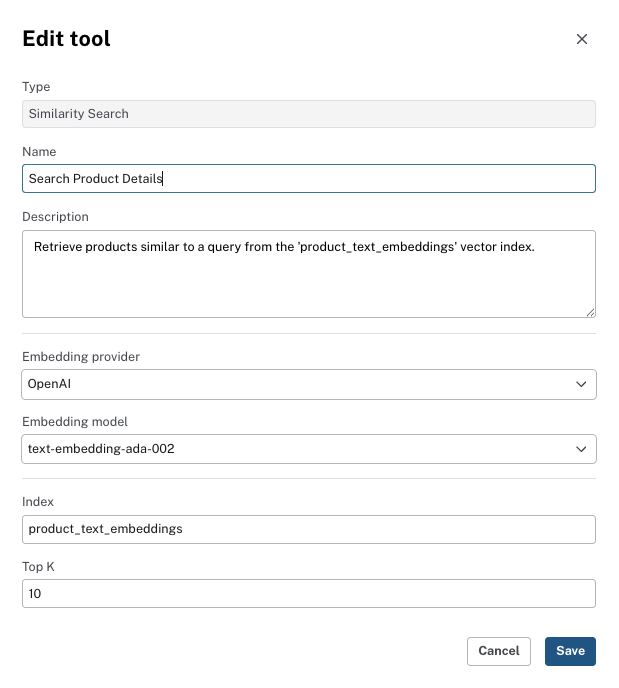

= Using the Similarity Search tool
:order: 5
:type: lesson

The Similarity Search tool finds nodes in your graph using semantic similarity rather than exact property matches.

In this lesson, you will learn:

* When to use the Similarity Search tool
* What your database needs before you can use it
* How to configure a Similarity Search tool in the Aura Console

== When to use Similarity Search

A **Similarity Search** tool finds nodes whose vector embeddings are closest to the embedding of the user's question.

Use it when the user is looking for entities that are _related_ or _similar_ rather than a specific known value:

* "What products are similar to Chai?"
* "Find documents about data governance."
* "Which terms are closest in meaning to this description?"

Similarity Search is a natural complement to Cypher Templates. The Similarity Search tool can find semantically related nodes, and a Cypher Template can then retrieve structured data connected to those nodes.

== Prerequisites

Before adding a Similarity Search tool, your AuraDB instance must have:

. **Vector embeddings** stored on the nodes you want to search — generated by one of the supported embedding providers (see below).
. **A vector index** built on those embeddings.

=== Supported embedding providers

Aura Agent supports the following text embedding providers and models:

[cols="1,2"]
|===
|Provider |Models

|**OpenAI** (via Azure OpenAI)
|`text-embedding-3-small`, `text-embedding-3-large`, `text-embedding-ada-002`

|**Vertex AI**
|`gemini-embedding-001`, `text-embedding-005`, `text-multi-lingual-embedding-002`
|===

The agent embeds the user's question using the same model used to generate the stored embeddings, ensuring the vector spaces align.

For more information, see the link:https://neo4j.com/docs/cypher-manual/current/indexes/semantic-indexes/vector-indexes/[Cypher Manual — Vector indexes^] and the link:https://neo4j.com/docs/aura/aura-agent/[Aura Agent documentation^].

[NOTE]
.Using your own data
====
The Northwind sample dataset used in this course does not include vector embeddings. To use a Similarity Search tool, you need a database with embeddings already loaded.
====

== Configuring a Similarity Search tool

In the Aura Console, add a Similarity Search tool from the agent configuration: **Add Tool** → **Similarity Search**.

The tool has two configuration fields:

[cols="1,3"]
|===
|Field |Description

|**Vector index name**
|The exact name of the vector index in your AuraDB instance.

|**Top K**
|The number of similar nodes to return. Start with 5–10; increase if you need more candidates for the LLM to reason over.
|===

Give the tool a clear **Name** and a **Description** that tells the agent when to use it. The description should describe the value returned by the tool - for example: "Find products semantically similar to the user's description."

read::Mark as completed[]

[.summary]
== Summary

The Similarity Search tool finds nodes by semantic similarity using vector embeddings. It requires a vector index and embeddings generated by a supported provider in your AuraDB instance. Configure it with the index name and a Top K value.

In the next lesson, you will learn how to design an agent with a clear role and scope.
