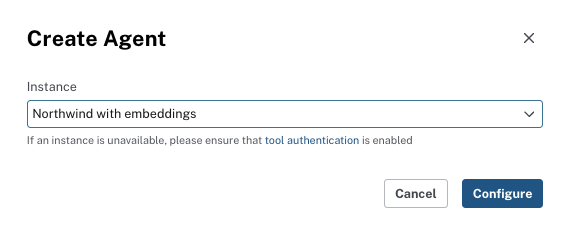
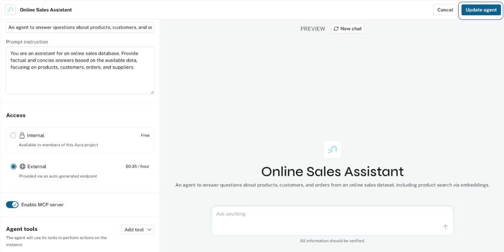
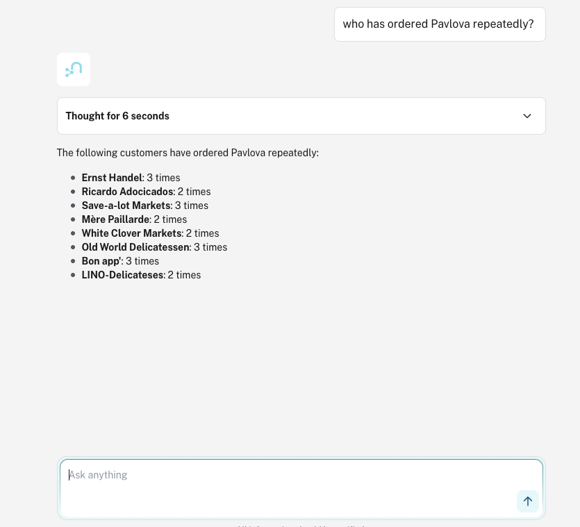
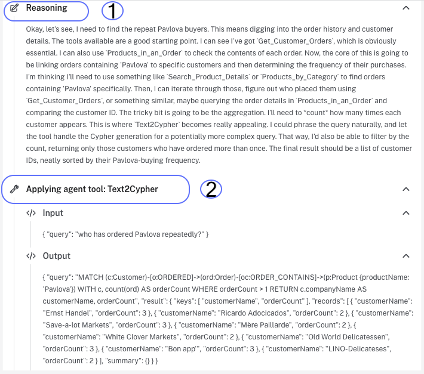

= Create an agent from scratch
:order: 6
:type: challenge

In this challenge, you will build an agent from scratch using your own knowledge graph. You define the role, add Cypher Template tools and a Text2Cypher tool that match your schema, then test the agent. Creating from scratch gives you full control over every tool, parameter, and instruction.

== Before you start

* Have an AuraDB instance with your knowledge graph loaded (or Northwind if you are using the example).
* Complete the Design an Agent lesson (lesson 5) so you have a role, scope, and tool design to implement.
* You will create a new agent in this challenge, not edit an existing one.

// == Available tools

// Every tool you add to an agent is one of three types.
// This lesson covers Cypher Template and Text2Cypher, the two tools you will configure hands-on:

// [cols="1,2,2"]
// |===
// |Tool |Best for |Requires

// |**Cypher Template**
// |Predictable questions with known parameters: "Get customer ALFKI", "Top 10 customers by order count"
// |A pre-written parameterized Cypher query

// |**Text2Cypher**
// |Ad-hoc questions where the query structure changes: "Which suppliers serve more than three regions?"
// |Schema context in the description (node labels and relationship types)
// |===

// A third tool type, **Similarity Search**, is available when your graph has vector embeddings and a vector index.
// The Northwind dataset does not include embeddings, so it is covered conceptually in Module 1 but not configured here.

== Step 1: Create the agent

Go to Aura Console → **Data Services** → **Agents** → **Create Agent** → **Create from scratch**.

image::images/create-from-scratch-menu.png[Create Agent menu showing Create from scratch and Create with AI options]

Select your AuraDB instance (the one that has your knowledge graph).

Set the **Agent Name** and **Description** to match your design from the Design an Agent lesson. Set **Instructions** to define the agent's role, list the node labels and relationship types in your graph (so the LLM can generate valid Cypher), and state that the agent should decline off-topic or harmful requests.

[NOTE]
.Example (Northwind)
====
For Northwind you could use **Agent Name** `Northwind Analyst`, **Description** `A retail analyst agent with access to the Northwind knowledge graph.`, and **Instructions**:

[copy]
----
You are a Northwind retail analyst with access to a knowledge graph of products, customers, orders, suppliers, and categories.
The graph contains these node labels: Customer, Order, Product, Category, Supplier, Address.
Relationships: PLACED (Customer→Order), CONTAINS (Order→Product), IN_CATEGORY (Product→Category), SUPPLIES (Supplier→Product), SHIPPED_TO (Order→Address).
Answer questions about customers, orders, products, categories, suppliers, and their relationships.
If the question is off-topic or harmful, politely decline.
----
====

The configuration page includes a live preview panel where you can test prompts before saving.

image::images/agent-preview.png[Agent configuration page showing name, description, instructions, and live preview panel]

== Step 2: Add Cypher Template tools

Click **Add Tool** → **Cypher Template**. Add tools that match your design from lesson 5: for each tool, fill in the name, description, parameters, and Cypher query (using your schema's labels and relationship types), then click **Save**.

image::images/get-customer-orders-cypher-template-tool.png[Cypher Template tool configuration showing name, description, parameters, and Cypher query]

Each saved tool appears in the tool list with a pencil icon to edit it and a trash icon to delete it:

image::images/tool-edit-delete.png[Tool list item showing List Products by Category with edit and delete icons]

Click **+ Add parameter** to open the edit dialog, then fill in the name, data type, and description:

image::images/edit-parameter-dialog.png[Edit parameter dialog showing the Name, Data type, and Description fields for a companyName parameter]

Once saved, the parameter appears in the Parameters list. Click the pencil icon to edit it:

image::images/parameter-list.png[Parameters section showing the saved companyName parameter with edit and delete icons]

If you are using Northwind, you can add the following four Cypher Template tools as a working example:

**Get Customer**

Name: [copy]#Get Customer#

Description: [copy]#Return customer details and recent orders for a customer ID, for example ALFKI.#

Parameter: name [copy]#customer_id#, type **string**, description [copy]#The customer ID to look up#

[source,cypher,role=noplay,options="nowrap"]
----
MATCH (c:Customer {id: $customer_id})
  -[:PLACED]->(o:Order) // <1>
RETURN c.id, c.companyName, c.contactName,
  collect(o.orderId)[0..5] AS recentOrders // <2>
----

<1> Match the Customer by ID and traverse PLACED relationships to their Orders
<2> Return customer fields and up to 5 recent order IDs

**Top Customers by Order Count**

Name: [copy]#Top Customers by Order Count#

Description: [copy]#Return customers with the most orders, limited by a count.#

Parameter: name [copy]#limit#, type **int**, description [copy]#Number of top customers to return#

[source,cypher,role=noplay,options="nowrap"]
----
MATCH (c:Customer)-[:PLACED]->(o:Order) // <1>
WITH c, count(o) AS orderCount // <2>
RETURN c.companyName, c.id, orderCount
ORDER BY orderCount DESC LIMIT $limit // <3>
----

<1> Match customers and their orders through PLACED
<2> Group by customer and count orders
<3> Sort by order count descending, limit by parameter

**Products by Category**

Name: [copy]#Products by Category#

Description: [copy]#List products in a category, supports partial name match such as Beverages or Beverage.#

Parameter: name [copy]#category#, type **string**, description [copy]#Category name or partial name to match#

[source,cypher,role=noplay,options="nowrap"]
----
MATCH (p:Product)-[:IN_CATEGORY]->(c:Category) // <1>
WHERE c.name CONTAINS $category // <2>
RETURN p.name, c.name
LIMIT 20
----

<1> Match products and their category through IN_CATEGORY
<2> Filter by category name, supports partial match

**Get Product**

Name: [copy]#Get Product#

Description: [copy]#Return product details and category for a product ID.#

Parameter: name [copy]#product_id#, type **string**, description [copy]#The product ID to look up#

[source,cypher,role=noplay,options="nowrap"]
----
MATCH (p:Product)-[:IN_CATEGORY]->(c:Category) // <1>
WHERE p.id = $product_id // <2>
RETURN p.id, p.name, p.unitPrice,
  c.name
----

<1> Match product and its category through IN_CATEGORY
<2> Filter by product ID parameter

== Step 3: Add a Text2Cypher tool

Add a Text2Cypher tool as a fallback for questions your Cypher Templates do not cover. The tool description must state when to use it (e.g. "only when no other tool covers the question") and include your graph's node labels and relationship types so the LLM can generate valid Cypher.

[NOTE]
.Cypher Template vs. Text2Cypher
====
Use a Cypher Template when you can write the complete Cypher now, with only `$parameter` slots for variable values. The `MATCH` pattern and `RETURN` clause must be fixed.
Use Text2Cypher when the query structure itself changes: different filter combinations, dynamic aggregations, or traversal patterns you cannot pre-define.
Text2Cypher generates Cypher at runtime and may produce queries with errors or incorrect relationship types.
====

image::images/text-2-cypher-tool.png[Text2Cypher tool configuration showing name and description fields]

Give the tool a name (e.g. "Query graph" or "Ad-hoc query") and a description that lists your node labels and relationship types. Example for Northwind:

Name: [copy]#Query Northwind#

Description:

[copy]
----
Use this tool ONLY when no other tool covers the question. The graph contains: Customer, Order, Product, Category, Supplier nodes. Relationships: PLACED (Customer→Order), CONTAINS (Order→Product), IN_CATEGORY (Product→Category), SUPPLIES (Supplier→Product).
----

A description like "answer any question" will cause the agent to use Text2Cypher for everything; keep the "ONLY when no other tool covers" constraint.
Listing the schema inside the description gives Text2Cypher the context it needs to generate valid Cypher.

== Step 4: Update and test

Once you have added all tools, click **Update agent** to apply your changes.

Test with questions that fit your graph and exercise different tools. If you are using Northwind, you can try:

* [copy]#Who has ordered Pavlova repeatedly?#
* [copy]#Which are the top 5 most ordered products?#
* [copy]#List products in the Beverages category#

Expand the **Thought** section on each response to trace the full reasoning path: the LLM's reasoning, the tool it selected, and the Cypher it executed.

image::images/agent-reasoning.png[Reasoning panel showing the LLM reasoning text and the tool being applied]

If the agent selects the wrong tool, read the reasoning text to understand why, then tighten the tool description that was incorrectly chosen.
Specific, distinct descriptions reduce wrong-tool selection.

== Step 5: Extend with more tools

Extend your agent with additional Cypher Template tools that fit your schema and design. Add them without step-by-step guidance: open the agent, click **Add Tool** → **Cypher Template**, and define name, description, parameters, and Cypher for each. Then click **Update agent** and test.

If you built the Northwind example agent, you can add the following three tools as a working example:

== Tool 1: Get Supplier (Northwind example)

Name: [copy]#Get Supplier#

Description: [copy]#Return supplier details and the products they supply. Use this tool when the question asks about a supplier by name or ID.#

Parameter: name [copy]#supplier_name#, type **string**, description [copy]#The supplier company name or partial name to look up#

[source,cypher,role=noplay]
----
MATCH (s:Supplier)-[:SUPPLIES]->(p:Product)
WHERE toLower(s.name) CONTAINS toLower($supplier_name)
RETURN s.id, s.name, s.contactName, s.country,
  collect(p.name) AS products
----

== Tool 2: Products by Supplier (Northwind example)

Name: [copy]#Products by Supplier#

Description: [copy]#List all products supplied by a specific supplier. Use this tool when the question asks what products a supplier provides.#

Parameter: name [copy]#supplier_id#, type **string**, description [copy]#The supplier ID to look up#

[source,cypher,role=noplay]
----
MATCH (s:Supplier {id: $supplier_id})-[:SUPPLIES]->(p:Product)-[:IN_CATEGORY]->(c:Category)
RETURN p.name, p.unitPrice, c.name
ORDER BY c.name, p.name
----

== Tool 3: Recent Orders for Customer (Northwind example)

Name: [copy]#Recent Orders for Customer#

Description: [copy]#Return the most recent orders placed by a customer, including the products in each order. Use this tool when the question asks about a customer's order history or recent purchases.#

Parameter: name [copy]#customer_id#, type **string**, description [copy]#The customer ID, for example ALFKI#

[source,cypher,role=noplay]
----
MATCH (c:Customer {id: $customer_id})-[:PLACED]->(o:Order)
RETURN o.orderId, o.orderDate,
  [(o)-[:CONTAINS]->(p:Product) | p.name] AS products
ORDER BY o.orderDate DESC
LIMIT 10
----

== Test your new tools

Run questions that exercise the new tools and verify the agent selects the correct one. If you added the Northwind example tools above, try:

* [copy]#What products does Exotic Liquids supply?#
* [copy]#Show me all products from supplier EXOTIC#
* [copy]#What has customer ALFKI ordered recently?#

Expand the **Thought** section on each response.
If a new tool was not selected, check whether its description is specific enough to distinguish it from the existing tools and Text2Cypher.

read::Mark as completed[]

[.summary]
== Summary

You built an agent from scratch with Cypher Template tools and a Text2Cypher fallback (and optionally extended it with more tools), using your own knowledge graph or the Northwind example.

In Module 3, you will publish your agent and connect it to Cursor.
