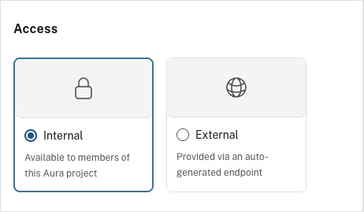
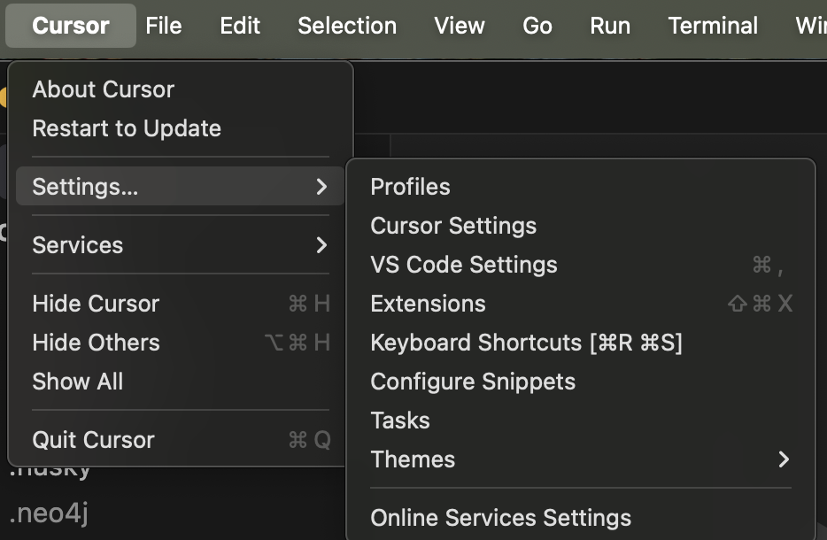
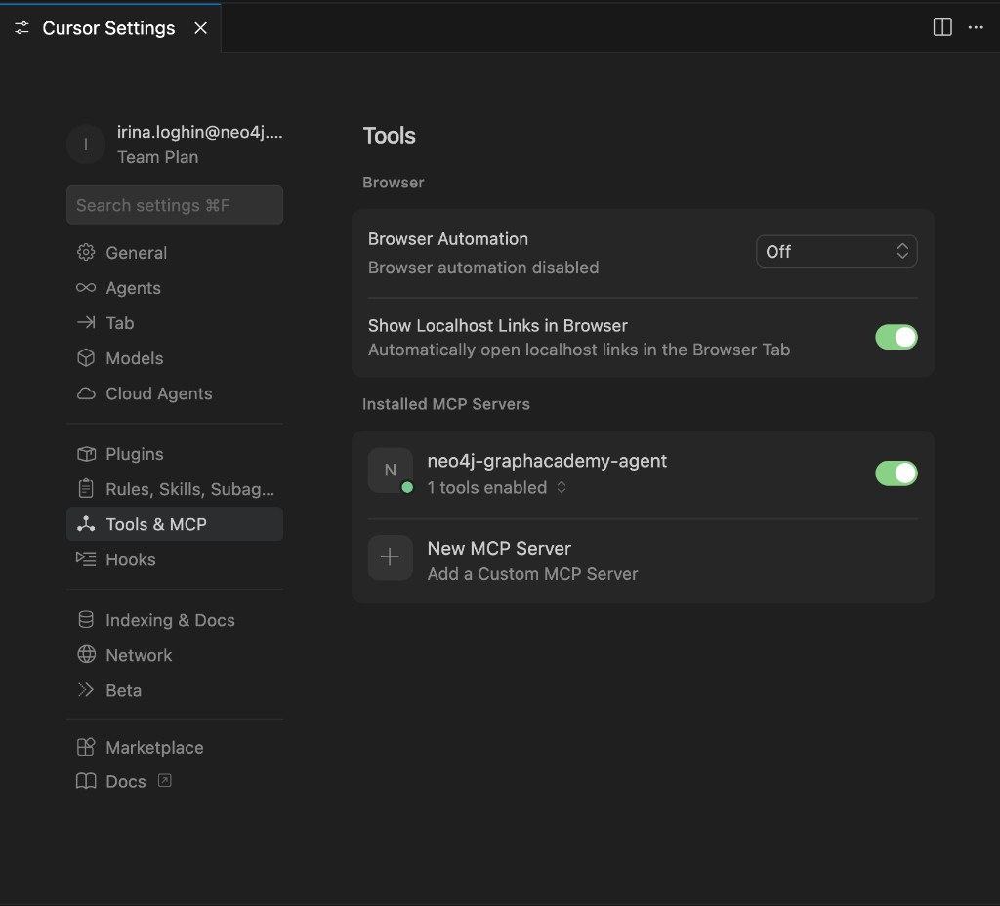
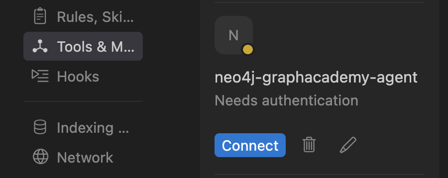
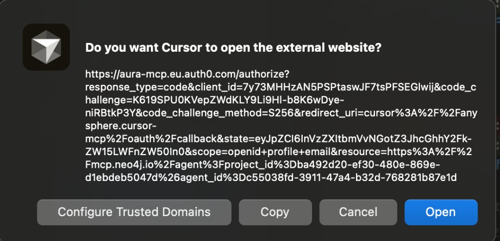
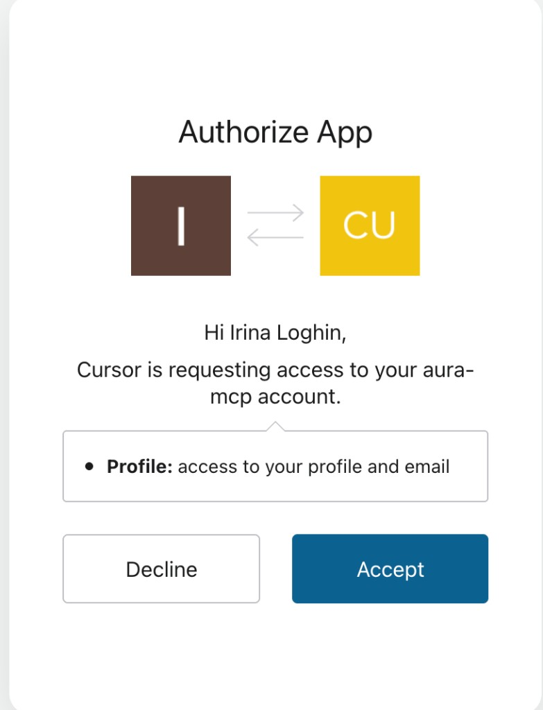

= Publishing an Agent
:order: 1
:type: challenge
:disable-cache: true

In this challenge, you will publish your agent so it can be called from external applications like Claude Desktop or Cursor.

== Goal

Make your agent accessible through an MCP server endpoint, then connect to it from a host application such as Claude Desktop or Cursor.

== What Is MCP?

The **Model Context Protocol**, MCP, is an open protocol that lets AI applications, called hosts, connect to external data sources and tools, called servers. When you enable MCP on an Aura Agent, Neo4j runs an MCP server that exposes your agent to host applications.

[source,mermaid]
----
%%{init: {
  "theme": "base",
  "securityLevel": "strict",
  "fontFamily": "Public Sans, Arial, Helvetica, sans-serif",
  "themeVariables": {
    "background": "#ffffff",
    "primaryTextColor": "#0f172a",
    "fontSize": "16px",
    "primaryColor": "#eef6f9",
    "primaryBorderColor": "#c7e0ec",
    "secondaryColor": "#f8fafc",
    "secondaryBorderColor": "#e5e7eb",
    "lineColor": "#94a3b8",
    "edgeLabelBackground": "#ffffff"
  }
}}%%
sequenceDiagram
    actor User
    participant Host as Host (Cursor / Claude Desktop)
    participant MCP as Aura MCP Server
    participant Agent as Aura Agent
    participant DB as AuraDB

    User->>Host: Ask a question
    Host->>MCP: Forward message through MCP protocol
    MCP->>Agent: Route to agent
    Agent->>Agent: Reason and select tool
    Agent->>DB: Run Cypher query
    DB-->>Agent: Graph results
    Agent-->>MCP: Natural language answer
    MCP-->>Host: Return response
    Host-->>User: Display answer
----

[NOTE]
.How the connection works
====
MCP host applications include Claude Desktop and Cursor. When you add your agent's MCP endpoint to a host, that application sends user messages to your agent and receives graph-backed responses. Your agent's tools run against your AuraDB instance; the host never sees your schema or credentials directly.
====

=== MCP Endpoint and Authentication

The MCP endpoint URL is unique to your agent. Copy it from the agent menu after enabling External access and the MCP server toggle.

MCP uses OAuth: the first time a host application invokes your agent, it opens a login prompt asking you to authenticate with your Aura Console credentials. See link:https://neo4j.com/docs/aura/aura-agent/[Aura Agent documentation^] for host-specific setup details.

== Internal and External Access

Agents have two access modes:

**Internal**, default: Only members of your Aura project can use the agent. No additional charges.

**External**: The agent is exposed through an MCP server endpoint. External agents incur charges per link:https://neo4j.com/pricing/[Neo4j pricing^].

image::images/make-external-enable-mcp-server.png[Access settings showing External selected with Enable MCP server toggle]

For this challenge, you need External access with MCP server enabled.

image::images/agent-tools-with-mcp.png[Complete agent configuration showing Enable MCP server toggle on and the full list of agent tools]

== Steps

. Open your agent in the Aura Console
. Click the agent menu and select **Configure**
+
image::images/configure-agent-menu.png[Agent menu showing Configure, Copy External endpoint, and Copy MCP server endpoint options]
. Under Access, select **External**
. Enable the **MCP server** toggle
. Click **Save**
. From the agent menu, click **Copy MCP server endpoint**
. Add the endpoint to your host application; see below for host-specific steps
. Send a test message to confirm the agent responds

== Connecting to Cursor

. Open the **Cursor** menu from the top-left, then **Settings...**, then **Cursor Settings**
+

. In the left sidebar, select **Tools & MCP**
. Under **Installed MCP Servers**, click **+ New MCP Server**
+

. Add your agent's MCP endpoint. If you edit `mcp.json` directly, replace `<your-mcp-url>` with your agent's MCP endpoint from the agent menu:

[source,json]
----
{
  "mcpServers": {
    "neo4j-graphacademy-agent": {
      "url": "<your-mcp-url>",
      "transport": "streamable-http"
    }
  }
}
----

. Save and reload Cursor
. Your agent appears in the **Tools & MCP** list with a **Needs authentication** status. Click **Connect**
+

. Cursor asks permission to open the Aura MCP authentication website. Click **Open**
+

. The login page opens in your browser. Click **Continue with Neo4j Aura**
+
image::images/mcp/aura-mcp-login.png[Login page for aura-mcp showing a Continue with Neo4j Aura button]
. On the authorization screen, click **Accept** to grant Cursor access to your Aura MCP account
+

. Return to Cursor. Your agent is now connected and available as a tool

For connecting other hosts such as Claude Desktop, see link:https://neo4j.com/docs/aura/aura-agent/[Aura Agent documentation^].

== Test your agent in Cursor

With the agent connected, open a new Cursor chat in **Agent** mode and ask it a question. Address the agent by its MCP server name, for example:

----
Using the neo4j-graphacademy-agent, find the top 10 orders
----

Cursor routes the request to your agent, which queries your AuraDB instance and returns the results.

image::images/mcp/cursor-agent-response-top-orders.png[Cursor chat showing the agent returning a table of 10 orders with Order ID, Customer, Order Date, and Freight columns]

The agent returns what its tools can retrieve. In this example, the Northwind Analyst returns the first 10 orders by order ID, not ranked by value, since no Cypher Template or Text2Cypher query for that ranking was added. This is expected behavior: the agent's answers are bounded by the tools you configured.

Try these additional prompts to explore what your agent can do:

----
Using the neo4j-graphacademy-agent, list all products in the Seafood category
----

----
Using the neo4j-graphacademy-agent, who are the top 5 customers by number of orders?
----

Each prompt exercises a different tool. Comparing the **Thought** sections across prompts shows you how the agent selects between Cypher Templates and Text2Cypher depending on which tool description best matches the question.

[.summary]
== Summary

In this challenge, you published your agent as an external MCP server and connected to it from a host application.

== Next Steps

Continue learning:

* link:/courses/genai-fundamentals/[Neo4j and GenAI Fundamentals^] - Generative AI and Neo4j integration
* link:/courses/genai-integration-langchain/[Using Neo4j with LangChain^] - Integrate Neo4j with LangChain for RAG and agents

read::Mark as completed[]

