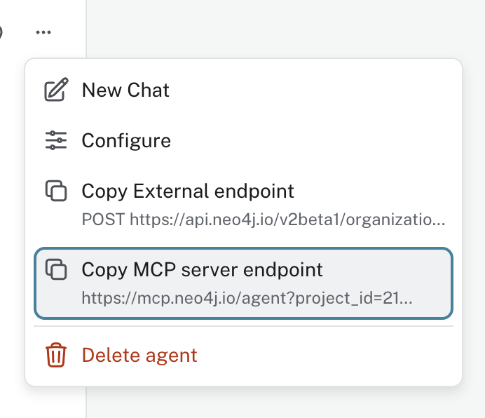

= Publishing an agent
:order: 1
:type: lesson

So far in this course, you have created and tested an agent in the Aura Console.

In this lesson, you will learn how to publish your agent and make it available to external applications via the REST API and MCP.

== Internal and external access

When you create an agent, it starts in **Internal** mode. Only members of your Aura project can use it, and only through the Aura Console preview panel. There is no public endpoint and no additional charges.

image::images/enable-internal-agent.png[Access settings showing Internal selected, available to members of this Aura project]

Switching to **External** exposes the agent's HTTP API so that applications outside your Aura project can call it.

External agents incur usage-based charges. See the link:https://neo4j.com/docs/aura/aura-agent/[Aura Agent documentation^] for pricing.

There are two ways to integrate an external agent: the **REST API** and the **MCP server**.

=== REST API

When External access is on, your agent exposes an HTTP endpoint. Applications call it with a POST request and receive a JSON response — no MCP client required.

To call the endpoint you need three things:

. **An Aura API key** — generate one in **Account Settings → API Keys** in the Aura Console. Save the Client ID and Client Secret; the secret is shown only once.
. **A bearer token** — exchange your credentials for an access token (valid for one hour):
+
[source,bash]
----
export BEARER_TOKEN=$(curl -s --request POST 'https://api.neo4j.io/oauth/token' \
    --user "$CLIENT_ID:$CLIENT_SECRET" \
    --header 'Content-Type: application/x-www-form-urlencoded' \
    --data-urlencode 'grant_type=client_credentials' | jq -r .access_token)
----
. **The agent endpoint URL** — copy it from the **...** menu next to your agent in the Agents list. The URL has this format:
+
----
https://api.neo4j.io/v2beta1/organizations/<org-id>/projects/<project-id>/agents/<agent-id>/invoke
----

With those in hand, send a question to your agent:

[source,bash]
----
curl --request POST "$ENDPOINT_URL" \
 -H 'Content-Type: application/json' \
 -H 'Accept: application/json' \
 -H "Authorization: Bearer $BEARER_TOKEN" \
 -d '{"input": "Which are the top 5 most ordered products?"}' \
 --max-time 60
----

The agent returns a structured JSON response with the answer.

=== Enabling MCP

Switching to External also reveals the **Enable MCP server** toggle.

image::images/make-external-enable-mcp-server.png[Access settings showing External selected with the Enable MCP server toggle visible]

**Model Context Protocol (MCP)** is an open protocol for connecting AI applications to external tools and data sources. In MCP, a *client* is an AI application such as Cursor or Claude Desktop, and a *server* exposes tools the MCP client can discover and call.

Enabling the toggle starts an MCP server that wraps your agent as a callable tool, so MCP clients can connect and invoke it without any custom integration code.

Both External access and the MCP toggle must be on for MCP clients; the HTTP API works with the External toggle alone.

=== Copying the MCP endpoint

After saving with the MCP server enabled, open the **...** menu next to your agent in the Agents list and select **Copy MCP server endpoint**.

The endpoint URL is what you paste into your MCP client configuration. It has this format:

[source,text]
----
https://mcp.neo4j.io/agent?project_id=<project-id>&agent_id=<agent-id>
----

=== Connecting Claude Code

Add the endpoint to Claude Code using the CLI:

[source,bash]
----
claude mcp add --transport http aura-agent https://mcp.neo4j.io/agent?project_id=<project-id>&agent_id=<agent-id>
----

Or add it manually to your `~/.claude.json`:

[source,json]
----
{
  "mcpServers": {
    "aura-agent": {
      "transport": "http",
      "url": "https://mcp.neo4j.io/agent?project_id=<project-id>&agent_id=<agent-id>"
    }
  }
}
----

Replace the `project_id` and `agent_id` values with those from the endpoint you copied. The first time Claude Code invokes the server it will prompt you to authenticate with your Aura credentials.

[.quiz]
== Check your understanding

include::questions/1-access-modes.adoc[leveloffset=+1]

[.summary]
== Summary

You learned how agents move from Internal to External access, and what enabling the MCP server makes possible.

In the next lesson, you will enable external access for your agent and connect it to Cursor.
