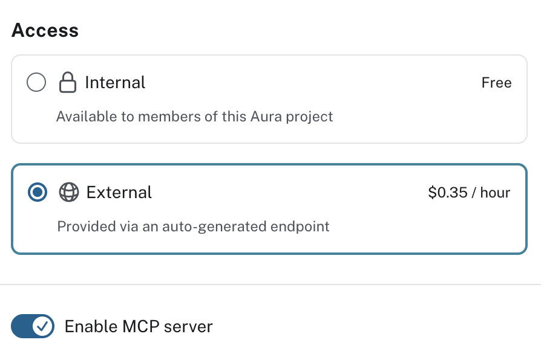
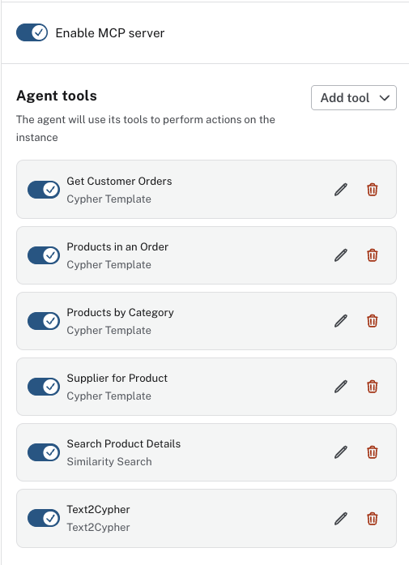
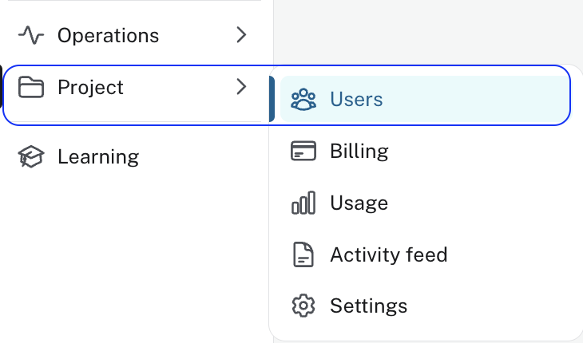

= Setting Up Access
:order: 1
:type: lesson
:disable-cache: true

Before an agent can be called from external applications, you need to change its access mode from Internal to External and enable the MCP (Model Context Protocol) server.

In this lesson, you will learn how to switch your agent to External access, enable the MCP server, and how project roles control who can use or manage agents.

== Internal and External Access

Agents have two access modes:

**Internal**, default: Only members of your Aura project can use the agent through the Aura Console preview panel. No additional charges.

image::images/enable-internal-agent.png[Access settings showing Internal selected, available to members of this Aura project]

**External**: The agent is exposed through an MCP server endpoint that external applications can connect to.

[WARNING]
.External agents incur charges
====
Although internal agents are free, external ones incur charges. Check the link:https://neo4j.com/docs/aura/aura-agent/[Aura Agent documentation^] for details.
====

Enabling External access also reveals the **Enable MCP server** toggle.
Both must be on before any external application can connect.

== Project permissions

Agent access within your Aura project is controlled by project roles. There are no dedicated agent-level roles.

[cols="1,2"]
|===
|Role |Permissions

|**Viewer** and **Member**
|Can list and invoke all agents in the project

|**Project Admin**
|Can also create, update, and delete agents
|===

To give a teammate access to an agent, add them to the Aura project with the appropriate role.

== Enable External Access

[NOTE]
.Project Admin required
====
Changing agent access settings requires the **Project Admin** role.
To check your role, go to **Project** → **Users** in the Aura Console left navigation:

Your role is listed in the **Project role** column next to your email address:

image::images/project-users-list.png[Project users list showing User, Project role, and Status columns]

If you are not a Project Admin, ask your Organization Admin to update your role.
====

. Open your agent in the Aura Console.
. Click the agent menu and select **Configure**.
+
image::images/configure-agent-menu.png[Agent menu showing Configure, Copy External endpoint, and Copy MCP server endpoint options]
. Under **Access**, select **External**.
. Enable the **MCP server** toggle.
. Click **Update agent**.

Your agent now has an MCP endpoint. You will use it in the next lesson to connect a host application.

To delete an agent, open the **...** menu next to the agent in the Agents list and select **Delete agent**. See the Configuration Methods lesson in Module 2 for the full steps and screenshots.

[.quiz]
== Check your understanding

include::questions/1-access-modes.adoc[leveloffset=+1]

include::questions/2-project-permissions.adoc[leveloffset=+1]

[.summary]
== Summary

You switched your agent from Internal to External access and enabled the MCP server. You also learned that agent access is governed by Aura project roles: Viewers and Members can invoke agents, while Admins can create, update, and delete them.

In the next lesson, you will connect your agent to Cursor using the MCP endpoint.
