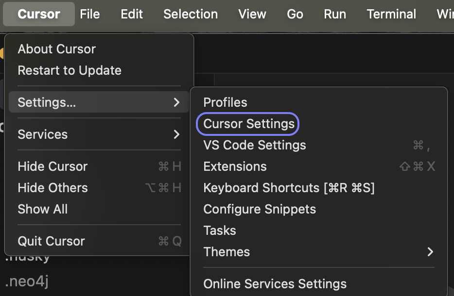
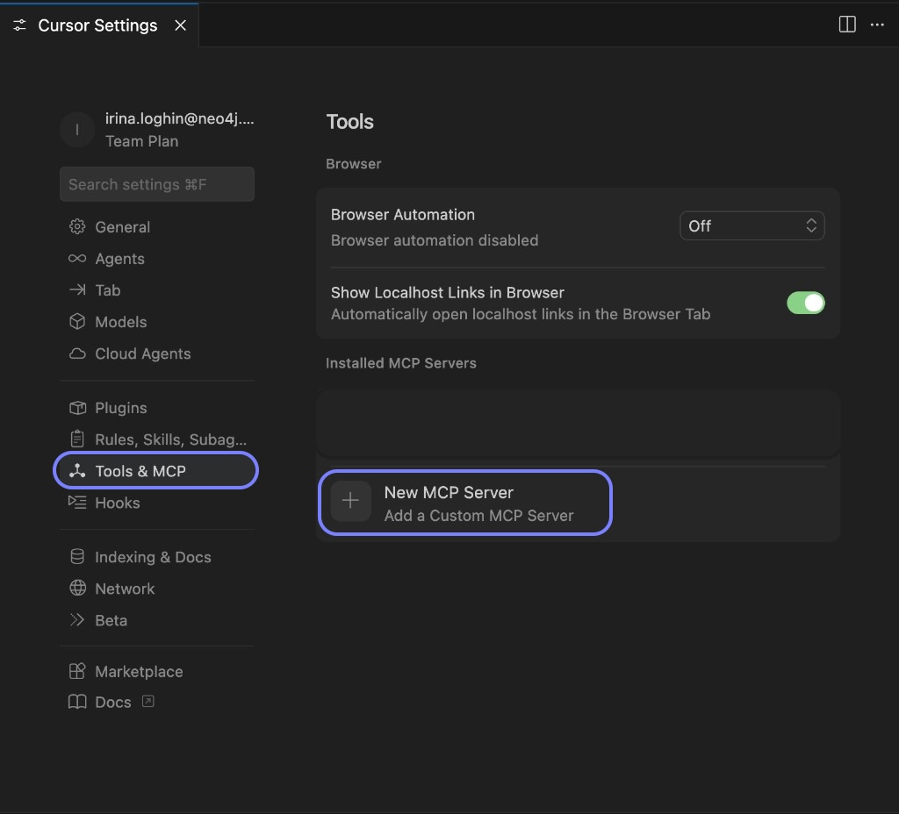
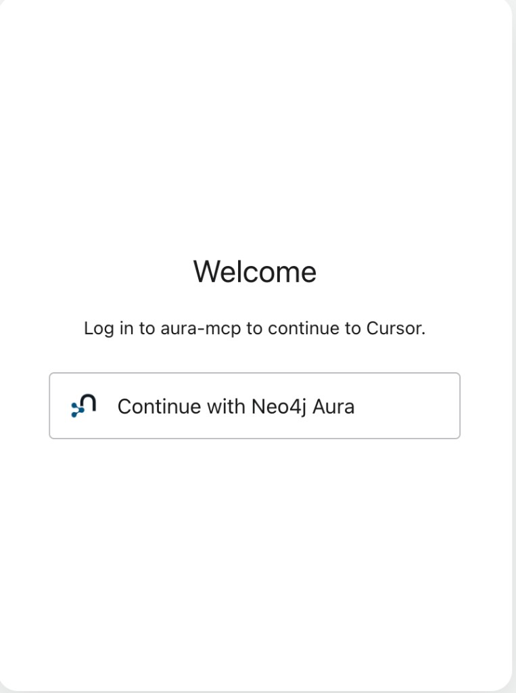
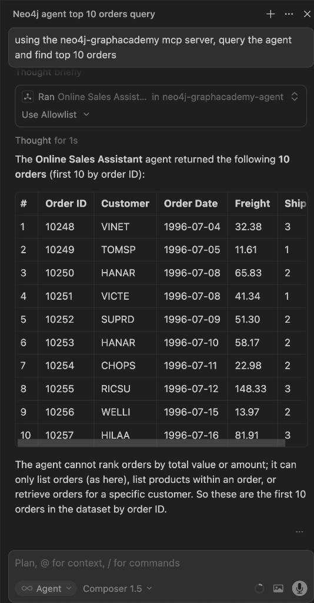

= Connect your agent to Cursor
:order: 2
:type: challenge
:optional: true

In this challenge, you will connect the agent you built (on your own knowledge graph or a sample like Northwind) to Cursor using the MCP endpoint and test it with real prompts.

== Before you start

* Complete the previous lesson (Publishing agent): enable **External access** and the **MCP server** toggle for your agent.
* Copy your agent's MCP endpoint from the agent menu (e.g. **...** next to the agent in the Agents list → **Copy MCP server endpoint**) so you can paste it into Cursor in the steps below.

== What is MCP?

The **Model Context Protocol**, MCP, is an open protocol that lets AI applications, called hosts, connect to external data sources and tools, called servers. When you enable MCP on an Aura Agent, Neo4j runs an MCP server that exposes your agent to host applications.

[source,mermaid]
----
%%{init: {
  "theme": "base",
  "securityLevel": "strict",
  "fontFamily": "Public Sans, Arial, Helvetica, sans-serif",
  "themeVariables": {
    "background": "#ffffff",
    "primaryTextColor": "#0f172a",
    "fontSize": "16px",
    "primaryColor": "#eef6f9",
    "primaryBorderColor": "#c7e0ec",
    "secondaryColor": "#f8fafc",
    "secondaryBorderColor": "#e5e7eb",
    "lineColor": "#94a3b8",
    "edgeLabelBackground": "#ffffff"
  }
}}%%
sequenceDiagram
    actor User
    participant Host as Host (Cursor / Claude Desktop)
    participant MCP as Aura MCP Server
    participant Agent as Aura Agent
    participant DB as AuraDB

    User->>Host: Ask a question
    Host->>MCP: Forward message through MCP protocol
    MCP->>Agent: Route to agent
    Agent->>Agent: Reason and select tool
    Agent->>DB: Run Cypher query
    DB-->>Agent: Graph results
    Agent-->>MCP: Natural language answer
    MCP-->>Host: Return response
    Host-->>User: Display answer
----

[NOTE]
.How the connection works
====
MCP host applications include Claude Desktop and Cursor. When you add your agent's MCP endpoint to a host, that application sends user messages to your agent and receives graph-backed responses. Your agent's tools run against your AuraDB instance. The host never sees your schema or credentials directly.
====

== MCP endpoint and authentication

Copy your agent's MCP endpoint from the agent menu. It appears after External access and the MCP server toggle are enabled.

image::images/agent-menu-mcp-endpoint.png[Agent menu showing Configure, Copy External endpoint, and Copy MCP server endpoint options]

MCP uses OAuth: the first time a host application invokes your agent, it opens a login prompt asking you to authenticate with your Aura Console credentials. See link:https://neo4j.com/docs/aura/aura-agent/[Aura Agent documentation^] for host-specific setup details.

== Connect to Cursor

. Open the **Cursor** menu from the top-left, then **Settings...**, then **Cursor Settings**.
+

. In the left sidebar, select **Tools & MCP**.
. Under **Installed MCP Servers**, click **+ New MCP Server**.
+

. A new file `mcp.json` will be created in your home directory and opened in the editor. Add your agent's MCP endpoint to the file. If you edit `mcp.json` directly, replace `<your-mcp-url>` with the endpoint from the agent menu:
+
[source,json]
----
{
  "mcpServers": {
    "neo4j-graphacademy-agent": {
      "url": "<your-mcp-url>",
      "transport": "http"
    }
  }
}
----
. Save and reload Cursor.
. Your agent appears in the **Tools & MCP** list with a **Needs authentication** status. Click **Connect**.
+
image::images/cursor-agent-needs-authentication.png[Tools and MCP panel showing neo4j-graphacademy-agent with Needs authentication status and a Connect button]
. Cursor asks permission to open the Aura MCP authentication website. Click **Open**.
+
image::images/cursor-open-aura-mcp-website.png[macOS dialog asking whether to open the aura-mcp.eu.auth0.com authorization URL in a browser]
. The login page opens in your browser. Click **Continue with Neo4j Aura**.
+

. On the authorization screen, click **Accept** to grant Cursor access to your Aura MCP account.
+
image::images/cursor-authorize-aura-mcp.png[Authorize App screen showing Cursor requesting access to the aura-mcp account with Accept and Decline buttons]
. Return to Cursor. Your agent is now connected and available as a tool.

For connecting other hosts such as Claude Desktop, see link:https://neo4j.com/docs/aura/aura-agent/[Aura Agent documentation^].

== Test your agent in Cursor

[IMPORTANT]
.Restart Cursor before testing
====
Restarting Cursor after adding the MCP endpoint is mandatory. If your agent is not working, a missed restart is likely the reason.
====

Open a new Cursor chat in **Agent** mode and ask a question. Address the agent by its MCP server name:

[copy]
----
Using the neo4j-graphacademy-agent, find the top 10 orders
----

Cursor routes the request to your agent, which queries your AuraDB instance and returns the results.
The agent's answers are bounded by the tools you configured. In this example it returns the first 10 orders by order ID since no ranking tool was added.

Try these additional prompts to exercise different tools:

[copy]
----
Using the neo4j-graphacademy-agent, list all products in the Seafood category
----

[copy]
----
Using the neo4j-graphacademy-agent, who are the top 5 customers by number of orders?
----

Each prompt exercises a different tool. Compare how the agent selects between Cypher Templates and Text2Cypher depending on which tool description best matches the question.

read::Mark as completed[]

[.summary]
== Summary

You connected your agent to Cursor using the MCP endpoint and tested it with real prompts.
In the next lesson, you will see suggested next steps and mark the course as completed.
